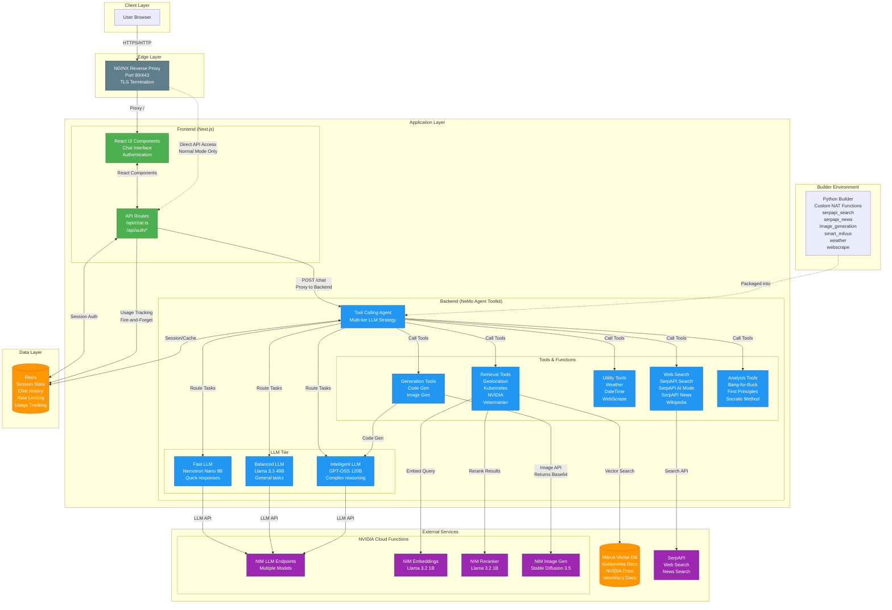
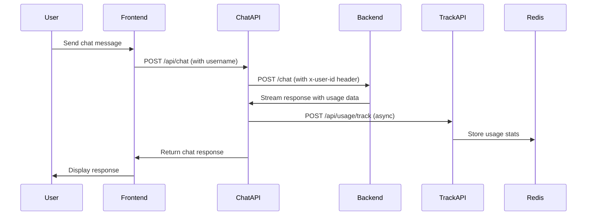
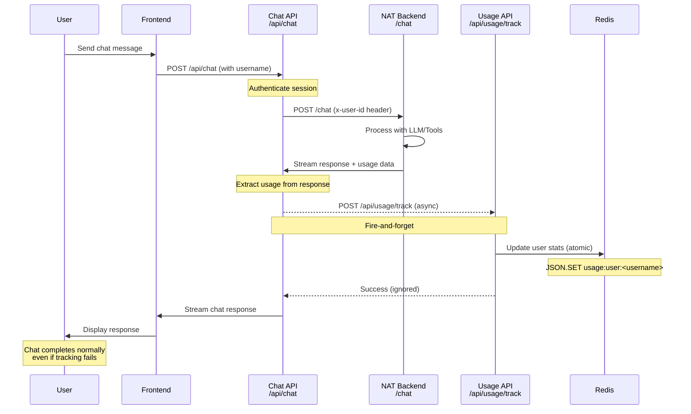

# Daedalus Architecture

This document provides a comprehensive overview of the Daedalus application architecture, including system components, data flow, and integration patterns.

## System Overview

Daedalus is a full-stack AI agent platform built on the NVIDIA NeMo Agent toolkit. It provides an intelligent chat interface with multi-modal capabilities including web search, retrieval-augmented generation, code generation, and image generation.

## Architecture Diagram



## Component Details

### 1. Client Layer

**User Browser**
- Modern web browser with JavaScript enabled
- Supports WebSockets for real-time streaming
- Handles authentication tokens (JWT)

### 2. Edge Layer

**NGINX Reverse Proxy**
- TLS termination for HTTPS traffic
- Routes requests to frontend and backend services
- Serves static assets and generated images
- Ports: 80 (HTTP), 443 (HTTPS)
- Configuration: `nginx/conf.d/frontend.conf`

### 3. Application Layer

#### Frontend (Next.js)

**Technology Stack:**
- Next.js 14.2 with React 18
- TypeScript for type safety
- Edge runtime for API routes
- Tailwind CSS for styling

**Key Components:**
- **Authentication**: JWT-based auth with bcrypt password hashing
- **Chat Interface**: Real-time streaming chat with markdown support
- **Chat Components**: Message bubbles, code blocks, images, charts
- **Sidebar**: Conversation history and folder management
- **Settings**: User preferences and configuration

**API Routes:**
- `/api/chat.ts`: Main chat endpoint, proxies to backend
- `/api/auth/*`: Authentication endpoints
- `/api/session/*`: Session management
- `/api/usage/*`: Usage tracking and statistics

**Key Features:**
- Streaming responses with Server-Sent Events
- Intermediate step visualization
- Base64 content filtering for performance
- Message history management
- Multi-language support (i18next)
- Automatic usage tracking per user

#### Backend (NeMo Agent Toolkit)

**Core Component:**
- Tool-calling agent with multi-tier LLM strategy
- Handles complex orchestration of tools and models
- Streaming response support
- Error handling and recovery

**LLM Strategy:**

1. **Fast LLM** (Nemotron Nano 9B)
   - Quick responses for simple tasks
   - Low latency operations
   - Prompt rewriting for image generation

2. **Balanced LLM** (Llama 3.3 49B)
   - Default agent LLM
   - General-purpose tasks
   - Good quality/speed tradeoff
   - Optimizable parameters

3. **Intelligent LLM** (GPT-OSS 120B)
   - Complex reasoning tasks
   - Code generation
   - Deep analysis tools
   - Highest quality outputs

**Tool Categories:**

1. **Knowledge Retrieval Tools**
   - `geolocation_retriever_tool`: Canonical geolocation data (top-1 with reranking)
   - `nvidia_retriever_tool`: NVIDIA docs and blogs
   - `kubernetes_retriever_tool`: K8s documentation
   - `veterinarian_retriever_tool`: Veterinary knowledge
   - Uses Smart Milvus with reranking

2. **Web Search & Information**
   - `serpapi_search_tool`: Google standard search with organic results, related questions, and web scraping enrichment (geolocation integration)
   - `serpapi_ai_tool`: Google AI Mode search with AI-generated summaries and structured text blocks (geolocation integration)
   - `serpapi_news_tool`: News aggregation with geolocation integration
   - `wikipedia_search_tool`: Wikipedia queries
   - `webscrape_tool`: Web page content extraction

3. **Utility Tools**
   - `current_datetime_tool`: System time
   - `weather_tool`: Weather forecasting with hourly data and geolocation integration

4. **Content Generation**
   - `code_generation_tool`: Python code generation using intelligent LLM
   - `image_generation_tool`: Stable Diffusion 3.5 images (returns base64-encoded PNG in markdown format)

5. **Specialized Analysis**
   - `bang_for_buck_tool`: Infrastructure ROI calculator
   - `first_principles_tool`: First-principles reasoning
   - `socratic_method_tool`: Socratic dialogue
   - `thinker_sequential_executor_tool`: Deep reasoning orchestrator

**SerpAPI Tool Comparison:**

| Feature | serpapi_search_tool | serpapi_ai_tool |
|---------|---------------------|-----------------|
| **Engine** | `google` | `google_ai_mode` |
| **Results Type** | Raw search results | AI-generated summaries |
| **Web Scraping** | Yes (enrichment) | No (self-contained) |
| **Response Structure** | Organic results, related questions, hierarchical (0-3 levels) | Structured text blocks with references |
| **Text Blocks** | Only in ai_overview (if available) | Primary response format |
| **Source Citations** | URLs in organic results | Structured references with snippets |
| **Geolocation** | Optional integration | Optional integration |
| **Use Case** | Comprehensive search with multiple result types | Quick AI-generated answers with sources |
| **Latency** | Higher (due to scraping) | Lower (no scraping) |
| **Result Hierarchy** | 4 levels (0-3) | Single level |

**Geolocation Integration:**

The geolocation retriever provides intelligent location name resolution for location-aware tools:

- **Purpose**: Resolve fuzzy or ambiguous location names to canonical forms
- **Technology**: Smart Milvus retriever with vector search and reranking
- **Data Source**: Milvus `geolocation` collection with canonical location data
- **Integration**: Used by `serpapi_search_tool`, `serpapi_ai_tool`, `serpapi_news_tool`, and `weather_tool`
- **Process**:
  1. User provides location (e.g., "SF", "Ann Arbor", "NYC")
  2. Location embedded using NIM Embeddings
  3. Vector search in geolocation collection (top-5 candidates)
  4. Reranked to top-1 canonical location
  5. Returns structured data: canonical name, GPS coordinates, country code
  6. Tool uses canonical location for API requests
- **Benefits**:
  - Consistent location naming across tools
  - Handles abbreviations and informal names
  - Reduces ambiguity in location-based queries
  - Improves search result relevance
  - Better weather data accuracy
- **Configuration**: Optional (controlled by `use_geolocation_retriever` flag in tool config)
- **Fallback**: Tools gracefully fall back to original location if retriever fails

### 4. Data Layer

**Redis**
- Version: Redis 8.0.3 (Kubernetes) / Redis 7 Alpine (Docker Compose)
- Persistence: AOF (Append-Only File) + RDB snapshots
- Use cases:
  - Session management
  - Chat history storage
  - Rate limiting
  - Caching
  - User-level usage tracking
- Configuration: Save every 60s if ≥1 key changed
- Port: 6379
- Storage:
  - Docker Compose: Local volume mount
  - Kubernetes: PVC with 64Gi capacity
- Redis JSON module: Used for structured data storage (users, sessions, usage stats)

**RedisInsight** (Kubernetes only)
- Version: latest
- Purpose: Redis management and monitoring UI
- Features:
  - Visual database browser
  - Query execution and profiling
  - Performance monitoring
  - Memory analysis
  - Key pattern analysis
- Port: 5540
- Auto-configured to connect to Redis instance
- Storage: PVC with 4Gi capacity
- Access: ClusterIP service with optional NodePort

### 5. External Services

**NVIDIA Cloud Functions (NIM)**

1. **LLM Endpoints**
   - Nemotron Nano 9B (fast)
   - Llama 3.3 49B (balanced)
   - GPT-OSS 120B (intelligent)
   - OpenAI-compatible API

2. **Embedding Model**
   - Llama 3.2 1B Embed QA
   - Text-to-vector conversion
   - Used for semantic search

3. **Reranker**
   - Llama 3.2 1B Rerank QA
   - Improves retrieval relevance
   - Top-K → Top-N refinement

4. **Image Generation**
   - Stable Diffusion 3.5 Large model
   - Configurable dimensions (768-1344 pixels)
   - Default: 1024x1024 resolution
   - Optional prompt rewriting with fast LLM
   - Returns base64-encoded PNG
   - Up to 300s timeout
   - Supports 50 diffusion steps (configurable 5-100)

**Milvus Vector Database**
- Kubernetes cluster deployment
- Collections:
  - `geolocation`: Canonical geolocation data for location resolution
  - `kubernetes`: K8s documentation
  - `nvidia`: NVIDIA corporate/technical docs
  - `vetpartner`: Veterinary knowledge
- Features: Vector search with reranking

**SerpAPI**
- Web search integration (Google standard search)
- AI Mode search with structured summaries
- News search capabilities
- Location-aware results with geolocation integration

### 6. Builder Environment

**Purpose**: Package custom NAT functions

**Custom Functions:**
- `serpapi_search`: Google standard search via SerpAPI with geolocation integration
- `serpapi_ai`: Google AI Mode search with structured summaries and geolocation integration
- `serpapi_news`: News aggregation with geolocation integration
- `image_generation`: SD 3.5 integration
- `smart_milvus`: Enhanced Milvus retrieval with reranking
- `weather`: Weather data fetching with geolocation integration
- `webscrape`: Web content extraction

**Build Process:**
- Base image with NAT toolkit
- Install custom function packages
- Deploy as backend container

## Data Flow

### 1. User Chat Request

```
User types message
  ↓
Frontend validates & sends to /api/chat
  ↓
API route authenticates via Redis session
  ↓
API route forwards to backend /chat
  ↓
Backend agent receives message
  ↓
Agent selects appropriate LLM tier
  ↓
LLM determines which tools to call
  ↓
Tools execute (may call external services)
  ↓
Results aggregated and streamed back
  ↓
Frontend renders streaming response
  ↓
User sees real-time answer
```

### 2. Retrieval-Augmented Generation (RAG)

```
User asks domain-specific question
  ↓
Agent calls appropriate retriever tool
  ↓
Query embedded via NIM Embeddings
  ↓
Vector search in Milvus (top-K results)
  ↓
Results reranked via NIM Reranker (top-N)
  ↓
Context provided to LLM
  ↓
LLM generates answer using retrieved context
  ↓
Response streamed to user
```

**Example for Geolocation:**
```
User provides fuzzy location (e.g., "SF")
  ↓
Geolocation retriever tool called
  ↓
Query embedded via NIM Embeddings
  ↓
Vector search in Milvus geolocation collection (top-5)
  ↓
Reranked to top-1 canonical location
  ↓
Returns "San Francisco, California, United States"
  ↓
Canonical location used for weather/search tools
```

### 3. Image Generation

```
User requests image
  ↓
Agent calls image_generation_tool
  ↓
Prompt optionally rewritten by fast LLM for better quality
  ↓
Request sent to SD 3.5 NIM endpoint (POST /v1/infer)
  ↓
Image generated (up to 300s timeout)
  ↓
Base64-encoded PNG returned in response
  ↓
Backend wraps in markdown: 
  ↓
Response streamed to frontend
  ↓
Frontend renders inline image from base64 data
```

**Note:** Images are returned as base64-encoded data embedded in markdown, not saved to disk. A `/tmp/generated_images` volume exists for optional file-based serving but is not currently used by the image generation function.

### 4. Web Search with AI Mode

```
User requests information via web search
  ↓
Agent selects between serpapi_search_tool or serpapi_ai_tool
  ↓
If location provided, geolocation_retriever resolves it (optional)
  ↓
serpapi_ai_tool: Requests AI-generated summary
  ↓
Returns structured text blocks with source references
  ↓
OR serpapi_search_tool: Requests standard search results
  ↓
Returns organic results, related questions, and enriched content
  ↓
Response streamed to user with formatted markdown
```

### 5. Location-Aware Tool Integration

```
User asks location-aware question (weather, news, search)
  ↓
Tool receives location parameter (e.g., "Ann Arbor")
  ↓
If geolocation integration enabled:
  ↓
  geolocation_retriever_tool called
  ↓
  Fuzzy location → Canonical location (e.g., "Ann Arbor, Michigan, United States")
  ↓
Tool uses canonical location for API request
  ↓
More accurate, consistent results returned
```

**Supported Tools with Geolocation:**
- `serpapi_search_tool`: Better search result locality
- `serpapi_ai_tool`: Improved AI summary context
- `serpapi_news_tool`: More relevant news results
- `weather_tool`: Accurate weather data fetching

### 6. Code Generation

```
User requests code
  ↓
Agent calls code_generation_tool
  ↓
Intelligent LLM (GPT-OSS 120B) generates code
  ↓
Code returned with proper formatting
  ↓
Frontend renders with syntax highlighting
```

### 7. Usage Tracking



**Usage Data Structure:**
- Total tokens (prompt + completion)
- Request count per user
- Daily usage breakdown (last 90 days)
- Monthly usage breakdown
- First and last request timestamps

**Redis Key Pattern:**
```
usage:user:<username>
```

**Example Usage Stats:**
```json
{
  "username": "john_doe",
  "total_prompt_tokens": 15000,
  "total_completion_tokens": 20000,
  "total_tokens": 35000,
  "request_count": 100,
  "first_request_at": 1672531200000,
  "last_request_at": 1704067200000,
  "daily_usage": {
    "2025-09-30": {
      "prompt_tokens": 150,
      "completion_tokens": 200,
      "total_tokens": 350
    }
  },
  "monthly_usage": {
    "2025-09": {
      "prompt_tokens": 5000,
      "completion_tokens": 6000,
      "total_tokens": 11000
    }
  }
}
```

## Deployment Architecture

### Docker Compose Deployment

**Services:**
```
Services:
├── builder (development helper)
├── backend (NAT agent)
├── frontend (Next.js app)
├── nginx (reverse proxy)
└── redis (data persistence)

Volumes:
├── ssl_certs (TLS certificates)
├── generated_images (reserved for file-based image serving, not currently used)
└── redis/data (persistent storage)

Network:
└── daedalus-network (bridge)
```

**Use Case:** Local development and testing

**Note:** Images are currently returned as base64 inline data, not saved to the `generated_images` volume.

### Kubernetes Deployment (Helm Chart)

#### Kubernetes Architecture Diagram

```mermaid
graph TB
    subgraph "External Traffic"
        INTERNET[Internet/Users]
    end

    subgraph "Kubernetes Cluster"
        subgraph "Ingress Layer (Optional)"
            INGRESS[Ingress Controller<br/>Optional External Access]
        end

        subgraph "Namespace: daedalus"
            subgraph "Edge Services"
                NGINX_SVC[NGINX Service<br/>ClusterIP:80/443]
                NGINX_POD[NGINX Pod<br/>- Routing<br/>- TLS Termination<br/>- Restricted Mode]
                NGINX_CFG[ConfigMap<br/>nginx-conf<br/>Two Modes]
                NGINX_PVC[PVC<br/>generated-images<br/>1Gi]
            end

            subgraph "Application Services"
                FE_SVC[Frontend Service<br/>ClusterIP:3000]
                FE_POD[Frontend Pod<br/>Next.js<br/>Port 3000]
                FE_SECRET[Secret<br/>frontend-env<br/>Environment Vars]

                BE_SVC[Backend Service<br/>ClusterIP:8000]
                BE_POD[Backend Pod<br/>NAT Agent<br/>Port 8000]
                BE_CFG[ConfigMap<br/>backend-config<br/>config.yaml]
                BE_SECRET[Secret<br/>backend-env<br/>API Keys]
                BE_PVC[PVC<br/>backend-data<br/>6Gi]
                BE_NP[NetworkPolicy<br/>Restrict Access]
            end

            subgraph "Data Services"
                REDIS_SVC[Redis Service<br/>ClusterIP:6379]
                REDIS_POD[Redis Pod<br/>v8.0.3<br/>AOF + RDB]
                REDIS_PVC[PVC<br/>redis-data<br/>64Gi]

                RI_SVC[RedisInsight Service<br/>ClusterIP:5540]
                RI_POD[RedisInsight Pod<br/>Management UI]
                RI_PVC[PVC<br/>redisinsight-data<br/>4Gi]
            end
        end

        subgraph "External Dependencies"
            MILVUS_EXT[Milvus Vector DB<br/>milvus.milvus.svc<br/>Port 19530]
        end
    end

    subgraph "External Cloud Services"
        NIM[NVIDIA NIM<br/>LLMs, Embeddings<br/>Reranker, Image Gen]
        SERP[SerpAPI<br/>Web/News Search]
    end

    %% Traffic Flow
    INTERNET -->|HTTPS| INGRESS
    INGRESS --> NGINX_SVC
    NGINX_SVC --> NGINX_POD

    %% NGINX Modes
    NGINX_CFG -.->|Normal Mode| NGINX_POD
    NGINX_CFG -.->|Restricted Mode| NGINX_POD
    NGINX_POD -->|Proxy to Frontend| FE_SVC
    NGINX_POD -.->|Direct API (Normal Mode Only)| BE_SVC

    %% Frontend to Backend
    FE_SVC --> FE_POD
    FE_POD -->|/api/chat| BE_SVC
    FE_POD -->|Session Auth| REDIS_SVC
    FE_POD -->|Usage Tracking| REDIS_SVC

    %% Backend connections
    BE_SVC --> BE_POD
    BE_POD --> REDIS_SVC
    BE_POD -->|External APIs| NIM
    BE_POD -->|Search| SERP
    BE_POD -->|Vector Search| MILVUS_EXT

    %% Redis connections
    REDIS_SVC --> REDIS_POD
    RI_SVC --> RI_POD
    RI_POD -->|Monitor| REDIS_SVC

    %% Storage
    NGINX_POD -.->|Mount| NGINX_PVC
    BE_POD -.->|Mount| BE_PVC
    REDIS_POD -.->|Mount| REDIS_PVC
    RI_POD -.->|Mount| RI_PVC

    %% Config & Secrets
    FE_POD -.->|Load| FE_SECRET
    BE_POD -.->|Load| BE_CFG
    BE_POD -.->|Load| BE_SECRET

    %% Network Policy
    BE_NP -.->|Protect| BE_POD

    classDef k8s fill:#326CE5,stroke:#1A4B9E,color:#fff
    classDef storage fill:#FF9800,stroke:#E65100,color:#fff
    classDef config fill:#9C27B0,stroke:#6A1B9A,color:#fff
    classDef external fill:#4CAF50,stroke:#2E7D32,color:#fff
    classDef security fill:#F44336,stroke:#C62828,color:#fff

    class NGINX_SVC,FE_SVC,BE_SVC,REDIS_SVC,RI_SVC k8s
    class NGINX_POD,FE_POD,BE_POD,REDIS_POD,RI_POD k8s
    class NGINX_PVC,BE_PVC,REDIS_PVC,RI_PVC storage
    class NGINX_CFG,BE_CFG,FE_SECRET,BE_SECRET config
    class NIM,SERP,MILVUS_EXT external
    class BE_NP,INGRESS security
```

#### Helm Chart Components

**Chart Information:**
- **Name:** daedalus
- **Version:** 0.1.0
- **Type:** Application
- **Location:** `helm/daedalus/`

**Deployments:**
1. **Backend Deployment**
   - Replicas: 1
   - Image: `daedalus.ddns.me:5050/btuttle/daedalus:backend-{version}`
   - Port: 8000
   - Environment: Loaded from Secret
   - Volumes: config.yaml (ConfigMap), /data (PVC)
   - Service: ClusterIP

2. **Frontend Deployment**
   - Replicas: 1
   - Image: `daedalus.ddns.me:5050/btuttle/daedalus:frontend-{version}`
   - Port: 3000
   - Environment: Auto-configured with K8s service FQDNs
   - Service: ClusterIP

3. **NGINX Deployment**
   - Replicas: 1
   - Image: `nginx:alpine`
   - Ports: 80 (HTTP), 443 (HTTPS - optional)
   - Volumes: nginx-conf (ConfigMap), generated-images (PVC), tls-secret (Secret - optional)
   - Service: ClusterIP with optional NodePort

4. **Redis Deployment**
   - Replicas: 1
   - Image: `redis:8.0.3`
   - Port: 6379
   - Persistence: AOF + RDB
   - Volume: redis-data (PVC - 64Gi)
   - Service: ClusterIP

5. **RedisInsight Deployment**
   - Replicas: 1
   - Image: `redis/redisinsight:latest`
   - Port: 5540
   - Purpose: Redis management and monitoring UI
   - Volume: redisinsight-data (PVC - 4Gi)
   - Service: ClusterIP with optional NodePort
   - Auto-configured to connect to Redis

**ConfigMaps:**
1. **backend-config**
   - Contains: `config.yaml` with NAT workflow configuration
   - Mounted at: `/workspace/config.yaml`

2. **nginx-conf**
   - Contains: `frontend.conf` NGINX configuration
   - Two modes:
     - **Normal Mode:** Allows direct API access through NGINX
     - **Restricted Mode:** Blocks direct API access, forces through frontend
   - Template-driven with Helm variables

**Secrets:**
1. **backend-env**
   - NVIDIA API keys
   - External service credentials
   - Environment-specific settings

2. **frontend-env**
   - Authentication credentials
   - Session secrets
   - Feature flags

3. **TLS Secret (Optional)**
   - Certificate and key for HTTPS
   - Name configurable via `nginx.https.tlsSecretName`

**Persistent Volume Claims:**
1. **backend-data** (6Gi)
   - Backend optimizer results
   - Temporary processing data

2. **redis-data** (64Gi)
   - Chat history
   - Session data
   - Cached responses

3. **redisinsight-data** (4Gi)
   - RedisInsight configuration
   - Saved queries and settings

4. **generated-images** (1Gi)
   - Reserved for file-based image serving
   - Currently unused (images returned as base64 inline)
   - Available for NGINX to serve from `/images/*` endpoint

**Network Policies:**
1. **backend-networkpolicy** (Optional, enabled by default)
   - Restricts backend ingress to:
     - Frontend pods only
     - NGINX pods (if needed)
     - Same namespace for health checks
   - Prevents direct external access to backend
   - Enhances security posture

**Ingress (Optional):**
- Kubernetes Ingress resource for external access
- Configurable ingress class
- TLS termination support
- Routes to NGINX service

#### NGINX Configuration Modes

**Normal Mode** (`restrictedMode: false`):
- Allows direct API access through NGINX
- Routes for:
  - `/v1/*` → Backend (OpenAI-compatible)
  - `/generate/*` → Backend (NAT generate endpoint)
  - `/chat/*` → Backend (NAT chat endpoint)
  - `/upload/*`, `/tools/*`, `/health/*` → Backend
  - `/evaluate` → Backend (with extended timeouts)
  - `/images/*` → Static files from PVC
  - `/` → Frontend
- Use case: Direct API integration, testing

**Restricted Mode** (`restrictedMode: true`, default):
- Blocks all direct API access with 403 Forbidden
- Only allows:
  - `/` → Frontend (all requests through Next.js)
  - `/_next/*` → Frontend static assets
  - `/images/*` → Generated images (if enabled)
  - Static files (js, css, images, fonts)
- Use case: Production security, force auth through frontend
- Security: Prevents API key exposure, enforces frontend authentication

#### Service Discovery

All services use Kubernetes DNS with fully qualified domain names:

```
<release>-<component>.<namespace>.svc.cluster.local
```

**Examples:**
- Backend: `myrelease-daedalus-backend.daedalus.svc.cluster.local:8000`
- Frontend: `myrelease-daedalus-frontend.daedalus.svc.cluster.local:3000`
- Redis: `myrelease-daedalus-redis.daedalus.svc.cluster.local:6379`
- NGINX: `myrelease-daedalus-nginx.daedalus.svc.cluster.local:80`

#### Helm Values Configuration

**Key Configuration Options:**

```yaml
# Enable/disable components
backend.enabled: true
frontend.enabled: true
nginx.enabled: true
redis.enabled: true

# Security
backend.networkPolicy.enabled: true  # Restrict backend access
nginx.config.restrictedMode: true    # Block direct API access

# TLS/HTTPS
nginx.https.enabled: true
nginx.https.tlsSecretName: "my-tls-secret"

# Storage
backend.persistence.size: 6Gi
redis.persistence.size: 64Gi
nginx.imageVolume.size: 1Gi

# External access
ingress.enabled: false
ingress.className: "nginx"
ingress.hosts: []
```

#### Deployment Workflow

**Script:** `helm-build-deploy.sh`

**Steps:**
1. Validate prerequisites (kubectl, helm, namespace)
2. Build Docker images for backend and frontend
3. Push images to container registry
4. Create Kubernetes namespace (if needed)
5. Create secrets from `.env` file:
   ```bash
   kubectl create secret generic <release>-daedalus-backend-env \
     --from-env-file=.env --dry-run=client -o yaml | kubectl apply -f -
   kubectl create secret generic <release>-daedalus-frontend-env \
     --from-env-file=.env --dry-run=client -o yaml | kubectl apply -f -
   ```
6. Provision TLS secrets (optional)
7. Install or upgrade Helm chart:
   ```bash
   helm upgrade --install <release> ./helm/daedalus \
     -n <namespace> \
     -f values.yaml \
     --set-file backend.config.data=backend/config.yaml
   ```
8. Validate deployment health

**Manual Deployment:**

```bash
# Install
helm install myrelease ./helm/daedalus -n daedalus

# Upgrade with custom backend config
helm upgrade --install myrelease ./helm/daedalus \
  -f values.yaml \
  --set-file backend.config.data=backend/config.yaml \
  -n daedalus

# Uninstall
helm uninstall myrelease -n daedalus
```

## Security Architecture

### Authentication Flow

```
User login
  ↓
Credentials validated against auth-passwords.json
  ↓
Password hashed with bcrypt
  ↓
JWT token generated and signed
  ↓
Token stored in Redis session
  ↓
Token sent to client as HTTP-only cookie
  ↓
Subsequent requests validated via JWT
```

### Security Features

**Application Security:**
- Bcrypt password hashing
- JWT session tokens
- HTTP-only cookies
- HTTPS via NGINX (production)
- Content-length limits (50MB default, 100MB for uploads)
- Request timeouts (60s default, 300s for streaming, 600s for evaluation)
- robots.txt respect for web scraping
- User ID tracking for audit logs (`x-user-id` header)

**Kubernetes Security:**
1. **Network Policies**
   - Backend pod isolation (enabled by default)
   - Only allows ingress from frontend and NGINX pods
   - Prevents direct external access to backend service
   - Namespace-level isolation

2. **NGINX Restricted Mode**
   - Blocks direct API access (403 Forbidden)
   - Forces all requests through authenticated frontend
   - Prevents API key exposure
   - Default configuration for production

3. **Secret Management**
   - Kubernetes Secrets for sensitive data
   - Environment variables injected at runtime
   - API keys never in container images
   - Separate secrets for backend and frontend

4. **TLS/HTTPS**
   - Optional TLS termination at NGINX
   - Certificate management via Kubernetes Secrets
   - Supports TLSv1.2 and TLSv1.3
   - Strong cipher suites

5. **RBAC and Service Accounts**
   - Kubernetes RBAC for access control
   - Service accounts per deployment
   - Principle of least privilege

6. **Security Headers**
   - `X-Frame-Options: DENY`
   - `X-Content-Type-Options: nosniff`
   - `X-XSS-Protection: 1; mode=block`
   - `Referrer-Policy: strict-origin-when-cross-origin`

### Security Testing

**Validation Script:** `test-security.sh`
- Validates network policy enforcement
- Tests restricted mode API blocking
- Probes backend endpoints through NGINX
- Verifies in-cluster pod isolation
- Run after each deployment

## Configuration Management

### Environment Variables (.env)

- Authentication credentials
- Redis connection settings
- Backend endpoints
- NVIDIA API keys
- Service ports
- Deployment mode

### Backend Config (config.yaml)

- LLM model endpoints and parameters
- Tool configurations
- Retriever settings
- Workflow orchestration
- Optimizer settings

### Frontend Config (env.example)

- API endpoints
- Redis configuration
- Authentication settings
- Feature flags

## Monitoring & Observability

### Logging

**Application Logging:**
- Frontend: Console logging with prefixes (`aiq -` prefix)
- Backend: NAT toolkit logging (INFO level configurable)
- NGINX: Access and error logs to `/var/log/nginx/`
- Structured log format for parsing

**Kubernetes Logging:**
- Pod logs via `kubectl logs`
- Persistent logs (optional with logging sidecar)
- Log aggregation with Fluentd/Fluent Bit (optional)
- Centralized logging with ELK or Loki (optional)

### Metrics

**Application Metrics:**
- Request/response timing
- Token usage tracking
- Tool call frequency
- Error rates
- Streaming response performance

**Kubernetes Metrics:**
- Pod resource utilization (CPU, memory)
- PVC usage and capacity
- Service endpoint health
- Network policy enforcement
- Replica availability

**Redis Metrics (via RedisInsight):**
- Memory usage and fragmentation
- Command statistics
- Key space analysis
- Slow query log
- Connection pool status

### Debugging

**Application Debugging:**
- Verbose mode for agent operations (`verbose: true` in config)
- Intermediate step visualization in frontend
- Stream debugging in frontend
- Error stack traces with details tags

**Docker Debugging:**
- `docker compose logs <service>` for service logs
- `docker compose exec <service> sh` for shell access
- Container inspection and resource usage

**Kubernetes Debugging:**
- `kubectl logs <pod>` for pod logs
- `kubectl describe <resource>` for resource details
- `kubectl exec -it <pod> -- sh` for shell access
- `kubectl get events` for cluster events
- `helm status <release>` for deployment status
- `helm get values <release>` for configuration review

**RedisInsight Dashboard:**
- Visual key exploration
- Real-time memory analysis
- Query profiling
- Connection monitoring

## Scalability Considerations

### Horizontal Scaling

**Docker Compose:**
- Limited horizontal scaling capability
- Manual service replication required
- Suitable for development and small deployments

**Kubernetes:**
1. **Frontend Scaling**
   - Stateless design enables easy horizontal scaling
   - Update `frontend.replicas` in Helm values
   - Kubernetes Service handles load balancing
   - Session state in Redis (not in pods)

2. **Backend Scaling**
   - Can scale horizontally with multiple replicas
   - Update `backend.replicas` in Helm values
   - NAT agent is stateless (state in Redis)
   - Load balanced via Kubernetes Service

3. **NGINX Scaling**
   - Can run multiple replicas
   - Update `nginx.replicas` in Helm values
   - Ingress controller handles external load balancing

4. **Redis Scaling**
   - Current: Single instance (master)
   - Future: Redis Cluster or Sentinel for high availability
   - RedisInsight scales independently

**Auto-scaling (Kubernetes):**
- Horizontal Pod Autoscaler (HPA) based on:
  - CPU utilization
  - Memory usage
  - Custom metrics (request rate, queue depth)
- Vertical Pod Autoscaler (VPA) for resource optimization

### Performance Optimization

**Application Level:**
- Edge runtime for API routes
- Streaming responses reduce perceived latency
- Redis caching for session data
- Vector search optimization with reranking
- Multi-tier LLM strategy (use cheapest viable model)
- Base64 content filtering to prevent memory overflow
- Request/response compression

**Infrastructure Level:**
- Persistent volumes with high IOPS for Redis
- Node affinity for co-locating related pods
- Resource requests and limits tuning
- Connection pooling for external services
- CDN for static assets (optional)

**Network Optimization:**
- Internal service mesh communication
- Reduced network hops with proper pod placement
- Connection keep-alive for backend APIs
- NGINX buffering optimization for streaming

## Development Workflow

### Local Development

```bash
# Frontend
cd frontend/
npm install
npm run dev

# Backend (via Docker Compose)
docker compose up backend redis

# Full stack
docker compose up --build
```

### Testing

- Frontend: Vitest unit tests
- Security: `test-security.sh` validation
- Integration: Full stack Docker testing

### CI/CD

- Automated builds via `docker-build-deploy.sh`
- Container registry pushes
- Helm chart updates
- Kubernetes deployment

## Technology Stack Summary

| Layer | Technology | Version |
|-------|-----------|---------|
| Frontend Framework | Next.js | 14.2.10 |
| UI Library | React | 18.2.0 |
| Language | TypeScript | 4.9.5 |
| Styling | Tailwind CSS | 3.3.3 |
| Backend Framework | NeMo Agent Toolkit | develop |
| Agent Type | Tool Calling Agent | - |
| Cache/Session | Redis | 8.0.3 (K8s) / 7-alpine (Docker) |
| Redis Management | RedisInsight | latest |
| Reverse Proxy | NGINX | alpine |
| Orchestration | Docker Compose / Kubernetes + Helm | v2 / 1.x |
| Package Manager | npm / uv | 9+ / latest |
| Chart Version | Helm Chart (daedalus) | 0.1.0 |

## External Dependencies

| Service | Purpose | Provider |
|---------|---------|----------|
| NVIDIA NIM LLMs | Language models (3 tiers) | NVIDIA Cloud |
| NVIDIA NIM Embeddings | Text embeddings | NVIDIA Cloud |
| NVIDIA NIM Reranker | Result reranking | NVIDIA Cloud |
| NVIDIA NIM SD 3.5 | Image generation | NVIDIA Cloud |
| Milvus | Vector database (4 collections) | Self-hosted K8s |
| SerpAPI | Web search (standard + AI mode) and news | Third-party API |

## Deployment Comparison: Docker Compose vs Kubernetes

| Feature | Docker Compose | Kubernetes (Helm) |
|---------|----------------|-------------------|
| **Use Case** | Local development, testing | Production, staging, multi-tenant |
| **Complexity** | Low - simple YAML | Medium - Helm charts + K8s concepts |
| **Scalability** | Manual, limited | Auto-scaling, horizontal pod autoscaling |
| **High Availability** | No | Yes (multi-replica, self-healing) |
| **Load Balancing** | Basic (NGINX only) | Built-in (Services + Ingress) |
| **Secret Management** | .env files | Kubernetes Secrets |
| **Storage** | Local volumes | PVCs with various storage classes |
| **Networking** | Bridge network | Service mesh, NetworkPolicies |
| **Security** | Basic (NGINX, app-level) | Advanced (NetworkPolicy, RBAC, Pod Security) |
| **Monitoring** | Manual (logs, docker stats) | Prometheus, Grafana, built-in metrics |
| **Updates** | `docker compose up --build` | `helm upgrade` with rolling updates |
| **Rollback** | Manual | `helm rollback <release>` |
| **Multi-Environment** | Manual env switching | Namespaces, multiple releases |
| **RedisInsight** | Not included | Included by default |
| **NGINX Modes** | Normal mode only | Normal + Restricted mode |
| **Backend Isolation** | Network-level only | NetworkPolicy + RBAC |
| **Resource Limits** | Docker resource constraints | K8s requests/limits, quotas |
| **Setup Time** | Minutes | 10-30 minutes (first time) |
| **Operational Cost** | Low (single machine) | Higher (cluster management) |
| **Best For** | Development, demos | Production, enterprise deployments |

**Recommendation:**
- **Use Docker Compose** for local development, testing, and demos
- **Use Kubernetes/Helm** for production deployments, multi-user environments, and when you need high availability, security, and scalability

## Usage Tracking System

### Overview
The application includes comprehensive per-user token usage tracking that automatically captures and stores all token consumption in Redis. This enables monitoring, analytics, and potential rate limiting or billing integration.

### Sequence Diagram



### Architecture Summary

| Component | Description | Technology |
|-----------|-------------|------------|
| **Storage** | User usage statistics | Redis JSON module |
| **Key Pattern** | `usage:user:<username>` | Redis key-value |
| **Tracking Method** | Fire-and-forget async | Non-blocking |
| **Aggregation** | Daily + Monthly | Automatic |
| **Retention** | 90 days (daily data) | Auto-cleanup |
| **API Endpoints** | `/api/usage/track`, `/api/usage/stats` | Next.js API routes |

### Components

**1. Usage Tracking Utility** (`frontend/utils/usage/tracking.ts`)
- Core functions for tracking and retrieving usage statistics
- Redis integration using JSON module for structured data
- Automatic daily and monthly aggregation
- Data retention management (90-day cleanup for old daily data)
- Atomic operations to prevent race conditions

**2. API Endpoints**
- `POST /api/usage/track`: Record usage for a user (internal only)
  - Validates and aggregates token usage data
  - Updates total, daily, and monthly statistics atomically
  - Returns success/error status
- `GET /api/usage/stats`: Retrieve usage statistics (user-facing)
  - Query params: `username` (optional - defaults to session user), `all=true` (admin only)
  - Returns comprehensive usage breakdown
  - Supports per-user and system-wide queries

**3. Chat Integration** (`frontend/pages/api/chat.ts`)
- Automatic extraction of usage data from backend responses
  - Parses `usage` field from OpenAI-compatible responses
  - Extracts `prompt_tokens`, `completion_tokens`, `total_tokens`
- Non-blocking fire-and-forget tracking
  - Does not wait for tracking to complete
  - Errors do not interrupt chat flow
- Works with both streaming and non-streaming responses
  - Streaming: Tracks after final chunk received
  - Non-streaming: Tracks immediately after response

### Data Structure

**UserUsageStats:**
```typescript
{
  username: string;
  total_prompt_tokens: number;
  total_completion_tokens: number;
  total_tokens: number;
  request_count: number;
  first_request_at: number;
  last_request_at: number;
  daily_usage: Record<string, UsageData>;  // YYYY-MM-DD
  monthly_usage: Record<string, UsageData>; // YYYY-MM
}
```

### Features
- ✅ Automatic tracking (no manual intervention)
- ✅ Per-user statistics
- ✅ Daily and monthly aggregation
- ✅ Persistent storage in Redis
- ✅ Non-blocking implementation
- ✅ Error-resilient (tracking failures don't interrupt chat)
- ✅ Atomic updates (prevents race conditions)
- ✅ Automatic data retention (90-day cleanup)

### API Reference

| Endpoint | Method | Authentication | Purpose | Parameters |
|----------|--------|----------------|---------|------------|
| `/api/usage/track` | POST | Internal only | Record usage data | `username`, `prompt_tokens`, `completion_tokens`, `total_tokens` |
| `/api/usage/stats` | GET | Session required | Get user statistics | `username` (optional), `all=true` (admin) |

**Example Request:**
```bash
# Get your own stats
GET /api/usage/stats

# Get another user's stats (admin only)
GET /api/usage/stats?username=john_doe

# Get all users' stats (admin only)
GET /api/usage/stats?all=true
```

**Example Response:**
```json
{
  "username": "john_doe",
  "total_tokens": 35000,
  "total_prompt_tokens": 15000,
  "total_completion_tokens": 20000,
  "request_count": 100,
  "first_request_at": 1672531200000,
  "last_request_at": 1704067200000,
  "daily_usage": { "2025-09-30": { "total_tokens": 350 } },
  "monthly_usage": { "2025-09": { "total_tokens": 11000 } }
}
```

### Security
- ✅ Users can only view their own statistics
- ✅ Admin endpoints require proper authorization
- ✅ Usage tracking is internal (called from trusted API routes)
- ✅ No PII stored beyond username
- ✅ Rate limiting on stats endpoint to prevent abuse

### Programmatic Access

**Server-side usage tracking utilities:**
```typescript
import {
  getUserUsageStats,
  getAllUsageStats,
  trackUserUsage,
  cleanupOldUsageData
} from '@/utils/usage/tracking';

// Get a user's statistics
const stats = await getUserUsageStats('john_doe');
console.log(`Total tokens: ${stats.total_tokens}`);
console.log(`Request count: ${stats.request_count}`);

// Track usage manually (usually automatic via chat API)
await trackUserUsage('john_doe', {
  prompt_tokens: 150,
  completion_tokens: 200,
  total_tokens: 350
});

// Get all users' stats (admin function)
const allStats = await getAllUsageStats();

// Clean up old daily data (keeps last 90 days)
await cleanupOldUsageData('john_doe');
```

### Maintenance

**Automated Cleanup:**
The system automatically cleans up daily usage data older than 90 days when tracking new usage. Monthly aggregates are retained indefinitely.

**Manual Cleanup (Optional Cron Job):**
```typescript
// Run periodically for all users
import { getAllUsageStats, cleanupOldUsageData } from '@/utils/usage/tracking';

const allStats = await getAllUsageStats();
for (const stats of allStats) {
  await cleanupOldUsageData(stats.username);
}
```

**Redis Inspection:**
```bash
# Using Redis CLI
redis-cli
> JSON.GET usage:user:john_doe

# Using RedisInsight
# Navigate to port 5540 and browse usage:user:* keys
```

### Testing

**Functional Testing:**
1. Start the application
2. Log in as a user
3. Send chat messages
4. Verify tracking: `GET /api/usage/stats`
5. Check Redis: Use RedisInsight or Redis CLI

**Example Test:**
```bash
# Send a chat message
curl -X POST 'http://localhost:3000/api/chat' \
  -H 'Content-Type: application/json' \
  -H 'Cookie: session=<your-cookie>' \
  -d '{"messages": [{"role": "user", "content": "Hello"}]}'

# Check your usage stats
curl -X GET 'http://localhost:3000/api/usage/stats' \
  -H 'Cookie: session=<your-cookie>'
```

### Monitoring

**Server Logs:**
Look for usage tracking confirmations:
```
Usage tracked for user john_doe: 350 tokens
```

**Redis Metrics:**
Monitor via RedisInsight:
- Key count: `usage:user:*` pattern
- Memory usage for usage keys
- Command statistics for JSON.GET/JSON.SET

### Documentation
- Detailed API documentation: `frontend/docs/USAGE_TRACKING.md`

## Future Enhancements

Potential areas for expansion:

### Platform Enhancements
1. **Multi-modal Inputs**: Vision models for image understanding
2. **Voice Integration**: Speech-to-text and text-to-speech
3. **Collaborative Features**: Multi-user conversations with shared context
4. **Advanced RAG**: Hybrid search, query decomposition, graph-based retrieval
5. **Workflow Automation**: Saved workflows, templates, and chaining
6. **Model Fine-tuning**: Custom model training pipeline integration
7. **Analytics Dashboard**: Usage statistics, cost tracking, and insights
8. **Plugin System**: Third-party tool integration marketplace
9. **Expanded Geolocation**: Global coverage with multi-language support
10. **Tool Orchestration**: Intelligent tool selection and chaining based on context

### Usage Tracking Enhancements
1. **Rate Limiting**: Per-user token limits and throttling
2. **Usage Alerts**: Notifications when approaching limits
3. **Cost Calculation**: Pricing integration based on model usage
4. **Analytics Dashboard**: Visual usage trends and insights
5. **Export Functionality**: CSV/JSON reports
6. **Billing Integration**: Usage-based pricing systems

### Kubernetes-Specific Enhancements
1. **Service Mesh**: Istio or Linkerd for advanced traffic management
2. **GitOps**: ArgoCD or Flux for declarative deployment
3. **External Secrets**: Integration with Vault, AWS Secrets Manager
4. **Multi-Region Deployment**: Global load balancing and data replication
5. **Cost Optimization**: Resource right-sizing, spot instances
6. **Disaster Recovery**: Automated backup and restore procedures
7. **Multi-Tenancy**: Namespace isolation with resource quotas
8. **Observability Stack**: Full Prometheus, Grafana, Jaeger integration

### Security Enhancements
1. **OAuth2/OIDC**: Enterprise SSO integration
2. **API Rate Limiting**: Per-user/per-tenant rate limits
3. **Audit Logging**: Comprehensive security event logging
4. **Encryption at Rest**: Database and volume encryption
5. **mTLS**: Mutual TLS for service-to-service communication
6. **Pod Security Standards**: Enforce restricted pod security policies

## References

### Application Documentation
- [NeMo Agent Toolkit Documentation](https://docs.nvidia.com/nemo/agent-toolkit)
- [Next.js Documentation](https://nextjs.org/docs)
- [React Documentation](https://react.dev)
- [Usage Tracking API Documentation](frontend/docs/USAGE_TRACKING.md)

### Infrastructure Documentation
- [Docker Compose Documentation](https://docs.docker.com/compose)
- [Kubernetes Documentation](https://kubernetes.io/docs)
- [Helm Documentation](https://helm.sh/docs)
- [NGINX Documentation](https://nginx.org/en/docs)

### Data & Storage
- [Redis Documentation](https://redis.io/docs)
- [RedisInsight Documentation](https://redis.io/docs/ui/insight/)
- [Milvus Documentation](https://milvus.io/docs)
- [Kubernetes Persistent Volumes](https://kubernetes.io/docs/concepts/storage/persistent-volumes/)

### Security & Networking
- [Kubernetes Network Policies](https://kubernetes.io/docs/concepts/services-networking/network-policies/)
- [Kubernetes Secrets Management](https://kubernetes.io/docs/concepts/configuration/secret/)
- [NGINX Security Headers](https://nginx.org/en/docs/http/ngx_http_headers_module.html)
- [TLS Best Practices](https://wiki.mozilla.org/Security/Server_Side_TLS)

### Deployment & Operations
- [Helm Chart Development Guide](https://helm.sh/docs/chart_template_guide/)
- [Kubernetes Best Practices](https://kubernetes.io/docs/concepts/configuration/overview/)
- [Docker Build Best Practices](https://docs.docker.com/develop/dev-best-practices/)
- [GitOps Principles](https://opengitops.dev/)

### External Services
- [NVIDIA NIM Documentation](https://docs.nvidia.com/nim/)
- [SerpAPI Documentation](https://serpapi.com/docs)
- [Stable Diffusion Documentation](https://github.com/Stability-AI/stablediffusion)
