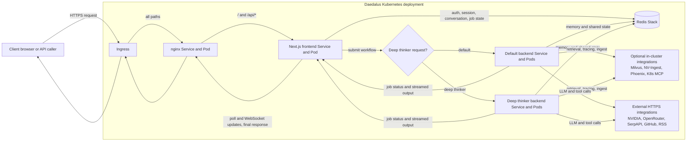
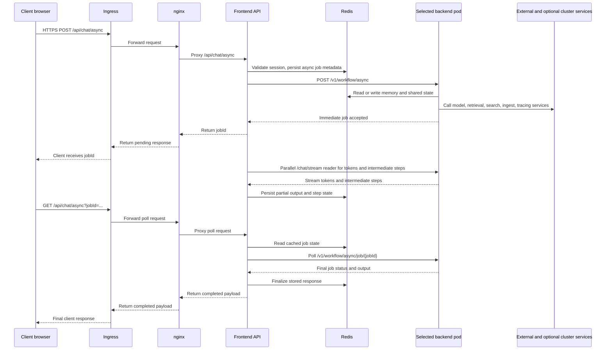
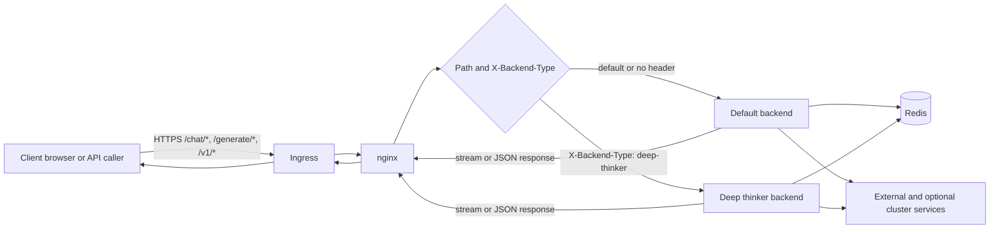

<p align="center">
  
</p>

# Daedalus

Daedalus is a full-stack reference application built on the [NVIDIA NeMo Agent toolkit](https://github.com/NVIDIA/NeMo-Agent-Toolkit). It combines a Next.js chat UI, NeMo Agent workflows, Redis-backed memory and session state, optional document retrieval, and Kubernetes deployment support.

## What This Repository Contains

- A Next.js 14 frontend with streaming chat, attachments, authentication, PWA support, and conversation sync
- NeMo Agent backend configurations for a tool-calling workflow and a deeper reasoning workflow
- Custom builder packages for image generation, image understanding, retrieval, RSS ingestion, transcript parsing, and MAS routing
- A Docker Compose stack for local development
- A Helm chart and deployment script for a fuller Kubernetes deployment
- Optional hardening for Kubernetes and Cilium network policies

## Deployment Modes

Daedalus supports two practical ways to run the project.

| Mode                 | What it starts                                                                                                                                  | Best for                                                          |
| -------------------- | ----------------------------------------------------------------------------------------------------------------------------------------------- | ----------------------------------------------------------------- |
| Local Docker Compose | `frontend`, `backend`, `nginx`, `redis`, `redisinsight`, `marketing`, plus a `builder` utility container                                        | Local development and validating one backend config at a time     |
| Kubernetes via Helm  | Separate default and deep-thinker backends, frontend, nginx, redis, redisinsight, jupyterlab, autonomous agent, ingress, PVCs, network policies | Persistent multi-user deployments and the full platform footprint |

Important: the local Compose stack does not start Milvus, NV-Ingest, Phoenix, or JupyterLab. Those integrations are wired into the backend configs and Helm values, but they require external services or cluster deployment.

## Quick Start

### 1. Create `.env`

```bash
cp .env.template .env
```

For local Docker Compose, update these values first:

```bash
DEPLOYMENT_MODE=local
NVIDIA_API_KEY=nvapi-...
NVIDIA_INFERENCE_API_KEY=nvapi-...
```

Authentication is required by the frontend. The repo supports either a single user or numbered multi-user entries.

Single-user example:

```bash
AUTH_USERNAME=admin
AUTH_PASSWORD=change-me
AUTH_NAME=Administrator
DAEDALUS_DEFAULT_USER=admin
```

Multi-user example:

```bash
AUTH_USER_1_USERNAME=alice
AUTH_USER_1_PASSWORD=change-me
AUTH_USER_1_NAME=Alice
AUTH_USER_2_USERNAME=bob
AUTH_USER_2_PASSWORD=change-me
AUTH_USER_2_NAME=Bob
DAEDALUS_DEFAULT_USER=alice
```

Useful optional keys:

```bash
SERPAPI_KEY=...
GITHUB_PAT=...
OPENROUTER_API_KEY=...
AA_API_KEY=...
```

### 2. Choose the backend workflow for local Compose

The Compose stack runs one backend container and expects a file at `backend/config.yaml`.

Use the standard tool-calling workflow:

```bash
cp backend/tool-calling-config.yaml backend/config.yaml
```

Or use the reasoning-focused workflow instead:

```bash
cp backend/react-agent-config.yaml backend/config.yaml
```

If you switch configs, recreate the backend container so NAT reloads the new file.

### 3. Start the local stack

```bash
docker compose up --build
```

### 4. Open the app

- Main app through nginx: `http://localhost`
- Frontend directly: `http://localhost:3000`
- Backend API: `http://localhost:8000`
- RedisInsight: `http://localhost:8001`
- Marketing site: `http://localhost:8080`

## Local Development Notes

- Compose is the easiest way to run the full local stack.
- The standalone frontend dev server uses port `5000`, while the production container listens on `3000`.
- In local Compose, the frontend does not get a separate default and deep-thinker backend pair. You choose one backend config by copying it to `backend/config.yaml`.
- The `builder` service is a convenience container for working inside the NeMo Agent builder environment; it does not serve traffic.

## Kubernetes Deployment

Use Kubernetes when you want the full Daedalus layout: separate default and deep-thinker backends, ingress, PVC-backed storage, JupyterLab, the autonomous agent CronJob, and optional Cilium policies.

### Preferred path: `deploy.sh`

The repository includes a deployment script that builds, pushes, creates or updates secrets, and runs Helm.

Before using it:

1. Fill in `.env` with your real secrets.
2. Set `DOCKER_REGISTRY` and `DAEDALUS_VERSION` in `.env`.
3. Update image repositories, ingress hostnames, and any node-placement or persistence settings in [`custom-values.yaml`](custom-values.yaml).
4. If you want the autonomous agent to write into your own history, set `autonomousAgent.userId` to a real login username.

Run:

```bash
./deploy.sh
```

Useful flags:

```bash
./deploy.sh --dry-run
./deploy.sh --skip-build
./deploy.sh --skip-tls
./deploy.sh -n daedalus -r daedalus
```

### Manual Helm path

If you prefer to deploy manually:

```bash
kubectl create namespace daedalus

kubectl -n daedalus create secret generic daedalus-backend-env \
  --from-env-file=.env

kubectl -n daedalus create secret generic daedalus-frontend-env \
  --from-env-file=.env

helm upgrade --install daedalus ./helm/daedalus \
  -n daedalus \
  -f custom-values.yaml \
  --set-file backend.default.config.data=backend/tool-calling-config.yaml \
  --set-file backend.deepThinker.config.data=backend/react-agent-config.yaml \
  --timeout 10m
```

### Full Helm footprint

The Helm chart can deploy:

- Two backend deployments: default and deep thinker
- Frontend and nginx
- Redis Stack and RedisInsight
- JupyterLab
- An autonomous-agent CronJob
- Ingress, PVCs, PodDisruptionBudget, and network policies
- Optional Cilium FQDN-based egress restrictions

Start with [`helm/daedalus/values.yaml`](helm/daedalus/values.yaml) for defaults and [`custom-values.yaml`](custom-values.yaml) for an opinionated example.

### Kubernetes request flow

The main browser chat path in Kubernetes goes through the frontend's async API route. The frontend authenticates the user, stores job state in Redis, selects the default or deep-thinker backend, and then returns progress plus the final answer back to the browser.



The sequence below shows the primary UI request and response path used by `/api/chat/async`.



nginx can also proxy backend API paths directly. Requests to `/chat/`, `/generate/`, and `/v1/` bypass the frontend pod and are sent straight to the default or deep-thinker backend based on the `X-Backend-Type` header.



## Key Configuration Files

| File                                                                   | Purpose                                |
| ---------------------------------------------------------------------- | -------------------------------------- |
| [`README.md`](README.md)                                               | Top-level setup and deployment guide   |
| [`.env.template`](.env.template)                                       | Main environment variable template     |
| [`docker-compose.yaml`](docker-compose.yaml)                           | Local multi-service stack              |
| [`backend/tool-calling-config.yaml`](backend/tool-calling-config.yaml) | Standard tool-calling backend workflow |
| [`backend/react-agent-config.yaml`](backend/react-agent-config.yaml)   | Reasoning-focused backend workflow     |
| [`frontend/env.example`](frontend/env.example)                         | Frontend API path example              |
| [`helm/daedalus/values.yaml`](helm/daedalus/values.yaml)               | Default Helm values                    |
| [`custom-values.yaml`](custom-values.yaml)                             | Example production overrides           |
| [`deploy.sh`](deploy.sh)                                               | Build, push, and deploy helper         |

## Backend Workflows

Daedalus ships with two backend configurations.

| Config       | File                                                                   | Intended use                                                      |
| ------------ | ---------------------------------------------------------------------- | ----------------------------------------------------------------- |
| Default      | [`backend/tool-calling-config.yaml`](backend/tool-calling-config.yaml) | Fast tool use, retrieval, memory, MCP integrations, image tooling |
| Deep Thinker | [`backend/react-agent-config.yaml`](backend/react-agent-config.yaml)   | More deliberate reasoning and longer-form research tasks          |

Both configs include the custom packages from `builder/` and rely heavily on environment-variable substitution for secrets and endpoints.

## Frontend Capabilities

The frontend includes:

- Streaming chat against NAT endpoints such as `/chat/stream` and `/v1/chat/completions`
- Authentication backed by Redis
- File attachments for images, documents, and videos
- Conversation folders, export/import, and search
- Real-time sync and usage tracking APIs
- PWA support and offline assets
- A built-in Help dialog for end users

For frontend-specific details, see [`frontend/README.md`](frontend/README.md).

## Custom Builder Packages

The `builder/` directory contains reusable NeMo Agent functions and helpers.

| Package               | Purpose                                                |
| --------------------- | ------------------------------------------------------ |
| `agent_skills`        | Discovers and runs repo-packaged skills                |
| `content_distiller`   | Summarization and extraction helpers                   |
| `image_augmentation`  | Image editing                                          |
| `image_comprehension` | Image analysis and OCR                                 |
| `image_generation`    | Text-to-image generation                               |
| `json_repair_agent`   | Repairs malformed JSON outputs                         |
| `mas_optimizer`       | Multi-agent vs single-agent routing and verification   |
| `nat_helpers`         | Shared helpers such as geolocation and image utilities |
| `nat_nv_ingest`       | NV-Ingest integration for document ingestion           |
| `rss_feed`            | RSS fetching and ranking                               |
| `serpapi_search`      | Search integration                                     |
| `smart_milvus`        | Milvus retrieval and reranking                         |
| `think_tool`          | Deliberate reasoning helper                            |
| `user_interaction`    | Structured clarification and confirmation prompts      |
| `vtt_interpreter`     | Transcript-to-notes processing                         |
| `webscrape`           | Web page extraction                                    |

Several packages include their own README files under `builder/`.

## Autonomous Agent

The Helm chart enables an autonomous background agent by default. It runs as a CronJob and can add memories and research updates for a configured user.

Important settings:

- `autonomousAgent.enabled`
- `autonomousAgent.schedule`
- `autonomousAgent.timeZone`
- `autonomousAgent.userId`
- `autonomousAgent.backendType`

Its long-form instructions live in:

- [`helm/daedalus/files/autonomous-agent-soul.md`](helm/daedalus/files/autonomous-agent-soul.md)
- [`helm/daedalus/files/autonomous-agent-heartbeat.md`](helm/daedalus/files/autonomous-agent-heartbeat.md)

## Network Security

The Helm chart supports two layers of traffic control for Kubernetes deployments.

- Kubernetes `NetworkPolicy` for coarse ingress and egress control
- Optional `CiliumNetworkPolicy` resources for FQDN-based egress allowlists and DNS visibility

The Cilium layer is disabled by default in [`helm/daedalus/values.yaml`](helm/daedalus/values.yaml) and enabled in the example [`custom-values.yaml`](custom-values.yaml).

## MAS Optimizer

The `mas_optimizer` package implements task routing between single-agent and centralized multi-agent handling. It is configured in the backend YAML under `mas_optimizer_tool` and is intended to avoid unnecessary coordination overhead on simpler requests.

If you need to tune it, start with the thresholds in:

- [`backend/tool-calling-config.yaml`](backend/tool-calling-config.yaml)

## Development

### Frontend only

```bash
cd frontend
npm install
npm run dev
```

The standalone dev server runs on `http://localhost:5000`.

### Builder tests

```bash
cd builder
uv run --with pytest --with pyyaml --with pydantic --with httpx \
  pytest tests/ -v
```

With coverage:

```bash
cd builder
uv run --with pytest --with pyyaml --with pydantic --with httpx --with pytest-cov \
  pytest tests/ --cov --cov-report=term-missing
```

### Frontend tests

```bash
cd frontend
npm install
npm run test
npm run coverage
```

## Troubleshooting

### `backend/config.yaml` is missing

The local backend container mounts `/workspace/config.yaml` from `backend/config.yaml`. Create it by copying one of the provided backend configs before starting Compose.

### Login page loads but no user can sign in

Make sure you defined either:

- `AUTH_USERNAME` and `AUTH_PASSWORD`, or
- `AUTH_USER_1_USERNAME`, `AUTH_USER_1_PASSWORD`, and related numbered variables

Also set `DAEDALUS_DEFAULT_USER` to a real configured username if you want memory and background-agent activity associated with that user.

### Local Compose cannot reach Milvus or NV-Ingest

That is expected unless you provide those external services yourself. The local stack only starts the Daedalus-facing containers.

## Repository Layout

```text
daedalus-agent/
  backend/          NeMo Agent workflow YAML files
  builder/          Custom Python packages and tests
  docs/             Additional design notes
  frontend/         Next.js application
  helm/daedalus/    Helm chart and embedded agent assets
  marketing/        Static marketing site
  nginx/            Reverse-proxy configuration
  skills/           Repo-packaged agent skills
```

## Additional Docs

- [`frontend/README.md`](frontend/README.md)
- [`helm/daedalus/README.md`](helm/daedalus/README.md)
- [`builder/nat_nv_ingest/README.md`](builder/nat_nv_ingest/README.md)
- [`builder/smart_milvus/README.md`](builder/smart_milvus/README.md)
- [`builder/rss_feed/README.md`](builder/rss_feed/README.md)
- [`builder/image_augmentation/README.md`](builder/image_augmentation/README.md)

## License

Apache 2.0
