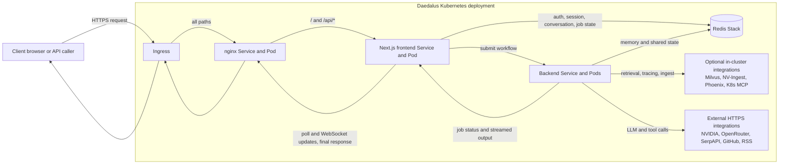
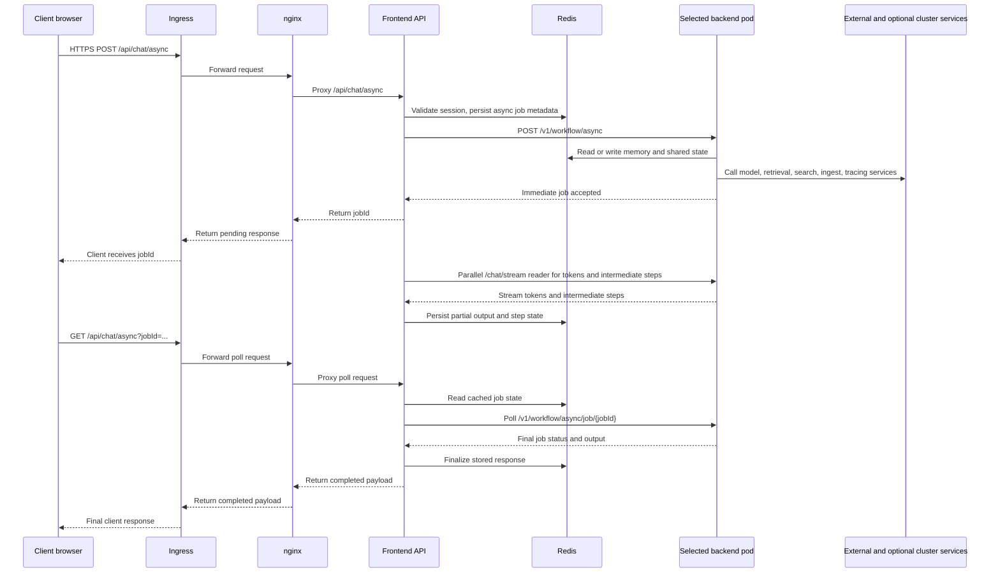

<p align="center">
  
</p>

# Daedalus

Daedalus is a production-ready AI agent platform built on the
[NVIDIA NeMo Agent toolkit](https://github.com/NVIDIA/NeMo-Agent-Toolkit).
It ships as a single deployable stack — chat UI, agent backend,
persistent memory, document retrieval, and autonomous background
research — that runs locally via Docker Compose or at scale on
Kubernetes.

What separates Daedalus from a typical chat wrapper:

- **Autonomous agent loop** — a background CronJob that independently
  researches, synthesizes, and writes to memory on a configurable
  schedule, seeded by a knowledge graph you define
- **Architecture-aware routing** — the MAS optimizer evaluates each
  request and selects single-agent or multi-agent execution based on
  task complexity, not a static configuration
- **Tool-rich execution** — MCP server integrations (GitHub, Kubernetes),
  web search, RSS ingestion, image generation and analysis, document
  ingestion into Milvus, and structured reasoning, all wired into one
  workflow config
- **Production hardening** — Helm chart with PVCs, PDBs, network
  policies, optional Cilium FQDN egress, and multi-user authentication
  out of the box

## Deployment Modes

Daedalus supports two practical ways to run the project.

| Mode                 | What it starts                                                                                                                                  | Best for                                                          |
| -------------------- | ----------------------------------------------------------------------------------------------------------------------------------------------- | ----------------------------------------------------------------- |
| Local Docker Compose | `frontend`, `backend`, `nginx`, `redis`, `redisinsight`, plus a `builder` utility container                                                      | Local development and validating one backend config at a time     |
| Kubernetes via Helm  | Backend, frontend, nginx, redis, redisinsight, autonomous agent, ingress, PVCs, network policies | Persistent multi-user deployments and the full platform footprint |

> [!IMPORTANT]
> The local Compose stack does not start Milvus, NV-Ingest, or Phoenix.
> Those integrations require external services or cluster deployment.

## Quick Start

### 1. Create `.env`

```bash
cp .env.template .env
```

For local Docker Compose, update these values first:

```bash
DEPLOYMENT_MODE=local
NVIDIA_API_KEY=nvapi-...
NVIDIA_INFERENCE_API_KEY=nvapi-...
```

Authentication is required by the frontend. The repo supports either a single user or numbered multi-user entries.

Single-user example:

```bash
AUTH_USERNAME=admin
AUTH_PASSWORD=change-me
AUTH_NAME=Administrator
DAEDALUS_DEFAULT_USER=admin
```

Multi-user example:

```bash
AUTH_USER_1_USERNAME=alice
AUTH_USER_1_PASSWORD=change-me
AUTH_USER_1_NAME=Alice
AUTH_USER_2_USERNAME=bob
AUTH_USER_2_PASSWORD=change-me
AUTH_USER_2_NAME=Bob
DAEDALUS_DEFAULT_USER=alice
```

Useful optional keys:

```bash
SERPAPI_KEY=...
GITHUB_PAT=...
```

### 2. Copy the backend config for local Compose

The Compose stack runs one backend container and expects a file at `backend/config.yaml`.

```bash
cp backend/tool-calling-config.yaml backend/config.yaml
```

If you edit the config later, recreate the backend container so NAT reloads the new file.

### 3. Start the local stack

```bash
docker compose up --build
```

### 4. Open the app

- Main app through nginx: `http://localhost`
- Frontend directly: `http://localhost:3000`
- Backend API: `http://localhost:8000`
- RedisInsight: `http://localhost:8001`

## Local Development Notes

- Compose is the easiest way to run the full local stack.
- The standalone frontend dev server uses port `5000`, while the production container listens on `3000`.
- In local Compose, you choose a backend config by copying it to `backend/config.yaml`.
- The `builder` service is a convenience container for working inside the NeMo Agent builder environment; it does not serve traffic.

## Kubernetes Deployment

Use Kubernetes when you want the full Daedalus layout: backend, ingress, PVC-backed storage, the autonomous agent CronJob, and optional Cilium policies.

### Preferred path: `deploy.sh`

The repository includes a deployment script that builds, pushes, creates or updates secrets, and runs Helm.

Before using it:

1. Fill in `.env` with your real secrets.
2. Set `DOCKER_REGISTRY` and `DAEDALUS_VERSION` in `.env`.
3. Update image repositories, ingress hostnames, and any node-placement or persistence settings in [`custom-values.yaml`](custom-values.yaml).
4. If you want the autonomous agent to write into your own history, set `autonomousAgent.userId` to a real login username.

Run:

```bash
./deploy.sh
```

Useful flags:

```bash
./deploy.sh --dry-run
./deploy.sh --skip-build
./deploy.sh --skip-tls
./deploy.sh -n daedalus -r daedalus
```

### Manual Helm path

If you prefer to deploy manually:

```bash
kubectl create namespace daedalus

kubectl -n daedalus create secret generic daedalus-backend-env \
  --from-env-file=.env

kubectl -n daedalus create secret generic daedalus-frontend-env \
  --from-env-file=.env

helm upgrade --install daedalus ./helm/daedalus \
  -n daedalus \
  -f custom-values.yaml \
  --set-file backend.default.config.data=backend/tool-calling-config.yaml \
  --timeout 10m
```

### Full Helm footprint

The Helm chart can deploy:

- Backend deployment
- Frontend and nginx
- Redis Stack and RedisInsight
- An autonomous-agent CronJob
- Ingress, PVCs, PodDisruptionBudget, and network policies
- Optional Cilium FQDN-based egress restrictions

Start with [`helm/daedalus/values.yaml`](helm/daedalus/values.yaml) for defaults and [`custom-values.yaml`](custom-values.yaml) for an opinionated example.

### Kubernetes request flow

The main browser chat path in Kubernetes goes through the frontend's async API route. The frontend authenticates the user, stores job state in Redis, submits the workflow to the backend, and then returns progress plus the final answer back to the browser.



The sequence below shows the primary UI request and response path used by `/api/chat/async`.



> **Direct API access:** nginx also proxies `/chat/*`, `/generate/*`,
> and `/v1/*` directly to the backend, bypassing the frontend pod.

## Backend Workflows

The backend configuration lives at [`backend/tool-calling-config.yaml`](backend/tool-calling-config.yaml) and covers tool use, retrieval, memory, MCP integrations, image tooling, and reasoning. It includes the custom packages from `builder/` and relies heavily on environment-variable substitution for secrets and endpoints.

The `mas_optimizer` package implements task routing between single-agent and centralized multi-agent handling. It evaluates each request and selects single-agent or multi-agent execution based on task complexity, avoiding unnecessary coordination overhead on simpler requests. Routing thresholds are configured in [`backend/tool-calling-config.yaml`](backend/tool-calling-config.yaml) under `mas_optimizer_tool`.

## Frontend Capabilities

The frontend includes:

- Streaming chat against NAT endpoints such as `/chat/stream` and `/v1/chat/completions`
- Authentication backed by Redis
- File attachments for images, documents, and videos
- Conversation folders, export/import, and search
- Real-time sync and usage tracking APIs
- PWA support and offline assets
- A built-in Help dialog for end users

For frontend-specific details, see [`frontend/README.md`](frontend/README.md).

## Custom Builder Packages

The `builder/` directory contains reusable NeMo Agent functions, helpers, and standalone modules that patch NAT at startup.

| Name                  | Type    | Purpose                                                              |
| --------------------- | ------- | -------------------------------------------------------------------- |
| `agent_skills`        | package | Discovers and runs repo-packaged skills                              |
| `content_distiller`   | package | Summarization and extraction helpers                                 |
| `image_augmentation`  | package | Image editing                                                        |
| `image_comprehension` | package | Image and video analysis                                             |
| `image_generation`    | package | Text-to-image generation                                             |
| `json_repair_agent`   | package | Repairs malformed JSON outputs                                       |
| `mas_optimizer`       | package | Multi-agent vs single-agent routing and verification                 |
| `nat_helpers`         | package | Shared helpers such as geolocation and image utilities               |
| `nat_nv_ingest`       | package | NV-Ingest integration for document ingestion                         |
| `rss_feed`            | package | RSS fetching and ranking                                             |
| `serpapi_search`      | package | Search integration                                                   |
| `smart_milvus`        | package | Milvus retrieval and reranking                                       |
| `think_tool`          | package | Deliberate reasoning helper                                          |
| `user_interaction`    | package | Structured clarification and confirmation prompts                    |
| `vtt_interpreter`     | package | Transcript-to-notes processing                                      |
| `webscrape`           | package | Web page extraction                                                  |
| `entrypoint.py`       | module  | Custom NAT entrypoint with Starlette compatibility shims             |
| `llm_diagnostics.py`  | module  | OpenAI SDK logging and timeout enforcement for LLM client resilience |
| `mcp_patches.py`      | module  | MCP StreamableHTTP timeout, reconnection, and error-logging patches  |

Several packages include their own README files under `builder/`.

## Autonomous Agent

The Helm chart enables an autonomous background agent by default. It runs as a CronJob and can add memories and research updates for a configured user. The agent mounts a seed knowledge graph from ConfigMap files that define its identity, interests, memory schema, and operating procedures.

Important settings:

- `autonomousAgent.enabled`
- `autonomousAgent.schedule`
- `autonomousAgent.timeZone`
- `autonomousAgent.userId`
- `autonomousAgent.backendType`
- `autonomousAgent.workspace.resetOnDeploy` — force re-seed all knowledge graph files from ConfigMap (use after major identity changes)
- `autonomousAgent.workspace.distillationInterval` — cycles between memory distillation passes

Knowledge graph seed files in [`helm/daedalus/files/`](helm/daedalus/files/):

- [`autonomous-agent-identity.md`](helm/daedalus/files/autonomous-agent-identity.md) — name, nature, and persona
- [`autonomous-agent-soul.md`](helm/daedalus/files/autonomous-agent-soul.md) — core principles and operating truths
- [`autonomous-agent-interests.md`](helm/daedalus/files/autonomous-agent-interests.md) — exploration topics and curiosity areas
- [`autonomous-agent-schema.md`](helm/daedalus/files/autonomous-agent-schema.md) — memory format and metadata structure
- [`autonomous-agent-user.md`](helm/daedalus/files/autonomous-agent-user.md) — user context and preferences
- [`autonomous-agent-heartbeat.md`](helm/daedalus/files/autonomous-agent-heartbeat.md) — cycle procedures and rotation rules
- [`autonomous-agent-memory.md`](helm/daedalus/files/autonomous-agent-memory.md) — persistent memory index

## Network Security

The Helm chart supports two layers of traffic control for Kubernetes deployments.

- Kubernetes `NetworkPolicy` for coarse ingress and egress control
- Optional `CiliumNetworkPolicy` resources for FQDN-based egress allowlists and DNS visibility

The Cilium layer is disabled by default in [`helm/daedalus/values.yaml`](helm/daedalus/values.yaml) and enabled in the example [`custom-values.yaml`](custom-values.yaml).

## Development

### Frontend only

```bash
cd frontend
npm install
npm run dev
```

The standalone dev server runs on `http://localhost:5000`.

### Builder tests

```bash
cd builder
uv run --with pytest --with pyyaml --with pydantic --with httpx \
  pytest tests/ -v
```

With coverage:

```bash
cd builder
uv run --with pytest --with pyyaml --with pydantic --with httpx --with pytest-cov \
  pytest tests/ --cov --cov-report=term-missing
```

### Frontend tests

```bash
cd frontend
npm install
npm run test
npm run coverage
```

## Troubleshooting

### `backend/config.yaml` is missing

The local backend container mounts `/workspace/config.yaml` from `backend/config.yaml`. Create it by copying one of the provided backend configs before starting Compose.

### Login page loads but no user can sign in

Make sure you defined either:

- `AUTH_USERNAME` and `AUTH_PASSWORD`, or
- `AUTH_USER_1_USERNAME`, `AUTH_USER_1_PASSWORD`, and related numbered variables

Also set `DAEDALUS_DEFAULT_USER` to a real configured username if you want memory and background-agent activity associated with that user.

### Local Compose cannot reach Milvus or NV-Ingest

That is expected unless you provide those external services yourself. The local stack only starts the Daedalus-facing containers.

## Key Configuration Files

| File                                                                   | Purpose                                |
| ---------------------------------------------------------------------- | -------------------------------------- |
| [`README.md`](README.md)                                               | Top-level setup and deployment guide   |
| [`.env.template`](.env.template)                                       | Main environment variable template     |
| [`docker-compose.yaml`](docker-compose.yaml)                           | Local multi-service stack              |
| [`backend/tool-calling-config.yaml`](backend/tool-calling-config.yaml) | Backend workflow configuration         |
| [`frontend/env.example`](frontend/env.example)                         | Frontend API path example              |
| [`helm/daedalus/values.yaml`](helm/daedalus/values.yaml)               | Default Helm values                    |
| [`custom-values.yaml`](custom-values.yaml)                             | Example production overrides           |
| [`deploy.sh`](deploy.sh)                                               | Build, push, and deploy helper         |

## Documentation Map

Use these docs when you want more component-level detail than this top-level guide provides.

| Document                                                      | Focus                                                         |
| ------------------------------------------------------------- | ------------------------------------------------------------- |
| [`frontend/README.md`](frontend/README.md)                    | Frontend architecture, async job flow, Redis state, and PWA   |
| [`docs/SRD-frontend.md`](docs/SRD-frontend.md)                | Frontend planning document plus implementation inventory       |
| [`helm/daedalus/README.md`](helm/daedalus/README.md)          | Helm chart footprint, values, and Kubernetes traffic model    |
| [`frontend/pages/api/milvus/README.md`](frontend/pages/api/milvus/README.md) | Current status of the frontend-side Milvus helper |
| [`builder/image_generation/README.md`](builder/image_generation/README.md) | Text-to-image builder function                          |
| [`builder/image_comprehension/README.md`](builder/image_comprehension/README.md) | Image and video analysis builder function         |
| [`builder/image_augmentation/README.md`](builder/image_augmentation/README.md) | Image-editing builder function                       |
| [`builder/nat_nv_ingest/README.md`](builder/nat_nv_ingest/README.md) | Document ingestion into NvIngest and Milvus            |
| [`builder/smart_milvus/README.md`](builder/smart_milvus/README.md) | Milvus retrieval and reranking behavior                 |
| [`builder/rss_feed/README.md`](builder/rss_feed/README.md)    | Feed-specific RSS retrieval and scraping                      |
| [`docs/SRD-backend-reference.md`](docs/SRD-backend-reference.md) | Backend planning and architecture reference               |
| [`docs/NVIDIA-branding-reference.md`](docs/NVIDIA-branding-reference.md) | NVIDIA branding and style guidelines              |

## Repository Layout

```text
daedalus-agent/
  backend/          NeMo Agent workflow YAML files
  builder/          Custom Python packages and tests
  docs/             Additional design notes
  frontend/         Next.js application
  helm/daedalus/    Helm chart and embedded agent assets
  nginx/            Reverse-proxy configuration
  skills/           Repo-packaged agent skills
```

## License

Apache 2.0
