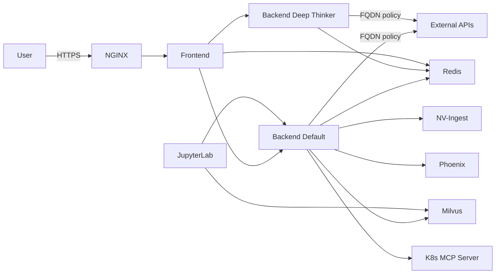
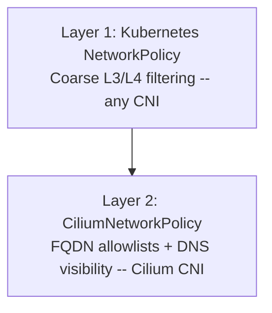
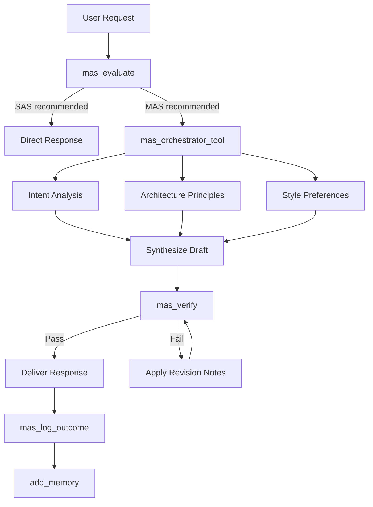

<p align="center">
  
</p>

# Daedalus

A full-stack reference implementation of the [NVIDIA NeMo Agent toolkit](https://github.com/NVIDIA/NeMo-Agent-Toolkit) combining multi-model reasoning, RAG, and a TypeScript/Next.js chat interface.

## Features

- **Dual Agent Workflows**: Tool-calling agent for quick tasks and reasoning agent for comprehensive research
- **RAG Knowledge Bases**: NVIDIA documentation, Kubernetes, veterinary medicine, mental health, and semiconductor analysis
- **Image Processing**: Generation, comprehension, and augmentation via NVIDIA NIM and OpenRouter
- **Document Ingestion**: Upload and query documents using NVIDIA NV-Ingest with Milvus vector storage
- **Cross-Session Memory**: Persistent user preferences and context via Redis
- **MCP Integrations**: GitHub, Kubernetes cluster management, and SerpAPI web search
- **Real-Time Streaming**: Server-sent events for responsive chat interactions
- **Progressive Web App**: Installable on desktop and mobile with offline support and background processing
- **Cross-Device Sync**: Real-time conversation synchronization across all your devices
- **Autonomous Agent**: Background CronJob that curates knowledge, monitors feeds, and builds context without human interaction
- **MAS Architecture Optimizer**: Task-contingent Multi-Agent vs Single-Agent routing with capability gating, decomposability analysis, and a verifier stage
- **Network Security**: Layered Kubernetes and Cilium network policies with FQDN-based egress allowlists

## Architecture



| Service | Description |
|---------|-------------|
| Frontend | Next.js 14, React 18, TypeScript, Tailwind CSS (port 3000) |
| Backend Default | NeMo Agent toolkit with tool-calling agent |
| Backend Deep Thinker | NeMo Agent toolkit with reasoning agent |
| NGINX | Reverse proxy with dynamic upstream resolution and optional restricted mode |
| Redis Stack | Persistence for chat history, sessions, and memory (RedisJSON + RedisSearch) |
| JupyterLab | Interactive notebook environment with access to backend services and Milvus |

## Prerequisites

- Docker and Docker Compose v2
- API keys (see [Configuration](#configuration) below)
- For Kubernetes deployment: Helm 3, kubectl, and a container registry
- For FQDN network policies: [Cilium](https://cilium.io/) CNI with DNS proxy and Hubble enabled

## Quick Start (Docker Compose)

### 1. Create your environment file

```bash
cp .env.template .env
```

Edit `.env` and set at minimum:

```bash
NVIDIA_API_KEY=nvapi-your-key-here        # Required. Get one at https://build.nvidia.com
NVIDIA_INFERENCE_API_KEY=nvapi-your-key    # Required for backend LLMs
```

Optional keys for additional features:

```bash
OPENROUTER_API_KEY=sk-or-...    # Image generation via OpenRouter
SERPAPI_KEY=...                  # Web search via SerpAPI
GITHUB_PAT=ghp_...              # GitHub MCP server integration
AA_API_KEY=...                  # Artificial Analysis benchmarks
```

### 2. Start the stack

```bash
docker compose up --build
```

### 3. Access the application

- **Via NGINX proxy**: http://localhost (recommended)
- **Frontend direct**: http://localhost:3000
- **Backend API**: http://localhost:8000
- **RedisInsight**: http://localhost:8001 (development only)

### 4. Set up authentication

The frontend requires authentication. Edit `frontend/env.example` or pass credentials via your `.env` file:

```bash
AUTH_USERNAME=admin
AUTH_PASSWORD=your-secure-password
AUTH_NAME=Your Name
```

## Kubernetes Deployment

### 1. Build and push images

You need a container registry accessible from your cluster. Build and tag the images:

```bash
# Set your registry (e.g., ghcr.io/yourorg, your-registry.example.com:5050/project)
export REGISTRY=your-registry.example.com/daedalus
export VERSION=0.1.0

# Build images
docker compose build builder backend frontend marketing

# Tag for your registry
docker tag daedalus:builder-${VERSION} ${REGISTRY}:builder-${VERSION}
docker tag daedalus:backend-${VERSION} ${REGISTRY}:backend-${VERSION}
docker tag daedalus:frontend-${VERSION} ${REGISTRY}:frontend-${VERSION}
docker tag daedalus:marketing-${VERSION} ${REGISTRY}:marketing-${VERSION}

# Push
docker push ${REGISTRY}:builder-${VERSION}
docker push ${REGISTRY}:backend-${VERSION}
docker push ${REGISTRY}:frontend-${VERSION}
docker push ${REGISTRY}:marketing-${VERSION}
```

### 2. Update Helm values

Edit `helm/daedalus/values.yaml` and replace the image registry placeholders:

```yaml
images:
  builder:
    repository: your-registry.example.com/daedalus   # <-- your registry
    tag: builder-0.1.0
  backend:
    repository: your-registry.example.com/daedalus   # <-- your registry
    tag: backend-0.1.0
  frontend:
    repository: your-registry.example.com/daedalus   # <-- your registry
    tag: frontend-0.1.0
```

Configure the ingress hostname:

```yaml
ingress:
  hosts:
    - host: your-domain.example.com    # <-- your domain
  tls:
    - secretName: daedalus-tls
      hosts:
        - your-domain.example.com      # <-- your domain
```

Optionally restrict pod scheduling to specific nodes:

```yaml
global:
  nodePlacement:
    allowedNodes: ["node-1", "node-2"]  # <-- your node names, or [] for any
```

### 3. Create secrets

```bash
NAMESPACE=daedalus
RELEASE=daedalus

kubectl create namespace ${NAMESPACE}

# Create backend secrets from your .env file
kubectl -n ${NAMESPACE} create secret generic ${RELEASE}-backend-env \
  --from-env-file=.env

# Create frontend secrets
kubectl -n ${NAMESPACE} create secret generic ${RELEASE}-frontend-env \
  --from-env-file=.env
```

Then reference these secrets in `values.yaml`:

```yaml
backend:
  default:
    env:
      fromSecret: "daedalus-backend-env"
  deepThinker:
    env:
      fromSecret: "daedalus-backend-env"
frontend:
  env:
    fromSecret: "daedalus-frontend-env"
```

### 4. (Optional) TLS setup

Place your TLS certificate and key in `nginx/ssl/`:

```bash
nginx/ssl/tls.crt    # or tls.pem
nginx/ssl/tls.key
```

Create the TLS secret:

```bash
kubectl -n ${NAMESPACE} create secret tls ${RELEASE}-tls \
  --cert=nginx/ssl/tls.crt \
  --key=nginx/ssl/tls.key
```

### 5. Inject backend configurations

The Helm chart can inline the agent YAML configs. Pass them with `--set-file`:

```bash
helm upgrade --install daedalus helm/daedalus \
  -n daedalus \
  --set-file backend.default.config.data=backend/tool-calling-config.yaml \
  --set-file backend.deepThinker.config.data=backend/react-agent-config.yaml \
  -f helm/daedalus/values.yaml \
  --timeout 10m
```

### 6. Verify deployment

```bash
kubectl get all -n daedalus
kubectl get pvc -n daedalus
kubectl logs -f deployment/daedalus-backend-default -n daedalus
```

## Network Security

The Helm chart deploys two layers of network policy that work together.

### Policy Layers



**Layer 1 -- Kubernetes NetworkPolicy** (always active, enforced by any CNI):

- Restricts backend ingress to frontend, nginx, and jupyterlab pods only
- Limits backend egress to DNS, Redis, cross-namespace services, and external HTTPS (port 443 to non-private IPs)
- Frontend and JupyterLab have egress-only policies scoped to required services

**Layer 2 -- CiliumNetworkPolicy** (opt-in via `backend.networkPolicy.cilium.enabled`):

- Replaces the broad `0.0.0.0/0:443` K8s egress rule with explicit FQDN allowlists
- Logs all DNS lookups via Hubble for auditing (`hubble observe --type dns`)
- Supports dual CoreDNS topologies (pod-networked and host-networked)

### Per-Component Policies

| Component | K8s NetworkPolicy | CiliumNetworkPolicy |
|-----------|-------------------|---------------------|
| Backend (default + deep-thinker) | Ingress from frontend/nginx/jupyterlab; egress to DNS, Redis, Milvus, MinIO, NV-Ingest, Phoenix, K8s MCP, external HTTPS | FQDN allowlist for NVIDIA APIs, NVCF control plane, MCP servers, OpenRouter, RSS feeds; separate webscrape policy for broad HTTP/HTTPS |
| Frontend | Egress to backends and Redis only | Same as K8s layer (no external access) |
| JupyterLab | Egress to backends, Redis, Milvus, external HTTP/HTTPS | FQDN allowlist for NVIDIA APIs, NVCF, Python package repos (PyPI, conda) |
| NGINX | Egress to frontend and backends | Same scope; backend access gated by `restrictedMode` |
| All daedalus pods | -- | DNS visibility policy (Hubble audit logging) |

### FQDN Allowlist (Backend)

When Cilium policies are enabled, backend pods can only reach these external domains on port 443:

| Category | Domains |
|----------|---------|
| NVIDIA Inference | `*.api.nvidia.com`, `*.api.nvcf.nvidia.com`, `inference-api.nvidia.com` |
| NVCF Control Plane | `connect.pnats.nvcf.nvidia.com`, `grpc.api.nvcf.nvidia.com`, `spot.gdn.nvidia.com`, `ess.ngc.nvidia.com`, `api.ngc.nvidia.com`, `sqs.*.amazonaws.com` |
| MCP Servers | `mcp.serpapi.com`, `serpapi.com`, `api.github.com`, `github.com`, `api.githubcopilot.com`, `copilot-proxy.githubusercontent.com`, `docs.dynamo.nvidia.com` |
| LLM Routing | `openrouter.ai` |
| RSS Feeds | `feeds.feedburner.com`, `developer.nvidia.com`, `nvidianews.nvidia.com`, `newsletter.semianalysis.com`, `karpathy.bearblog.dev`, `karpathy.github.io` |

The webscrape tool requires broader access and is handled by a separate CiliumNetworkPolicy that allows `0.0.0.0/0` on ports 80/443 (excluding private ranges). This policy can optionally enforce L7 filtering to restrict HTTP methods to GET and HEAD.

Additional domains can be added at deploy time:

```yaml
backend:
  networkPolicy:
    cilium:
      extraFQDNs: ["custom-api.example.com"]
```

### Cilium Prerequisites

The Cilium DNS proxy must be functional for FQDN policies to work. Required Cilium Helm settings:

```yaml
dnsProxy:
  enableTransparentMode: false    # Use L7 proxy redirect (not socket-level interception)
bpf:
  tproxy: true                    # Required for DNS proxy redirect via BPF
hubble:
  enabled: true                   # Required for DNS visibility auditing
```

## Configuration

### Environment Variables

| Variable | Required | Description |
|----------|----------|-------------|
| `NVIDIA_API_KEY` | Yes | NVIDIA API key from [build.nvidia.com](https://build.nvidia.com) |
| `NVIDIA_INFERENCE_API_KEY` | Yes | API key for backend LLM inference |
| `NVIDIA_INFERENCE_BASE_URL` | No | Inference endpoint URL (default: NVIDIA hosted) |
| `NVIDIA_INFERENCE_MODEL` | No | Model name for agent LLM calls |
| `OPENROUTER_API_KEY` | No | OpenRouter key for image generation |
| `SERPAPI_KEY` | No | SerpAPI key for web search |
| `GITHUB_PAT` | No | GitHub personal access token for MCP |
| `AA_API_KEY` | No | Artificial Analysis API key |
| `MILVUS_URI` | No | Milvus vector DB connection URI |
| `MINIO_ACCESS_KEY` | No | MinIO access key for document storage |
| `MINIO_SECRET_KEY` | No | MinIO secret key for document storage |

See `.env.template` for the full list with descriptions.

### Configuration Files

| File | Purpose |
|------|---------|
| `.env.template` | Environment variable template (copy to `.env`) |
| `backend/tool-calling-config.yaml` | Default agent: tools, retrievers, LLMs, MCP servers |
| `backend/react-agent-config.yaml` | Deep thinker agent: reasoning loop configuration |
| `helm/daedalus/values.yaml` | Kubernetes deployment: images, resources, ingress, persistence, network policies |
| `custom-values.yaml` | Production overrides (node placement, Cilium, autonomous agent) |
| `frontend/env.example` | Frontend-specific settings: auth, Redis, API path |

### Backend Agent Configuration

The backend YAML configs use environment variable substitution (`${VAR_NAME}`) for all secrets. API endpoints default to the public [NVIDIA API Catalog](https://build.nvidia.com):

```yaml
# Example: embedder using the public NVIDIA API
embedders:
  milvus_embedder:
    _type: nim
    base_url: https://integrate.api.nvidia.com/v1
    model_name: nvidia/llama-3.2-nv-embedqa-1b-v2
```

If you run self-hosted NIM endpoints, replace `https://integrate.api.nvidia.com/v1` with your endpoint URL.

### Autonomous Agent

The autonomous agent runs as a Kubernetes CronJob and is configured in `values.yaml`:

```yaml
autonomousAgent:
  enabled: true
  schedule: "*/60 * * * *"           # Run every 60 minutes
  userId: "your-username"            # <-- set to your login username
```

The `userId` must match the username you log in with so the agent's memories and conversation history appear in your sidebar under "Deep Thoughts by Daedalus". Its personality and task list are defined in:

- `helm/daedalus/files/autonomous-agent-soul.md` -- identity and areas of curiosity
- `helm/daedalus/files/autonomous-agent-heartbeat.md` -- per-cycle task checklist

#### Personalizing the Autonomous Agent

The soul file (`autonomous-agent-soul.md`) ships with generic defaults. Edit it to reflect your interests so the agent curates research you actually care about.

**User Context section** -- Tell the agent how you like to receive information. Consider:

- What communication style do you prefer? (e.g., bullet points vs. short paragraphs, formal vs. casual)
- Do you have any accessibility or cognitive needs? (e.g., ADHD-friendly formatting, dyslexia-aware fonts)
- How much detail do you want? (e.g., just the conclusion, or the full reasoning)

**Areas of Curiosity section** -- Replace the defaults with topics relevant to your work and interests. Ask yourself:

- What technologies do I use daily? What am I trying to learn?
- What industries or markets do I follow?
- Are there non-technical interests I want the agent to track? (e.g., sports, science, local events)
- What would I be excited to find in my morning briefing?

**Source Code Projects section** -- List the repos you contribute to or depend on. The agent will track releases, issues, and notable changes.

**Boundaries section** -- Set limits on what the agent stores. For example:

- Should it avoid storing speculative or low-confidence information?
- Are there topics it should skip entirely?
- Should it flag certain types of findings for your review before storing?

After editing, redeploy with Helm to pick up the changes. The agent reads the soul file fresh each cycle.

## User Guide

Daedalus includes a built-in **Help** section accessible from the sidebar. Click the Help button to learn about all available features. Below is a summary.

### Getting Started

1. Log in with your credentials.
2. Type a message and press Enter to chat.
3. Use **Shift + Enter** to add new lines without sending.

### AI Modes

| Mode | Best For |
|------|----------|
| **Standard** | Fast answers, quick lookups, simple tasks |
| **Deep Thinker** | Complex research, multi-step analysis, thorough investigation |

Toggle between modes with the **Deep Thinker** button below the chat input.

### What You Can Ask

- **Web search** -- "Search for the latest NVIDIA earnings report"
- **Image generation** -- "Generate an image of a futuristic city at sunset"
- **Image editing** -- Upload an image and ask "Change the background to a beach"
- **Image analysis** -- Upload or capture a photo and ask "What's in this image?"
- **Document Q&A** -- Upload a PDF and ask "Summarize this document"
- **Meeting notes** -- Upload a VTT/SRT transcript for structured notes
- **News** -- "What's the latest from the NVIDIA blog?"
- **Knowledge bases** -- Ask about NVIDIA GPUs, Kubernetes, or other indexed topics

### File Attachments

Click the **paperclip** icon to attach:
- **Images** (PNG, JPG, GIF, WebP) for analysis and OCR
- **Documents** (PDF, DOCX, TXT) for ingestion into a searchable knowledge base
- **Videos** (MP4, WebM, MOV) for frame analysis and transcript processing

Use the **camera** icon to capture photos directly from your device.

### Organizing Conversations

- Create folders via the sidebar folder icon and drag conversations into them
- Search conversations by name or content using the sidebar search bar
- Rename conversations by clicking their name
- Export all conversations as JSON for backup or device transfer

### Settings

Open **Settings** from the sidebar to configure:
- **Theme** -- dark or light mode
- **Chat History** -- include full conversation context for better follow-up answers
- **Background Processing** -- continue AI processing when the screen is locked (PWA)
- **Intermediate Steps** -- see the AI's reasoning, tool calls, and retrieval steps

### Install as App

Daedalus works as a Progressive Web App. Install it for a native-like experience with background processing and offline access to your history.

## Testing

### Frontend

The frontend uses [Vitest](https://vitest.dev/) with jsdom for unit tests. Tests live in `frontend/__tests__/`.

```bash
cd frontend
npm install        # install dependencies first
npm run test       # run tests in watch mode
npm run coverage   # run tests once and generate a coverage report
```

Coverage reports are output in text, JSON, and HTML formats.

### Builder Packages

The `builder/` packages use [pytest](https://pytest.org/) for unit tests. Tests live in `builder/tests/` and cover the pure-Python utility functions across all packages without requiring the full NAT container environment.

```bash
cd builder
uv run --with pytest --with pyyaml --with pydantic --with httpx \
  pytest tests/ -v
```

To include a coverage report:

```bash
uv run --with pytest --with pyyaml --with pydantic --with httpx --with pytest-cov \
  pytest tests/ --cov --cov-report=term-missing
```

The test suite mocks NAT framework imports and other container-only dependencies so tests run locally without Docker.

## Custom Function Packages

The `builder/` directory contains custom NeMo Agent toolkit function packages:

| Package | Description |
|---------|-------------|
| `image_generation` | Text-to-image generation via NVIDIA NIM or OpenRouter |
| `image_comprehension` | Image analysis and OCR |
| `image_augmentation` | Image editing and modification |
| `nat_nv_ingest` | Document ingestion pipeline with Milvus |
| `smart_milvus` | Vector retrieval with reranking |
| `rss_feed` | RSS feed fetching with relevance ranking |
| `webscrape` | Web page content extraction |
| `vtt_interpreter` | Meeting transcript to structured notes |
| `mas_optimizer` | MAS architecture optimizer with capability gating, task analysis, and verifier |
| `nat_helpers` | Geolocation and utility functions |

Install packages in editable mode:

```bash
cd builder
uv pip install -e <package>
```

## MAS Architecture Optimizer

The `mas_optimizer` package implements task-contingent architecture selection based on [Towards a Science of Scaling Agent Systems](https://arxiv.org/abs/2512.08296) (arXiv:2512.08296v2). It decides at runtime whether a request should be handled by a Single-Agent System (SAS) or a centralized Multi-Agent System (MAS) with a verifier stage.

### How It Works



### Decision Gates

Two independent gates must both pass before MAS is engaged:

| Gate | Condition | Paper Reference |
|------|-----------|-----------------|
| **Capability gate** | Estimated SAS accuracy < 0.45 | Capability coefficient beta = -0.404, p < 0.001 |
| **Task analysis** | Decomposability D > 0.35 AND tool count T < 12 | Coordination coefficient beta = -0.267 |

If either gate fails, the agent handles the request directly (SAS), avoiding the coordination overhead that would produce negative returns.

### Registered Tools

The package registers three NAT tools:

| Tool | Purpose |
|------|---------|
| `mas_evaluate` | Runs both gates and returns a JSON architecture recommendation with confidence scores |
| `mas_verify` | Verifier sub-agent that checks draft responses for topic drift, missing content, verbosity, and self-reference coherence. Reduces error amplification from 17.2x to 4.4x |
| `mas_log_outcome` | Logs task outcomes (architecture used, D/T scores, success) for closed-loop capability gate calibration via the memory system |

### Orchestrator Sub-Agent

The `mas_orchestrator_tool` is a `tool_calling_agent` that uses the reasoning LLM to run the centralized MAS protocol:

1. Calls `mas_evaluate` to confirm MAS is appropriate
2. Executes three analysis roles (Intent, Principles, Brevity), each producing a 5-word abstracted summary to stay at the optimal message density (~0.39 msgs/turn)
3. Synthesizes a draft response from the summaries
4. Runs `mas_verify` and applies any revision notes before output
5. Logs the outcome via `mas_log_outcome` for future calibration

### Configuration

All thresholds are configurable in `backend/tool-calling-config.yaml` under the `mas_optimizer_tool` function entry:

```yaml
mas_optimizer_tool:
  _type: mas_optimizer
  sas_accuracy_threshold: 0.45    # Capability gate threshold
  decomposability_threshold: 0.35  # Minimum D score for MAS
  tool_count_threshold: 12         # Maximum T for MAS eligibility
  drift_keywords:                  # Topic drift detection
    - vision language
    - VLM
  required_keywords:               # Required in meta-architecture responses
    - MAS
    - verifier
    - capability gate
  verbosity_ceiling: 2000          # Word count limit for verifier
```

The default thresholds are derived from Tables 4-5 and Section 4.3 of the source paper. Adjust only if re-evaluating on your specific tool configuration.

## Directory Structure

```
daedalus-agent/
  backend/          # NAT YAML configs (tool-calling, react-agent)
  builder/          # Custom NAT function packages
  frontend/         # Next.js app (pages/api/, components/, services/)
  helm/daedalus/    # Kubernetes Helm chart
  marketing/        # Static landing page
  nginx/            # Reverse proxy configuration
  skills/           # Agent skills (NVCF CLI, self-managed deployment)
```

## License

Apache 2.0
