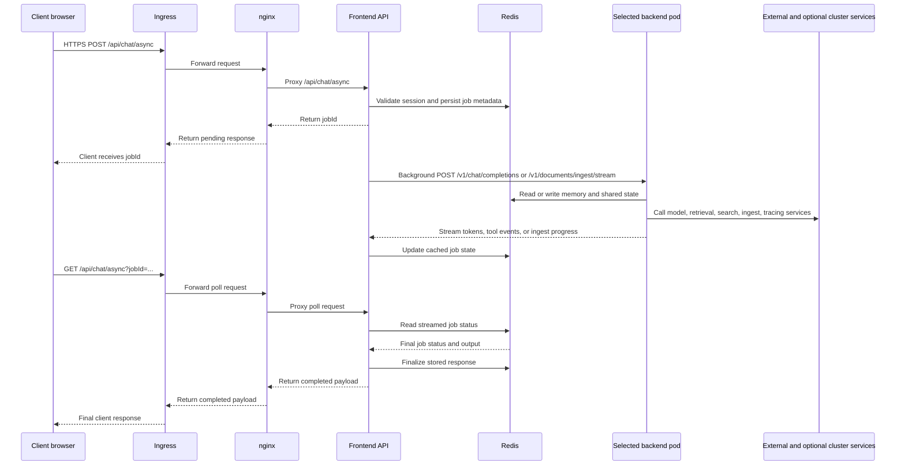

<p align="left">
  
</p>

# Daedalus

Daedalus is a production-ready AI agent platform built on the
[NVIDIA NeMo Agent toolkit](https://github.com/NVIDIA/NeMo-Agent-Toolkit).
It ships as a single deployable stack — chat UI, agent backend,
persistent memory, document retrieval, and autonomous background
research — that runs locally via Docker Compose or at scale on
Kubernetes.

What separates Daedalus from a typical chat wrapper:

- **Autonomous agent worker** — a dedicated background worker that
  researches, follows UI-managed goals, requests approvals, and writes
  durable memory on a configurable schedule
- **Direct tool routing** — one Responses API workflow calls the matching
  leaf tool directly for research, docs, ops, media, documents, and user data
- **Tool-rich execution** — MCP server integrations (GitHub, Kubernetes),
  web search, RSS ingestion, image generation and analysis, document
  ingestion into Milvus, and structured reasoning, all wired into one
  workflow config
- **Production hardening** — Helm chart with PVCs, PDBs, network
  policies, optional Cilium FQDN egress, internal service auth, and
  multi-user authentication out of the box

## Deployment Modes

Daedalus supports two practical ways to run the project.

| Mode                 | What it starts                                                                                    | Best for                                                          |
| -------------------- | ------------------------------------------------------------------------------------------------- | ----------------------------------------------------------------- |
| Local Docker Compose | `frontend`, `backend`, `nginx`, `redis`, plus a `builder` utility container                       | Local development and validating one backend config at a time     |
| Kubernetes via Helm  | Backend, frontend, nginx, redis, redisinsight, autonomous worker, ingress, PVCs, network policies | Persistent multi-user deployments and the full platform footprint |

> [!IMPORTANT]
> The local Compose stack does not start Milvus, NV-Ingest, or Phoenix.
> Those integrations require external services or cluster deployment.

## Quick Start

### 1. Create `.env`

```bash
cp .env.template .env
```

For local Docker Compose, update these values first:

```bash
DEPLOYMENT_MODE=local
NVIDIA_API_KEY=nvapi-...
SESSION_SECRET=<openssl-rand-base64-32>
```

Authentication is required by the frontend. The repo supports either a single user or numbered multi-user entries.

Single-user example:

```bash
AUTH_USERNAME=admin
AUTH_PASSWORD=change-me
AUTH_NAME=Administrator
DAEDALUS_DEFAULT_USER=admin
ADMIN_USERNAME=admin
```

Multi-user example:

```bash
AUTH_USER_1_USERNAME=alice
AUTH_USER_1_PASSWORD=change-me
AUTH_USER_1_NAME=Alice
AUTH_USER_2_USERNAME=bob
AUTH_USER_2_PASSWORD=change-me
AUTH_USER_2_NAME=Bob
DAEDALUS_DEFAULT_USER=alice
ADMIN_USERNAME=alice
```

`SESSION_SECRET` must be unique for every production deployment because it signs identity cookies. Generate one with `openssl rand -base64 32`.

`DAEDALUS_INTERNAL_API_TOKEN` protects trusted frontend-to-backend calls that
carry authenticated identity headers. Helm generates and preserves this token
automatically; for local Compose or non-Helm deployments, leave it empty for
development or set the same value for both frontend and backend.

Useful optional keys:

```bash
SERPAPI_KEY=...
GITHUB_PAT=...
```

`SERPAPI_KEY` enables the configured internet search provider used by the
research agents for web discovery, news, images, shopping, and URL lookup.

### 2. Optionally choose a backend config for local Compose

The Compose stack mounts `backend/tool-calling-config.yaml` by default. To run a different backend config, set `BACKEND_CONFIG_FILE` to the file that should be mounted as `/workspace/config.yaml`.

```bash
BACKEND_CONFIG_FILE=./backend/tool-calling-config.yaml docker compose up --build
```

If you edit the config later, recreate the backend container so NAT reloads the new file.

### 3. Start the local stack

```bash
docker compose up --build
```

### 4. Open the app

- Main app through nginx: `http://localhost`
- Frontend directly: `http://localhost:3000`
- Backend API: `http://localhost:8000`
- RedisInsight (bundled with Redis Stack): `http://localhost:8001`

## Local Development Notes

- Compose is the easiest way to run the full local stack.
- The standalone frontend dev server uses port `5000`, while the production container listens on `3000`.
- In local Compose, choose a backend config with `BACKEND_CONFIG_FILE`; it defaults to `./backend/tool-calling-config.yaml`.
- The `builder` service is a convenience container for working inside the NeMo Agent builder environment; it does not serve traffic.

## Kubernetes Deployment

Use Kubernetes when you want the full Daedalus layout: backend, ingress, PVC-backed storage, the autonomous worker, and optional Cilium policies.

### Preferred Path: `deploy.sh`

The repository includes a deployment script that builds, pushes, creates or updates secrets, and runs Helm.

Before using it:

1. Fill in `.env` with your real secrets.
2. Set `DOCKER_REGISTRY` and `DAEDALUS_VERSION` in `.env`.
3. Update image repositories, ingress hostnames, and any node-placement or persistence settings in [`custom-values.yaml`](custom-values.yaml).
4. If you want the autonomous worker to write memories and dashboard updates for your account, set `autonomousAgent.userId` to a real login username.

Run:

```bash
./deploy.sh
```

Useful flags:

```bash
./deploy.sh --dry-run
./deploy.sh --skip-build
./deploy.sh --skip-tls
./deploy.sh --skip-mcp-preflight
./deploy.sh --mcp-preflight-timeout 30
./deploy.sh --mcp-preflight-kubectl-image curlimages/curl:8.8.0
./deploy.sh -n daedalus -r daedalus
```

`deploy.sh` runs an MCP pre-flight before Helm. It checks every
`streamable-http` MCP server in `backend/tool-calling-config.yaml`, verifies
that configured `include` tools are advertised by `tools/list`, and runs
cluster-local URLs such as `*.svc.cluster.local` from a short-lived Kubernetes
curl pod in the target namespace.

### Manual Helm Path

If you prefer to deploy manually:

```bash
kubectl create namespace daedalus

kubectl -n daedalus create secret generic daedalus-backend-env \
  --from-env-file=.env

kubectl -n daedalus create secret generic daedalus-frontend-env \
  --from-env-file=.env

helm upgrade --install daedalus ./helm/daedalus \
  -n daedalus \
  -f custom-values.yaml \
  --set-file backend.default.config.data=backend/tool-calling-config.yaml \
  --timeout 10m
```

### Full Helm Footprint

The Helm chart can deploy:

- Backend deployment
- Frontend and nginx
- Redis Stack and RedisInsight
- An autonomous-agent worker Deployment
- Ingress, PVCs, PodDisruptionBudget, and network policies
- A chart-managed internal API token shared by frontend and backend
- Optional Cilium FQDN-based egress restrictions

Start with [`helm/daedalus/values.yaml`](helm/daedalus/values.yaml) for defaults and [`custom-values.yaml`](custom-values.yaml) for an opinionated example.

### Kubernetes Request Flow

The main browser chat path in Kubernetes goes through the frontend's async API route. The frontend authenticates the user, stores frontend-managed job metadata in Redis, opens a pinned backend stream, and returns a `jobId` immediately. Normal chat uses `/v1/chat/completions`; uploaded document ingestion uses `/v1/documents/ingest/stream` so progress can be pushed back through Redis and WebSocket. NAT `/v1/workflow/async` is kept only as a legacy document-ingest fallback.


The sequence below shows the primary UI request and response path used by `/api/chat/async`.



> **Direct API access:** Helm defaults to `nginx.config.restrictedMode=true`,
> which forces browser and API traffic through the authenticated frontend. Set
> `nginx.config.restrictedMode=false` only when you intentionally want nginx
> to proxy `/chat/*`, `/generate/*`, and `/v1/*` directly to the backend.

### Document Ingestion and Milvus Collections

Uploaded-document ingestion can target either user-scoped collections or
allow-listed shared collections. Both collection classes intentionally live in
the same Milvus database; the distinction is policy and naming, not a separate
database boundary.

The shared upload targets are `kubernetes`, `mentalhealth`, `nvidia`,
`semianalysis`, and `vetpartner`. Other arbitrary collection names are scoped
to the authenticated user before they reach Milvus. Ingestion requests carry
`collection_scope` (`shared` or `user`) plus provenance metadata such as
uploader, source, target collection, database name, and timestamp. The backend
rejects scope mismatches so accidental writes to shared corpora are caught
before ingestion.

For implementation details, see
[`frontend/pages/api/milvus/README.md`](frontend/pages/api/milvus/README.md)
and [`builder/nat_nv_ingest/README.md`](builder/nat_nv_ingest/README.md).

## Backend Workflows

The backend configuration lives at [`backend/tool-calling-config.yaml`](backend/tool-calling-config.yaml) and covers tool use, retrieval, memory, MCP integrations, image tooling, and reasoning. It includes the custom packages from `builder/` and relies heavily on environment-variable substitution for secrets and endpoints. Local Compose mounts this file directly, and Helm deployments should pass the same file with `--set-file backend.default.config.data=backend/tool-calling-config.yaml`.

The workflow uses one top-level Responses API agent with a direct leaf-tool
surface. Concise factual questions use retrievers, curated feeds, search, and
scraping directly; comprehensive reports, broad surveys, strategy work, and
multi-section comparisons use the same direct tools with source planning, plan
approval for expensive/open-ended research, source-ledger tracking, targeted
claim verification, and citation auditing before returning a report. The
frontend can pass per-message `sourcePolicy` metadata that becomes a hidden
`[SOURCE_POLICY]` control message for source inclusion/exclusion, retrieval
budget, and plan-approval requirements.

## Frontend Capabilities

The frontend includes:

- Frontend-managed async chat with pinned backend streaming
- Autonomy dashboard for worker status, goals, runs, feed items, and approvals
- Authentication backed by Redis
- File attachments for images, documents, and videos
- Direct document ingestion with streamed progress
- Doc-to-Markdown: download an entire uploaded document as a Markdown file (`POST /v1/documents/markdown`)
- Conversation folders, export and import, and search
- Real-time sync and usage tracking APIs
- PWA support and offline assets
- A built-in Help dialog for end users

For frontend-specific details, see [`frontend/README.md`](frontend/README.md).

## Custom Builder Packages

The `builder/` directory contains reusable NeMo Agent functions, helpers, and standalone modules that patch NAT at startup.
The `skills/` directory includes Daedalus runtime skills plus the upstream
NeMo Agent Toolkit v1.7 coding-agent skills (`nat-*` and `skill-evolution`).
NeMo Agent Toolkit implementation requests route through `nat-user-rules` first,
then the focused skill for workflow YAML, custom functions/tools, evals,
telemetry, MCP, or serving work.

| Name                 | Type    | Purpose                                                               |
| -------------------- | ------- | --------------------------------------------------------------------- |
| `agent_skills`       | package | Discovers and runs repo-packaged skills                               |
| `autonomous_agent`   | package | Long-running autonomous worker, Redis state store, and prompt runtime |
| `content_distiller`  | package | Summarization and extraction helpers                                  |
| `visual_media`       | package | Unified text-to-image, image edit, and image/video analysis           |
| `nat_helpers`        | package | Shared helpers such as geolocation and image utilities                |
| `nat_nv_ingest`      | package | Unified user-document ingestion, search, and listing                  |
| `rss_feed`           | package | RSS fetching, reranking, and scraping                                 |
| `serpapi_search`     | package | Search integration                                                    |
| `smart_milvus`       | package | Milvus retrieval, domain routing, and reranking                       |
| `source_verifier`    | package | Source planning, claim verification, and citation auditing            |
| `user_interaction`   | package | Structured clarification, plan approval, and confirmation prompts     |
| `vtt_interpreter`    | package | Transcript-to-notes processing                                        |
| `webscrape`          | package | Web page extraction                                                   |
| `entrypoint.py`      | module  | Custom NAT entrypoint with Starlette compatibility shims              |
| `llm_diagnostics.py` | module  | OpenAI SDK logging and timeout enforcement for LLM client resilience  |
| `mcp_patches.py`     | module  | Bounded MCP startup, OAuth bootstrap, approval, and logging patches   |

Several packages include their own README files under `builder/`.

### Calibrated source verification

`source_verifier_tool.verify_claim` can use a fine-tuned Fireworks classifier
instead of a generative LLM for its verdict. Set `FIREWORKS_API_KEY` and
`FIREWORKS_SOURCE_VERIFIER_MODEL`; otherwise it automatically falls back to
the configured fast LLM. The classifier should be trained to return exactly
one of the compact labels configured in
[`backend/tool-calling-config.yaml`](backend/tool-calling-config.yaml): `S`
(supported), `P` (partially supported), `U` (unsupported), or `I`
(insufficient context). The tool reads the selected label's first-token
log-probability as the calibrated confidence and includes classifier metadata
in the normal verification JSON response. Confirm the labels are single tokens
for the model tokenizer, as described in the
[Fireworks classifier guide](https://fireworks.ai/blog/Finetuning-LLMs-as-Classifiers).

## Autonomous Agent

The Helm chart enables an autonomous background agent by default. It runs as a dedicated worker Deployment, using Redis as its control plane: the UI stores config, goals, queued runs, events, feed items, approvals, and cancellation flags, while the worker consumes the queue and publishes updates back through the existing WebSocket sync channel.

The design follows the useful parts of Hermes-style autonomy: a persistent agent loop, stable identity and memory context, explicit goals, structured run output, and approval gates. Daedalus intentionally keeps the UI as the only human interaction point; there are no Slack, Discord, or other third-party messaging surfaces.

### Runtime Behavior

- The worker runs `python -m autonomous_agent.worker` from the builder image.
- Scheduled runs are controlled by `autonomousAgent.worker.intervalSeconds` and can be changed in the Autonomy dashboard.
- Manual runs are queued from the Autonomy dashboard, which writes to the Redis queue the worker consumes.
- The worker calls the backend workflow at `autonomousAgent.backendApiPath` (defaults to `/v1/workflow/async`) and writes structured feed items plus workspace updates.
- Destructive, irreversible, credential-related, send/merge/delete/scale/uninstall, or memory-delete actions must request confirmation. The run pauses and the dashboard shows a pending approval.
- A Redis lease with heartbeat prevents multiple worker replicas from running the same configured user concurrently.

### UI Control Plane

Open the app and select the **Autonomy** tab. The dashboard provides:

- Pause and resume for scheduled autonomous work
- Run-now and cancel controls
- Interval editing
- Goal creation
- Structured feed review
- Recent run and event history
- Pending action approvals

Important settings:

- `autonomousAgent.enabled`
- `autonomousAgent.worker.intervalSeconds`
- `autonomousAgent.worker.pollIntervalSeconds`
- `autonomousAgent.worker.leaseTtlSeconds`
- `autonomousAgent.replicas`
- `autonomousAgent.suspend`
- `autonomousAgent.userId`
- `autonomousAgent.backendApiPath`
- `autonomousAgent.requestTimeout`

The worker seeds its first-run workspace from built-in defaults in
[`builder/autonomous_agent/src/autonomous_agent/prompt.py`](builder/autonomous_agent/src/autonomous_agent/prompt.py).
After that, mutable workspace sections live in Redis and are updated by the
worker itself.

## Observability

`backend/tool-calling-config.yaml` sends traces to Phoenix by default through
`general.telemetry.tracing.phoenix`, using `DAEDALUS_PHOENIX_ENDPOINT` and
`PHOENIX_PROJECT_NAME`.

`.env.template` also documents the v1.7 Arize AX exporter variables
(`ARIZE_SPACE_ID`, `ARIZE_API_KEY`, `ARIZE_PROJECT_NAME`, and
`ARIZE_USE_EU_REGION`). Use those in an Arize-specific backend config or CLI
override; the default config stays on Phoenix so deployments without hosted
Arize credentials still start cleanly.

## Network Security

The Helm chart supports two layers of traffic control for Kubernetes deployments.

- Kubernetes `NetworkPolicy` for coarse ingress and egress control
- Optional `CiliumNetworkPolicy` resources for FQDN-based egress allowlists and DNS visibility

The Cilium layer is disabled by default in [`helm/daedalus/values.yaml`](helm/daedalus/values.yaml) and enabled in the example [`custom-values.yaml`](custom-values.yaml).

Backend ingress is limited to the chart-managed frontend and nginx pods by default. The chart no longer opens the backend to every pod in the release namespace. If another namespace needs access, add it explicitly:

```yaml
backend:
  networkPolicy:
    extraIngressNamespaces:
      - name: monitoring
        ports:
          - port: 8000
            protocol: TCP
```

Backend egress to known in-cluster dependencies such as Redis, Milvus,
NV-Ingest, Phoenix, and the Kubernetes MCP server is rendered by default. Add
extra namespace egress the same way:

```yaml
backend:
  networkPolicy:
    extraEgressNamespaces:
      - name: llm-gateway
        ports:
          - port: 8000
            protocol: TCP
```

When Cilium is enabled, the broad Kubernetes `0.0.0.0/0:443` egress fallback is
not rendered. External access is then controlled by the Cilium FQDN allowlist
and the optional `backend.networkPolicy.cilium.webscrape` rule. Disable
`webscrape.enabled` if you do not want broad HTTP/HTTPS fetches for the
webscrape tool.

Frontend-to-backend identity headers are protected by
`DAEDALUS_INTERNAL_API_TOKEN`. Helm creates `<release>-daedalus-internal-api`
and injects the token into both pods. Non-Helm deployments should set the same
token on frontend and backend; if it is unset, backend direct endpoints accept
the legacy identity header behavior for local development.

## Development

### Frontend Only

```bash
cd frontend
node --version # use Node.js 22
npm ci --legacy-peer-deps
npm run dev
```

The standalone dev server runs on `http://localhost:5000`.

### Builder Tests

```bash
cd builder
uv pip install -e ".[test]"
uv run python -m pytest -v
```

With coverage:

```bash
cd builder
uv pip install -e ".[test]"
uv run python -m pytest --cov --cov-report=term-missing
```

### Frontend Tests

```bash
cd frontend
npm ci --legacy-peer-deps
npm test -- --run
npm run coverage
```

### Local CI Mirror

The repo includes a [`Makefile`](Makefile) that mirrors the CI workflow jobs.
Run a single job locally with `make builder`, `make frontend`, `make helm`,
`make docker`, `make security`, or `make evals`. Run them all with `make ci`.

## Troubleshooting

### Backend Config Override Is Missing

The local backend container mounts `/workspace/config.yaml` from `BACKEND_CONFIG_FILE`, defaulting to `./backend/tool-calling-config.yaml`. If you override `BACKEND_CONFIG_FILE`, make sure that file exists before starting Compose.

### Login Page Loads But No User Can Sign In

Make sure you defined either:

- `AUTH_USERNAME` and `AUTH_PASSWORD`, or
- `AUTH_USER_1_USERNAME`, `AUTH_USER_1_PASSWORD`, and related numbered variables

Also set `DAEDALUS_DEFAULT_USER` to a real configured username if you want memory and background-agent activity associated with that user.

### Local Compose Cannot Reach Milvus or NV-Ingest

That is expected unless you provide those external services yourself. The local stack only starts the Daedalus-facing containers.

### Milvus Authentication Failures During Ingestion

If NvIngest document ingestion fails with `StatusCode.UNAUTHENTICATED` and `auth check failure`, set Milvus credentials in the backend environment secret: `MILVUS_USERNAME` and `MILVUS_PASSWORD`, or `MILVUS_TOKEN` when your token is formatted as `username:password`. The ingestion path passes those credentials to NvIngest's Milvus upload stage and to direct Milvus search and list clients.

## Key Configuration Files

| File                                                                   | Purpose                              |
| ---------------------------------------------------------------------- | ------------------------------------ |
| [`README.md`](README.md)                                               | Top-level setup and deployment guide |
| [`.env.template`](.env.template)                                       | Main environment variable template   |
| [`docker-compose.yaml`](docker-compose.yaml)                           | Local multi-service stack            |
| [`backend/tool-calling-config.yaml`](backend/tool-calling-config.yaml) | Backend workflow configuration       |
| [`frontend/env.example`](frontend/env.example)                         | Frontend API path example            |
| [`helm/daedalus/values.yaml`](helm/daedalus/values.yaml)               | Default Helm values                  |
| [`custom-values.yaml`](custom-values.yaml)                             | Example production overrides         |
| [`deploy.sh`](deploy.sh)                                               | Build, push, and deploy helper       |
| [`Makefile`](Makefile)                                                 | Local mirror of CI workflow jobs     |

## Documentation Map

Use these docs when you want more component-level detail than this top-level guide provides.

| Document                                                                     | Focus                                                          |
| ---------------------------------------------------------------------------- | -------------------------------------------------------------- |
| [`frontend/README.md`](frontend/README.md)                                   | Frontend architecture, async job flow, Redis state, and PWA    |
| [`helm/daedalus/README.md`](helm/daedalus/README.md)                         | Helm chart footprint, values, and Kubernetes traffic model     |
| [`evals/README.md`](evals/README.md)                                         | Local evaluation harness for routing, factuality, and workflow |
| [`frontend/pages/api/milvus/README.md`](frontend/pages/api/milvus/README.md) | Frontend-side Milvus collection helper                         |
| [`builder/visual_media/README.md`](builder/visual_media/README.md)           | Unified image generate / edit / analyze tool                   |
| [`builder/nat_nv_ingest/README.md`](builder/nat_nv_ingest/README.md)         | User-document ingestion, search, and listing                   |
| [`builder/rss_feed/README.md`](builder/rss_feed/README.md)                   | Feed-specific RSS retrieval and scraping                       |
| [`builder/smart_milvus/README.md`](builder/smart_milvus/README.md)           | Milvus retrieval and reranking behavior                        |

## Repository Layout

```text
daedalus-agent/
  backend/          NeMo Agent workflow YAML files
  builder/          Custom Python packages and tests
  evals/            Local evaluation harness
  frontend/         Next.js application
  helm/daedalus/    Helm chart and embedded agent assets
  nginx/            Reverse-proxy configuration
  skills/           Repo-packaged agent skills, including NeMo Agent Toolkit v1.7 coding skills
```

## License

Apache 2.0
