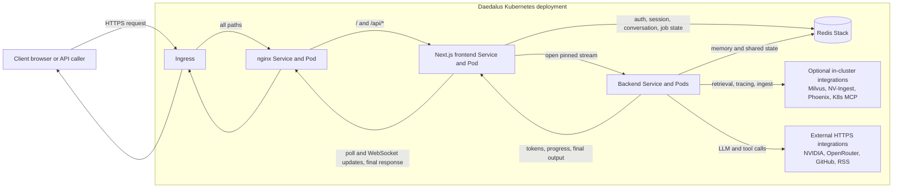
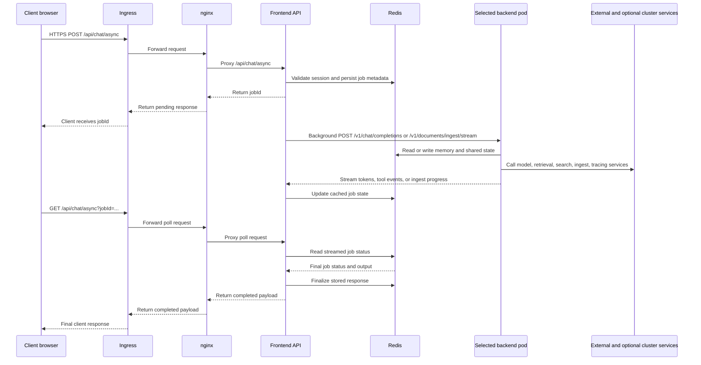

<p align="left">
  
</p>

# Daedalus

Daedalus is a production-ready AI agent platform built on the
[NVIDIA NeMo Agent toolkit](https://github.com/NVIDIA/NeMo-Agent-Toolkit).
It ships as a single deployable stack — chat UI, agent backend,
persistent memory, document retrieval, and autonomous background
research — that runs locally via Docker Compose or at scale on
Kubernetes.

What separates Daedalus from a typical chat wrapper:

- **Autonomous agent worker** — a dedicated background worker that
  researches, follows UI-managed goals, stays within non-interactive
  permissions, and writes durable memory on a configurable schedule
- **Direct tool routing** — one Responses API workflow calls the matching
  leaf tool directly for research, docs, ops, media, documents, and user data
- **Tool-rich execution** — MCP server integrations (GitHub, Kubernetes),
  web search, RSS ingestion, image generation and analysis, document
  ingestion into Milvus, and structured reasoning, all wired into one
  workflow config
- **Production hardening** — Helm chart with PVCs, PDBs, network
  policies, optional Cilium FQDN egress, internal service auth, and
  multi-user authentication out of the box

## Deployment Modes

Daedalus supports two practical ways to run the project.

| Mode                 | What it starts                                                              | Best for                                                          |
| -------------------- | --------------------------------------------------------------------------- | ----------------------------------------------------------------- |
| Local Docker Compose | `frontend`, `backend`, `nginx`, `redis`, plus a `builder` utility container | Local development and validating one backend config at a time     |
| Kubernetes via Helm  | Backend, frontend, nginx, Redis, autonomous worker, ingress, PVCs, policies | Persistent multi-user deployments and the full platform footprint |

> [!IMPORTANT]
> The local Compose stack does not start Milvus, NV-Ingest, or Phoenix.
> Those integrations require external services or cluster deployment.

## Quick Start

### 1. Create `.env`

```bash
cp .env.template .env
```

For local Docker Compose, update these values first:

```bash
DEPLOYMENT_MODE=local
NVIDIA_API_KEY=nvapi-...
SESSION_SECRET=<openssl-rand-base64-32>
```

Authentication is required by the frontend. The repo supports either a single user or numbered multi-user entries.

Single-user example:

```bash
AUTH_USERNAME=admin
AUTH_PASSWORD=change-me
AUTH_NAME=Administrator
DAEDALUS_DEFAULT_USER=admin
ADMIN_USERNAME=admin
```

Multi-user example:

```bash
AUTH_USER_1_USERNAME=alice
AUTH_USER_1_PASSWORD=change-me
AUTH_USER_1_NAME=Alice
AUTH_USER_2_USERNAME=bob
AUTH_USER_2_PASSWORD=change-me
AUTH_USER_2_NAME=Bob
DAEDALUS_DEFAULT_USER=alice
ADMIN_USERNAME=alice
```

`SESSION_SECRET` must be unique for every production deployment because it signs identity cookies. Generate one with `openssl rand -base64 32`.

`DAEDALUS_INTERNAL_API_TOKEN` protects trusted frontend-to-backend calls that
carry authenticated identity headers. Helm generates and preserves this token
automatically. Non-Helm deployments must set the same value for frontend and
backend. Local Compose alone opts into tokenless development explicitly with
`ALLOW_INSECURE_INTERNAL=1`, and its backend host port is loopback-bound.

Production durable memory uses the separately deployed Hindsight service. See
the [Hindsight memory integration and rollout runbook](docs/hindsight-memory-integration.md)
for identity isolation, validation, operations, and recovery.

Useful optional keys:

```bash
GITHUB_PAT=...
```

### 2. Confirm the backend config for local Compose

The Compose stack mounts `backend/tool-calling-config.yaml` by default. The
canonical configuration uses the OpenAI-compatible `/responses` provider API:

```bash
BACKEND_CONFIG_FILE=./backend/tool-calling-config.yaml docker compose up --build
```

The frontend still uses the backend's OpenAI-compatible
`/v1/chat/completions` route; Responses is the outbound model-provider API.
The former `tool-calling-responses-config.yaml` path remains a small inherited
compatibility alias. If you edit the canonical config, recreate the backend
container so NAT reloads it.

### 3. Start the local stack

```bash
docker compose up --build
```

### 4. Open the app

- Main app through nginx: `http://localhost`
- Frontend directly: `http://localhost:3000`
- Backend API: `http://localhost:8000`

## Local Development Notes

- Compose is the easiest way to run the full local stack.
- The standalone frontend dev server uses port `5000`, while the production container listens on `3000`.
- Compose publishes the backend API on host loopback only; use nginx for access from other machines.
- In local Compose, choose a backend config with `BACKEND_CONFIG_FILE`; it defaults to `./backend/tool-calling-config.yaml`.
- The `builder` service is a convenience container for working inside the NeMo Agent builder environment; it does not serve traffic.

## Kubernetes Deployment

Use Kubernetes when you want the full Daedalus layout: backend, ingress, PVC-backed storage, the autonomous worker, and optional Cilium policies.

### Preferred Path: `deploy.sh`

The repository includes a deployment script that builds, pushes, creates or updates secrets, and runs Helm.

Before using it:

1. Fill in `.env` with your real secrets.
2. Set `DOCKER_REGISTRY` and `DAEDALUS_VERSION` in `.env`.
3. Update image repositories, ingress hostnames, and any node-placement or persistence settings in [`custom-values.yaml`](custom-values.yaml).
4. If you want the autonomous worker to write memories and dashboard updates for your account, set `autonomousAgent.userId` to a real login username.

Run:

```bash
./deploy.sh
```

Useful flags:

```bash
./deploy.sh --dry-run
./deploy.sh --skip-build
./deploy.sh --skip-tls
./deploy.sh --skip-mcp-preflight
./deploy.sh --skip-rag-preflight
./deploy.sh --skip-rag-secret-sync
./deploy.sh --mcp-preflight-timeout 30
./deploy.sh --mcp-preflight-kubectl-image curlimages/curl:8.8.0
./deploy.sh --backend-config backend/tool-calling-config.yaml
./deploy.sh -n daedalus -r daedalus
```

`deploy.sh` runs an MCP pre-flight before Helm. It checks every
`streamable-http` MCP server in `backend/tool-calling-config.yaml`, verifies
that configured `include` tools are advertised by `tools/list`, and runs
cluster-local URLs such as `*.svc.cluster.local` from a short-lived Kubernetes
curl pod in the target namespace. Authenticated cluster-local probes read API
keys from the same backend Secret through `envFrom`; key values are never
placed in command arguments or printed.

For Kubernetes RAG deployments, `deploy.sh` also mirrors the authoritative
Milvus and MinIO credentials into namespace-local workload Secrets, then runs
authenticated `list_collections` and `has_collection` probes with the exact
rendered backend configuration. The second call exercises Milvus's
`DescribeCollection` authorization path rather than accepting a public-role
collection listing as proof of RAG access. The same preflight verifies TCP
reachability for the configured embedding and reranker URLs from a pod carrying
the backend policy labels. For Cilium namespace egress, configure the target
container port after Service translation (for example, the retriever Services
expose `8000` but their adapter pods receive traffic on `8080`). The defaults
match `daedalus-context`:

- `daedalus/milvus-root-credentials`, key `password`, username `root`
- `daedalus/milvus-minio-credentials`, keys `accesskey` and `secretkey`

Override the source contract by exporting `MILVUS_AUTH_SOURCE_NAMESPACE`,
`MILVUS_AUTH_SOURCE_SECRET`, `MILVUS_AUTH_SOURCE_PASSWORD_KEY`,
`MILVUS_AUTH_USERNAME`, `MINIO_AUTH_SOURCE_NAMESPACE`,
`MINIO_AUTH_SOURCE_SECRET`, `MINIO_AUTH_SOURCE_ACCESS_KEY`, and
`MINIO_AUTH_SOURCE_SECRET_KEY`. The copies are `<release>-milvus-auth`,
`<release>-minio-auth`, and `<release>-document-objects` in the Daedalus
namespace. Secret payloads are sent directly to the Kubernetes API and never
passed as Helm values. Use `--skip-rag-secret-sync` only when another Secret
controller provisions those target Secrets.

After synchronization, the deploy reads only each target Secret's Kubernetes
`metadata.resourceVersion` and places those opaque versions in pod-template
annotations. A credential rotation therefore changes the backend pod template;
the document-object version also changes the frontend pod template. Credential
bytes and hashes are not stored in Helm release metadata.

The production RAG contract uses Milvus database `default`, document bucket
`nv-ingest`, and the in-cluster endpoints
`milvus.daedalus.svc.cluster.local:19530`,
`milvus-minio.daedalus.svc.cluster.local:9000`, and
`nv-ingest.daedalus.svc.cluster.local:7670`. Keep the query embedding model,
vector dimension, vector/content field names, and distance metric compatible
with the URL-ingest writer; changing only the query side can leave a healthy
deployment that cannot search an existing collection correctly.

After rollout, verify both the workload and the authenticated RAG dependency:

```bash
kubectl -n daedalus rollout status deployment/daedalus-backend-default
kubectl -n daedalus get secret \
  daedalus-milvus-auth daedalus-minio-auth daedalus-document-objects
kubectl -n daedalus port-forward service/daedalus-backend-default 18000:8000
# In another shell:
curl -fsS http://127.0.0.1:18000/health/ready
```

The readiness response must report RAG ready. A successful TCP connection or
`list_collections` result alone is insufficient because the production path
also needs `DescribeCollection`, exercised by `has_collection`.

### Adding or expanding an MCP server

MCP exposure and approval follow one configuration rule:

- Omitting `include` (or leaving it empty) exposes every tool advertised by the
  server and authorizes those tools without a human approval credential. Use
  this only for operator-trusted MCP groups whose full capability surface is
  intentional, such as the unrestricted Kubernetes and UniFi integrations.
  The runtime still disables automatic reconnect/replay around operations that
  look mutating, so an ambiguous timeout cannot duplicate a side effect.
- A non-empty `include` is an explicit allowlist. Only those tools are exposed,
  and each exposed tool must be classified:

- A verified read-only tool must be added to its function group's exact
  `include` list and marked beside the tool under `tool_overrides`:

  ```yaml
  function_groups:
    example_mcp_server:
      _type: mcp_client
      include: [get_status]
      tool_overrides:
        get_status:
          approval_policy: read_only
  ```

  `backend/tool-calling-config.yaml` is the only repository configuration
  surface for this decision. The Responses overlay inherits these declarations
  and never duplicates them. The pinned runtime adapter loads the effective
  declarations before installing the approval gate. NAT ignores this
  Daedalus-owned extension itself.

- In an explicitly allowlisted group, a mutating, irreversible, or unreviewed
  tool must never be marked
  `read_only`. Omit `approval_policy`, or use
  `approval_policy: approval_required` when an explicit marker improves
  clarity. The call remains fail-closed until
  `confirm_action` issues a credential bound to the exact server, tool, and
  final arguments. Unknown policy values and policy entries outside `include`
  fail backend startup.
- For static API-key MCP providers, backend startup logs only whether the
  required environment variable is non-empty (`configured=True|False`), never
  the value. This verifies deployment injection, not upstream acceptance; a
  remote 401/403 or MCP error is the signal to investigate the credential or
  server policy.

Authentication scope is part of the server contract:

- Kubernetes and UniFi are shared-credential services. Their API key comes
  from the backend Secret and is never user-authorized. A 401/403 is an
  operator incident; `confirm_action` cannot repair it and the agent must not
  retry it in a loop.
- Gmail, Google Calendar, and Docs use one shared OAuth
  client configuration with per-user authorization. Google publishes each MCP
  as a separate protected resource, so the first use of each service can still
  require its own consent. NAT stores the resulting tokens in separate
  Redis-backed object-store buckets keyed by the authenticated user, so they
  survive restarts and work across chats and backend replicas. The frontend
  records each short-lived OAuth state in Redis, sends the callback to the exact
  backend pod that initiated the flow, and exposes one Connections view for all
  three saved authorizations. Missing, expired, or refresh-rejected tokens produce
  an `oauth_required` stream event with a service-specific Connect/Reopen action.
  The approval policy must allow a read-only call to reach the provider
  challenge or that reauthorization event cannot be created.
- Give each new per-user OAuth provider its own token bucket. NAT's token key
  is derived from user identity, so sharing a bucket between providers would
  allow one provider's token record to replace another's.

Provider-side quota, billing, rate-limit, and shared server-credential failures
are not user OAuth problems. Tools must return them explicitly, and the agent
must disclose the affected provider in its final response even if it can use a
fallback. In particular, Perplexity `insufficient_quota` is an operator-managed
usage limit; retrying or asking the user to authorize cannot repair it.

### Manual Helm Path

If you prefer to deploy manually:

```bash
kubectl create namespace daedalus

kubectl -n daedalus create secret generic daedalus-backend-env \
  --from-env-file=.env

kubectl -n daedalus create secret generic daedalus-frontend-env \
  --from-env-file=.env

helm upgrade --install daedalus ./helm/daedalus \
  -n daedalus \
  -f custom-values.yaml \
  --set-file backend.default.config.data=backend/tool-calling-config.yaml \
  --set-file backend.default.config.baseData=backend/tool-calling-config.yaml \
  --timeout 10m
```

### Full Helm Footprint

The Helm chart can deploy:

- Backend deployment
- Frontend and nginx
- Redis Stack using the repository-owned, security-updated runtime image
- An autonomous-agent worker Deployment
- Ingress, PVCs, PodDisruptionBudget, and network policies
- A chart-managed internal API token shared by frontend and backend
- Optional Cilium FQDN-based egress restrictions

Start with [`helm/daedalus/values.yaml`](helm/daedalus/values.yaml) for defaults and [`custom-values.yaml`](custom-values.yaml) for an opinionated production example. RedisInsight isn't shipped. Use an authenticated, time-bounded local client through `kubectl port-forward` when interactive Redis inspection is required. The [Helm Redis runbook](helm/daedalus/README.md#redis-acl-tls-and-rotation) covers ACL credential and TLS certificate rotation.

### Kubernetes Request Flow

The main browser chat path in Kubernetes goes through the frontend's async API route. The frontend authenticates the user, stores frontend-managed job metadata in Redis, opens a pinned backend stream, and returns a `jobId` immediately. Normal chat uses `/v1/chat/completions`; uploaded document ingestion always uses `/v1/documents/ingest/stream` so progress can be pushed back through Redis and WebSocket.


```mermaid
flowchart LR
    Client[Client browser or API caller]

    subgraph Cluster[Daedalus Kubernetes deployment]
        Ingress[Ingress]
        Nginx[nginx Service and Pod]
        Frontend[Next.js frontend Service and Pod]
        Backend[Backend Service and Pods]
        Redis[(Redis Stack)]
        Integrations[Optional in-cluster integrations<br/>Milvus, NV-Ingest, Phoenix, K8s MCP]
        External[External HTTPS integrations<br/>NVIDIA, OpenRouter, GitHub, RSS]
    end

    Client -->|HTTPS request| Ingress
    Ingress -->|all paths| Nginx
    Nginx -->|/ and /api/*| Frontend
    Frontend -->|auth, session, conversation, job state| Redis
    Frontend -->|open pinned stream| Backend
    Backend -->|memory and shared state| Redis
    Backend -->|retrieval, tracing, ingest| Integrations
    Backend -->|LLM and tool calls| External
    Backend -->|tokens, progress, final output| Frontend
    Frontend -->|poll and WebSocket updates, final response| Nginx
    Nginx --> Ingress
    Ingress --> Client
```

The sequence below shows the primary UI request and response path used by `/api/chat/async`.


```mermaid
sequenceDiagram
    participant C as Client browser
    participant I as Ingress
    participant N as nginx
    participant F as Frontend API
    participant R as Redis
    participant B as Selected backend pod
    participant X as External and optional cluster services

    C->>I: HTTPS POST /api/chat/async
    I->>N: Forward request
    N->>F: Proxy /api/chat/async
    F->>R: Validate session and persist job metadata
    F-->>N: Return jobId
    N-->>I: Return pending response
    I-->>C: Client receives jobId
    F->>B: Background POST /v1/chat/completions or /v1/documents/ingest/stream
    B->>R: Read or write memory and shared state
    B->>X: Call model, retrieval, search, ingest, tracing services
    B-->>F: Stream tokens, tool events, or ingest progress
    F->>R: Update cached job state
    C->>I: GET /api/chat/async?jobId=...
    I->>N: Forward poll request
    N->>F: Proxy poll request
    F->>R: Read streamed job status
    R-->>F: Final job status and output
    F->>R: Finalize stored response
    F-->>N: Return completed payload
    N-->>I: Return completed payload
    I-->>C: Final client response
```

> **Direct API access:** Helm defaults to `nginx.config.restrictedMode=true`,
> which forces browser and API traffic through the authenticated frontend. Set
> `nginx.config.restrictedMode=false` only when you intentionally want nginx
> to proxy `/chat/*`, `/generate/*`, and `/v1/*` directly to the backend.

### Document Ingestion and Milvus Collections

Uploaded-document ingestion can target either user-scoped collections or
allow-listed shared collections. Both collection classes intentionally live in
the same Milvus database; the distinction is policy and naming, not a separate
database boundary.

The shared upload targets are `kubernetes`, `mentalhealth`, `nvidia`,
`semianalysis`, and `vetpartner`. Other arbitrary collection names are scoped
to the authenticated user before they reach Milvus. Ingestion requests carry
`collection_scope` (`shared` or `user`) plus provenance metadata such as
uploader, source, target collection, database name, and timestamp. The backend
rejects scope mismatches so accidental writes to shared corpora are caught
before ingestion.

Legacy normalized private collections have an authenticated, operator-only
migration command at
[`builder/milvus_collection_migration.py`](builder/milvus_collection_migration.py).
It migrates one reviewed subject at a time, refuses ambiguous ownership, and
doesn't expose migration actions to the agent. See the private collection
migration runbook in
[`builder/nat_nv_ingest/README.md`](builder/nat_nv_ingest/README.md#private-collection-migration-runbook)
before cutover.

For implementation details, see
[`frontend/pages/api/milvus/README.md`](frontend/pages/api/milvus/README.md)
and [`builder/nat_nv_ingest/README.md`](builder/nat_nv_ingest/README.md).

## Backend Workflows

The canonical backend configuration lives at [`backend/tool-calling-config.yaml`](backend/tool-calling-config.yaml), uses the Responses API by default, and covers tool use, retrieval, memory, MCP integrations, image tooling, and reasoning. [`backend/tool-calling-responses-config.yaml`](backend/tool-calling-responses-config.yaml) is retained as an inherited compatibility alias. The workflow includes the custom packages from `builder/` and relies heavily on environment-variable substitution for secrets and endpoints.

The workflow uses one top-level, per-user Responses API agent with a direct
leaf-tool surface. It preserves full chat history, top-level instructions,
streaming, and per-user OAuth isolation. Concise factual questions use retrievers, curated feeds, search, and
scraping directly; comprehensive reports, broad surveys, strategy work, and
multi-section comparisons use the same direct tools with source planning, plan
approval for expensive/open-ended research, source-ledger tracking, targeted
claim verification, and citation auditing before returning a report. The
frontend can pass per-message `sourcePolicy` metadata that becomes a hidden
`[SOURCE_POLICY]` control message for source inclusion/exclusion, retrieval
budget, and plan-approval requirements.

### LLM Prompt-cache Management

Provider-side prompt caching can reduce latency and input-token cost when
requests begin with the same instructions and tool definitions. It is separate
from Daedalus's Redis-backed chat history, job state, and OAuth tokens, and from
Hindsight-backed durable memory. It is also separate from Responses API
continuation through `previous_response_id`. Daedalus does not use provider
prompt caches as durable application storage or as a source of conversation
history.

Daedalus models that support request-scoped cache routing expose two settings:

```yaml
llms:
  default_llm:
    # Other provider and model settings are omitted.
    prompt_cache_isolation: true
    session_affinity_scope: conversation
```

- `prompt_cache_isolation: true` gives each authenticated user a stable,
  opaque cache namespace. Users cannot share provider cache entries, while one
  user can reuse eligible prefixes across conversations. This is the preferred
  setting when users do not share one trust boundary.
- `prompt_cache_isolation: false` leaves cache separation to the provider's
  account or deployment boundary. Use it only for a single-user installation
  or a trusted tenant where cross-user reuse of identical static prefixes is
  intentional. It can improve cache utilization, but it is not a security
  boundary.
- `session_affinity_scope: conversation` keeps requests from one conversation
  on the same provider route when supported. `user` uses one route key for all
  of a user's conversations. Affinity can improve cache locality, but it does
  not replace cache isolation.

These are Daedalus adapter fields, not model request-body properties. Do not
put cache headers in `extra_headers`, `default_headers`, or `model_kwargs`.
The backend derives them immediately before each outbound request from trusted
authentication and conversation context. It sends opaque identifiers rather
than raw usernames or conversation IDs, and it overwrites conflicting values
supplied by a caller. A provider integration that does not support these fields
needs an equivalent adapter or must rely on that provider's default cache
behavior.

Use these operational practices:

- Keep static instructions, tool definitions, and their ordering stable and at
  the beginning of the prompt. Put request-specific data, timestamps, user
  preferences, retrieved documents, and conversation turns after the reusable
  prefix. Small early changes can prevent reuse of everything that follows.
- Set the same `DAEDALUS_INTERNAL_API_TOKEN` on every backend replica and the
  autonomous worker. Production uses it to derive consistent opaque cache and
  affinity identifiers. Helm manages this shared token; tokenless behavior is
  for local development only.
- Treat rotation of `DAEDALUS_INTERNAL_API_TOKEN`, a model or deployment
  change, and edits to system instructions or tool schemas as cache-cold
  events. Daedalus does not provide a provider-cache purge operation; changed
  prefixes naturally stop matching, and expiration or eviction remains
  provider-managed.
- Apply the same cache settings to every LLM role that handles user requests,
  including the default, tool-calling, reasoning, and verifier models. Review
  exceptions explicitly instead of allowing roles to inherit different tenant
  boundaries by accident.
- Validate with provider-reported cached-input-token metrics, latency, and
  billing for repeated representative requests. Latency alone is not proof of
  a cache hit. Logs and traces should record whether cache routing is enabled,
  but must not record raw identities, derived keys, authorization headers, or
  full sensitive prompts.

Changing cache isolation affects only future provider requests. It does not
delete Redis application data, conversation history, Hindsight memory, or
already-created provider cache entries.

### Tool-output context compaction

Daedalus reduces large structured tool results immediately before each model
call. This is separate from Hindsight memory, provider prompt caching, and the
manual `content_distiller_tool`:

- Small results, prose, code, malformed JSON, duplicate-key JSON, and
  non-finite JSON pass through unchanged. Valid JSON can be whitespace-minified
  without losing data.
- Large JSON arrays receive a bounded preview containing the first and last
  rows, error-like rows, query-relevant rows, and an even sample. The model sees
  the original item count and the exact indices retained. Requests for exact
  counts, exhaustive lists, absence checks, raw output, or verbatim output keep
  the complete result instead.
- Before a preview replaces the result, Daedalus stores the exact original in
  user-isolated Redis with a two-hour TTL. If storage fails, the original result
  stays in the prompt. `tool_output_retriever_tool` can search or page the exact
  cached text when omitted rows could affect the answer.
- The retriever is exempt from compaction, and every retrieval is bounded.
  References cannot cross authenticated user boundaries.

The workflow fields under `tool_output_compaction_*` set the activation size,
preview size, required savings, maximum accepted result size, and cache TTL.
Disable `tool_output_compaction_enabled` for an A/B baseline. Compare
provider-reported input tokens and end-to-end latency on the same request set,
then use exact-answer, exhaustive-list, absence-claim, and anomaly-retention
checks as quality gates. Logs record only tool names and aggregate sizes; they
do not record result content or cache references.

## Frontend Capabilities

The frontend includes:

- Frontend-managed async chat with pinned backend streaming
- Autonomy dashboard for worker status, goals, runs, feed items, and approvals
- Authentication backed by Redis
- File attachments for images, documents, and videos
- Durable, authenticated downloads for files created in the Bubblewrap sandbox
- Direct document ingestion with streamed progress
- Doc-to-Markdown: download an entire uploaded document as a Markdown file (`POST /v1/documents/markdown`)
- Conversation folders, export and import, and search
- Real-time sync and usage tracking APIs
- PWA support and offline assets
- A built-in Help dialog for end users

The sandbox adapter keeps multi-step files in a trusted conversation workspace.
After the agent verifies a completed file, `publish_file` copies its exact bytes
to owner-scoped document object storage. The final assistant message receives an
authenticated `/api/session/documentStorage` link instead of an unreachable
sandbox-relative path. Published files use the configured document retention
period and remain subject to the normal authenticated download checks.

For frontend-specific details, see [`frontend/README.md`](frontend/README.md).

## Custom Builder Packages

The `builder/` directory contains reusable NeMo Agent functions, helpers, and standalone modules that patch NAT at startup.
The `skills/` directory contains the runtime skills exposed to Daedalus.

| Name                | Type    | Purpose                                                               |
| ------------------- | ------- | --------------------------------------------------------------------- |
| `agent_skills`      | package | Discovers and runs repo-packaged skills                               |
| `autonomous_agent`  | package | Long-running autonomous worker, Redis state store, and prompt runtime |
| `content_distiller` | package | Long-content distillation helper                                      |
| `visual_media`      | package | Unified text-to-image, image edit, and image/video analysis           |
| `nat_helpers`       | package | Shared identity, memory, NVIDIA docs, image, and URL utilities        |
| `nat_nv_ingest`     | package | Unified user-document ingestion, search, and listing                  |
| `rss_feed`          | package | RSS fetching, reranking, and scraping                                 |
| `smart_milvus`      | package | Milvus retrieval, domain routing, and reranking                       |
| `source_verifier`   | package | Source planning, claim verification, and citation auditing            |
| `user_interaction`  | package | Structured clarification, plan approval, and confirmation prompts     |
| `webscrape`         | package | Web page extraction                                                   |
| `entrypoint.py`     | module  | Version-guarded NAT entrypoint with auth and application routes       |
| `mcp_patches.py`    | module  | Bounded MCP startup, OAuth bootstrap, and approval policy adapters    |

Several packages include their own README files under `builder/`.

### Source-verification critic

`source_verifier_tool.verify_claim` fact-checks one precise claim against the
content fetched from its cited URL. The critic is provider-neutral: its
`llm_name` refers to a normal entry in the workflow's `llms` section, so any LLM
provider supported by NeMo Agent Toolkit can be used without changing the
verifier implementation.

The default deployment defines an OpenAI-compatible `verifier_llm` using
`VERIFIER_API_KEY`, `VERIFIER_BASE_URL`, and `VERIFIER_MODEL`. To use a native
toolkit provider instead, change only that LLM entry's `_type` and provider
fields. The critic returns a validated `supported`, `partially_supported`,
`unsupported`, or `insufficient_context` verdict with source evidence and
specific claim issues. Its reported confidence is explicitly uncalibrated.

## Autonomous Agent

The Helm chart enables an autonomous background agent by default. It runs as a dedicated worker Deployment, using Redis as its control plane: the UI stores config, goals, queued runs, events, feed items, approvals, and cancellation flags, while the worker consumes the queue and publishes updates back through the existing WebSocket sync channel.

The design follows the useful parts of Hermes-style autonomy: a persistent agent loop, stable identity and memory context, explicit goals, and structured run output. Daedalus intentionally keeps background work non-interactive and the UI as the control point; there are no Slack, Discord, or other third-party messaging surfaces.

### Runtime Behavior

- The worker runs `python -m autonomous_agent.worker` from the builder image.
- Scheduled runs are controlled by `autonomousAgent.worker.intervalSeconds` and can be changed in the Autonomy dashboard.
- Each scheduled run selects the never-run or most-overdue active goal instead of repeatedly choosing the first broad goal. Add a `cadence:<n>h` or `cadence:<n>d` goal tag to set its target refresh interval; untagged goals default to daily.
- Manual runs are queued from the Autonomy dashboard, which writes to the Redis queue the worker consumes.
- The worker streams from the already-loaded backend workflow at `autonomousAgent.backendApiPath` (defaults to `/v1/chat/completions`) and writes structured feed items plus workspace updates.
- Autonomous research must stay non-interactive. Goal definitions should not use Gmail, Calendar, or other tools that can pause for per-user OAuth.
- Feed items must represent a new fact or changed current state. A second publisher repeating the same underlying story is corroboration, not a new update.
- The worker skips destructive, irreversible, credential-related, send/merge/delete/scale/uninstall, memory-delete, OAuth, and other approval-gated actions. Use interactive Chat for work that requires user confirmation or authorization.
- A Redis lease with heartbeat prevents multiple worker replicas from running the same configured user concurrently.

### UI Control Plane

Open the app and select the **Autonomy** tab. The dashboard provides:

- Pause and resume for scheduled autonomous work
- Run-now and cancel controls
- Interval editing
- Goal creation
- Structured feed review
- Recent run and event history
- Failed-run diagnostics for work that required interaction

Important settings:

- `autonomousAgent.enabled`
- `autonomousAgent.worker.intervalSeconds`
- `autonomousAgent.worker.pollIntervalSeconds`
- `autonomousAgent.worker.leaseTtlSeconds`
- `autonomousAgent.replicas`
- `autonomousAgent.suspend`
- `autonomousAgent.userId`
- `autonomousAgent.backendApiPath`
- `autonomousAgent.requestTimeout`

The worker seeds its first-run workspace from built-in defaults in
[`builder/autonomous_agent/src/autonomous_agent/prompt.py`](builder/autonomous_agent/src/autonomous_agent/prompt.py).
After that, mutable workspace sections live in Redis and are updated by the
worker itself.

## Observability

`backend/tool-calling-config.yaml` sends traces to Phoenix by default through
`general.telemetry.tracing.phoenix`, using `DAEDALUS_PHOENIX_ENDPOINT` and
`PHOENIX_PROJECT_NAME`.

`.env.template` also documents the v1.7 Arize AX exporter variables
(`ARIZE_SPACE_ID`, `ARIZE_API_KEY`, `ARIZE_PROJECT_NAME`, and
`ARIZE_USE_EU_REGION`). Use those in an Arize-specific backend config or CLI
override; the default config stays on Phoenix so deployments without hosted
Arize credentials still start cleanly.

## Network Security

The Helm chart supports two layers of traffic control for Kubernetes deployments.

- Kubernetes `NetworkPolicy` for coarse ingress and egress control
- Optional `CiliumNetworkPolicy` resources for FQDN-based egress allowlists and DNS visibility

The Cilium layer is disabled by default in [`helm/daedalus/values.yaml`](helm/daedalus/values.yaml) and enabled in the example [`custom-values.yaml`](custom-values.yaml).

Backend ingress is limited to the chart-managed frontend and nginx pods by default. The chart no longer opens the backend to every pod in the release namespace. If another namespace needs access, add it explicitly:

```yaml
backend:
  networkPolicy:
    extraIngressNamespaces:
      - name: monitoring
        ports:
          - port: 8000
            protocol: TCP
```

Backend egress to known in-cluster dependencies such as Redis, Milvus,
NV-Ingest, Phoenix, and the Kubernetes MCP server is rendered by default. Add
extra namespace egress the same way:

```yaml
backend:
  networkPolicy:
    extraEgressNamespaces:
      - name: llm-gateway
        ports:
          - port: 8000
            protocol: TCP
```

When Cilium is enabled, the broad Kubernetes `0.0.0.0/0:443` egress fallback is
not rendered. External access is then controlled by the Cilium FQDN allowlist
and the optional `backend.networkPolicy.cilium.webscrape` rule. Disable
`webscrape.enabled` if you do not want broad HTTP/HTTPS fetches for the
webscrape tool.

Frontend-to-backend identity headers are protected by
`DAEDALUS_INTERNAL_API_TOKEN`. Helm creates `<release>-daedalus-internal-api`
and injects the token into both pods. Non-Helm deployments should set the same
token on frontend and backend. The backend fails closed when it is unset unless
`ALLOW_INSECURE_INTERNAL=1` is explicitly configured for a local environment;
Docker Compose uses that opt-out together with a loopback-only backend mapping.

## Development

### Frontend Only

```bash
cd frontend
node --version # use Node.js 22
npm ci --legacy-peer-deps
npm run dev
```

The standalone dev server runs on `http://localhost:5000`.

### Builder Tests

```bash
cd builder
uv pip install -e ".[test]"
uv run python -m pytest -v
```

With coverage:

```bash
cd builder
uv pip install -e ".[test]"
uv run python -m pytest --cov --cov-report=term-missing
```

### Frontend Tests

```bash
cd frontend
npm ci --legacy-peer-deps
npm test -- --run
npm run coverage
```

### Local CI Mirror

The repo includes a [`Makefile`](Makefile) that mirrors the CI workflow jobs.
Run a single job locally with `make builder`, `make frontend`, `make helm`,
`make docker`, or `make security`. Run them all with `make ci`.

## Troubleshooting

### Backend Config Override Is Missing

The local backend container mounts `/workspace/config.yaml` from
`BACKEND_CONFIG_FILE`, defaulting to `./backend/tool-calling-config.yaml`. If you
select an inherited compatibility overlay, Compose also mounts the canonical
base beside it so NAT can resolve `base: tool-calling-config.yaml`. Recreate the
backend container after changing the selection.

### Login Page Loads But No User Can Sign In

Make sure you defined either:

- `AUTH_USERNAME` and `AUTH_PASSWORD`, or
- `AUTH_USER_1_USERNAME`, `AUTH_USER_1_PASSWORD`, and related numbered variables

Also set `DAEDALUS_DEFAULT_USER` to a real configured username if you want memory and background-agent activity associated with that user.

### Local Compose Cannot Reach Milvus or NV-Ingest

That is expected unless you provide those external services yourself. The local stack only starts the Daedalus-facing containers.

### Milvus Authentication Failures During Ingestion

If NvIngest document ingestion fails with `StatusCode.UNAUTHENTICATED` and
`auth check failure`, verify the authoritative source Secret and rerun
`deploy.sh`. The rollout preflight and `/health/ready` both call authenticated
`list_collections` plus `has_collection` (the `DescribeCollection` path);
readiness reports `reason=milvus_unavailable` without returning credentials.
For an externally managed target, configure
`retrieval.milvus.auth.existingSecret` with `MILVUS_USERNAME` and
`MILVUS_PASSWORD`, or set `tokenKey` for token authentication.

## Key Configuration Files

| File                                                                                       | Purpose                              |
| ------------------------------------------------------------------------------------------ | ------------------------------------ |
| [`README.md`](README.md)                                                                   | Top-level setup and deployment guide |
| [`.env.template`](.env.template)                                                           | Main environment variable template   |
| [`docker-compose.yaml`](docker-compose.yaml)                                               | Local multi-service stack            |
| [`backend/tool-calling-config.yaml`](backend/tool-calling-config.yaml)                     | Backend workflow configuration       |
| [`backend/tool-calling-responses-config.yaml`](backend/tool-calling-responses-config.yaml) | Legacy Responses config alias        |
| [`frontend/env.example`](frontend/env.example)                                             | Frontend API path example            |
| [`helm/daedalus/values.yaml`](helm/daedalus/values.yaml)                                   | Default Helm values                  |
| [`custom-values.yaml`](custom-values.yaml)                                                 | Example production overrides         |
| [`docs/hindsight-memory-integration.md`](docs/hindsight-memory-integration.md)             | Hindsight integration and rollout    |
| [`deploy.sh`](deploy.sh)                                                                   | Build, push, and deploy helper       |
| [`Makefile`](Makefile)                                                                     | Local mirror of CI workflow jobs     |

## Documentation Map

Use these docs when you want more component-level detail than this top-level guide provides.

| Document                                                                     | Focus                                                       |
| ---------------------------------------------------------------------------- | ----------------------------------------------------------- |
| [`frontend/README.md`](frontend/README.md)                                   | Frontend architecture, async job flow, Redis state, and PWA |
| [`helm/daedalus/README.md`](helm/daedalus/README.md)                         | Helm chart footprint, values, and Kubernetes traffic model  |
| [`frontend/pages/api/milvus/README.md`](frontend/pages/api/milvus/README.md) | Frontend-side Milvus collection helper                      |
| [`builder/visual_media/README.md`](builder/visual_media/README.md)           | Unified image generate / edit / analyze tool                |
| [`builder/nat_nv_ingest/README.md`](builder/nat_nv_ingest/README.md)         | User-document ingestion, search, and listing                |
| [`builder/rss_feed/README.md`](builder/rss_feed/README.md)                   | Feed-specific RSS retrieval and scraping                    |
| [`builder/smart_milvus/README.md`](builder/smart_milvus/README.md)           | Milvus retrieval and reranking behavior                     |

## Repository Layout

```text
daedalus-agent/
  backend/          NeMo Agent workflow YAML files
  builder/          Custom Python packages and tests
  frontend/         Next.js application
  helm/daedalus/    Helm chart and embedded agent assets
  nginx/            Reverse-proxy configuration
  skills/           Repo-packaged agent skills, including NeMo Agent Toolkit v1.7 coding skills
```

## License

Apache 2.0
