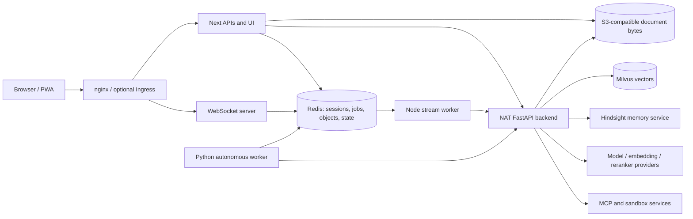

# Codebase review

The most urgent issues are **cross-user conversation overwrite, continued login by removed accounts, failed approved operations reported as successful, and unusable Redis startup in root Compose**. These were reproduced in isolated environments. They affect user data integrity, access revocation, trust in external updates, and the ability to run the local deployment.

**26 actionable findings: 4 P1, 21 P2, 1 P3; no P0 established.** Eighteen findings have executed evidence; eight are supported by a traced code path. Reproductions at simulated service boundaries establish first-party handling, not behavior of an untested real provider. Dependency scans establish affected package versions, not a reachable exploit.

**Status: partial end-to-end validation.** The entire tracked repository is inventoried and every area has a coverage status; source/control-flow review spans both deployment modes and all six required workflows. Individual test bodies and historical/generated material were selectively inspected as identified in [REVIEW_COVERAGE.md](REVIEW_COVERAGE.md). Required external-service, enforcing-CNI, arm64, physical-device and sustained-load validations remain unperformed. The local browser matrix also had one login timeout that passed its focused retry. These limits prevent a claim of complete integration assurance or production readiness.

| Review baseline | Recorded value |
|---|---|
| Branch / commit | `main` / `457d338ad9eec9a285a57436b37213b5ba577477` |
| Origin | `https://github.com/tuttlebr/daedalus-agent.git` |
| Initial local changes | None (`git status --porcelain` empty) |
| Later concurrent local file | Untracked `review.md` appeared during review; it was neither created nor modified by this review and is preserved |
| Isolated checkout | `/tmp/daedalus-review-457d338`, detached at the commit above |
| Evidence root | `/tmp/daedalus-review-evidence-457d338` |
| Review changes | Only these three requested reports in the original workspace; no production fixes, test changes or lock updates |

The reports cover the pinned commit, not concurrent `review.md`. Applicable `skills/AGENTS.md` was read. Application prompts, skill instructions, fixtures, retrieved content and historical reviews were treated as review material. Scripts were inspected before execution. Services, credentials, certificates, Redis namespaces and reproduction inputs were disposable. No live/production deployment, image publication, real-user contact or live infrastructure tool operation was performed. Redis chart installation and upgrades used a disposable Kind cluster. Public dependency/advisory retrieval was read-only.

## Priorities

| ID | Priority | Evidence | Finding |
|---|---|---|---|
| [RV-001](#rv-001) | P1 | Reproduced | Chat submission can overwrite another user's conversation |
| [RV-002](#rv-002) | P1 | Reproduced | Removed configured accounts can still log in |
| [RV-003](#rv-003) | P1 | Reproduced | Failed approved MCP operations are reported as completed |
| [RV-004](#rv-004) | P1 | Reproduced | Root Compose cannot start a usable Redis service |
| [RV-005](#rv-005) | P2 | Reproduced | Stored SVG originals execute script on the authenticated origin |
| [RV-006](#rv-006) | P2 | Reproduced | Approved memory deletion leaves deleted facts in automatic context |
| [RV-007](#rv-007) | P2 | Reproduced | Profile replacement deletes the old profile before acceptance |
| [RV-008](#rv-008) | P2 | Reproduced | Sandbox POST retries can duplicate consequential operations |
| [RV-009](#rv-009) | P2 | Reproduced | Concurrent goal writes lose acknowledged changes |
| [RV-010](#rv-010) | P2 | Code-supported | Replay stripping deletes legitimate new-turn content |
| [RV-011](#rv-011) | P2 | Code-supported | Accepted image jobs cannot recover after a frontend restart |
| [RV-012](#rv-012) | P2 | Code-supported | Failed cancellation is acknowledged and job tracking is discarded |
| [RV-013](#rv-013) | P2 | Reproduced | Autonomy cancellation cannot interrupt a silent backend stream |
| [RV-014](#rv-014) | P2 | Reproduced | Fetch deadlines and cancellation stop at response headers |
| [RV-015](#rv-015) | P2 | Reproduced | Incomplete or unparsed ingestion streams are saved as success |
| [RV-016](#rv-016) | P2 | Code-supported | Failures before the first token hide their error and retry action |
| [RV-017](#rv-017) | P2 | Reproduced | Untrusted tool text can forge a terminal approval event |
| [RV-018](#rv-018) | P2 | Reproduced | An explicitly empty citation ledger disables provenance checking |
| [RV-019](#rv-019) | P2 | Code-supported | Push subscriptions permit arbitrary HTTPS destinations |
| [RV-020](#rv-020) | P2 | Code-supported | Interrupted rate-limit initialization can block a user indefinitely |
| [RV-021](#rv-021) | P2 | Code-supported | Concurrent image loads corrupt blob ownership and accounting |
| [RV-022](#rv-022) | P2 | Reproduced | Cancelling optional skill execution leaves its child process alive |
| [RV-023](#rv-023) | P2 | Reproduced | Release scanning disagrees with CI and blocks image signing |
| [RV-024](#rv-024) | P2 | Code-supported | Kubernetes policy blocks configured completion push delivery |
| [RV-025](#rv-025) | P2 | Reproduced | Security gates omit shipped upstream images with affected dependencies |
| [RV-026](#rv-026) | P3 | Reproduced | An empty skill-operation allowlist enables all operations |

## Architecture and trust boundaries

The external identity boundary is the Redis-backed session, with bcrypt login, session-ID rotation, HttpOnly cookies, a sliding 24-hour Redis session lifetime and a seven-day sid cookie Max-Age. APIs derive the username server-side. Internal requests add `x-user-id` and the service token; backend HTTP middleware and tool identity helpers validate this context. Browser/model-supplied resource IDs remain untrusted. WebSocket subscriptions independently check job/conversation ownership. Redis is a shared privileged store: namespaced references help organization but do not substitute for authorization, as RV-001 demonstrates.

The backend entrypoint loads inherited workflow configuration, installs version-sensitive NAT patches, and registers document, image, memory and exact-approval routes. The canonical workflow uses the Responses API with per-user builders, bounded history, request-local loop guards, and tool-output compaction. Model prompts and loaded skills guide behavior but grant no capabilities. The shipped skill dispatcher permits list/load and disables script execution; RV-022/RV-026 require an operator to enable additional operations. Missing/empty MCP include lists intentionally authorize an unrestricted operator-owned group; this policy choice is not reported as an accidental permission bypass.

Approval tokens bind authenticated user, server, tool, canonical arguments and hash, with atomic single consumption. OAuth uses separate per-user Gmail/Calendar/Docs stores and stable NAT request identity. The native pinned-runtime checks verify registration, private API/graph adapters and offline refresh and callback-binding contracts; actual external consent and provider writes were not exercised. Pending approvals default to seven days, executable approval credentials to 300 seconds, and success receipts to two hours. Stored refresh credentials have no automatic TTL by default and need explicit revocation/deletion.

| Deployment | Actual supported topology and limits |
|---|---|
| Root Compose | nginx, Next/WebSocket, separate stream worker, NAT backend, Redis and SeaweedFS/object-store initialization. There is no bundled autonomy, Milvus, NV-Ingest, Hindsight or model-service process. Those require external/disposable configuration or a separately launched worker. Redis is unusable under both normal username branches: duplicate-user startup failure or cross-container protected-mode denial (RV-004); e2e Compose uses a different working Redis configuration. |
| Kubernetes default Helm | Separate frontend, stream-worker, backend, nginx and Redis workloads; optional autonomous worker, PVCs, probes, service identities, secrets, standard NetworkPolicy or Cilium policy. External RAG/memory/provider service contracts are configured rather than provisioned by this chart. |
| Kubernetes custom values | Enables environment-specific ingress/TLS/NodePort, storage and Cilium/external-service wiring. Both default/custom manifests render; the disposable Redis chart fixture validates persisted ACL/TLS upgrades and rollback. No installed production state was inspected. |

Readiness is deliberately weaker than proof of a complete request. Frontend readiness checks Redis; backend readiness follows configured memory/RAG dependency policy (including degraded modes); nginx probes application health. A healthy local process or a rendered chart does not prove model, OAuth, ingestion or memory success. Root Compose's named-user Redis branch specifically returns local PONG while rejecting another container's authenticated connection.

## End-to-end workflow review

| Workflow | Success path / controls | Failure, cancellation, retry and recovery evidence |
|---|---|---|
| Login → session → API → backend identity → resource | Login initializes configured users and checks bcrypt; rotates sid; APIs and WebSocket read session username; backend service-token middleware and NAT context carry trusted identity; object/private-collection/memory reads enforce ownership. | Real Redis session/ownership tests and two distinct-user reproductions. Session logout/expiry refresh races have existing atomic guards; removed-account reconciliation and chat finalization still fail (RV-001/002). Live remote IAM is not proved. |
| Chat → queue → worker → model/tools → stream → saved conversation | API validates session/rate limit, chooses backend, creates status and guarded queue request; worker uses token-fenced leases and start markers; SSE reader persists offset-aware text/steps; terminal journal records conversation, memory and cleanup phases. Browser WebSocket plus polling reconciles state. | Real Redis concurrent terminal/journal/append/lease checks and actual Next→queue→worker fixture. Client cancellation failures, silent body waits, replay rewriting, hidden early errors and ingestion false success remain (RV-010/012/014/015/016). Model/tool services were fixtures. General chat clean EOF is deliberate compatibility, not independently classified as a defect. |
| Tool approval / OAuth → execution → timeout/reconnect | Exact user-bound one-use approval plus server-owned pending record; registered per-user MCP invocation; OAuth state hashes map callback to selected backend; per-user Redis-backed token storage retains refresh credentials. | Native NAT contracts and real Redis expiry/concurrent consumption passed. Failure envelopes can falsely complete an approved update (RV-003); untrusted strings can terminate the graph as an approval event (RV-017) but do not mint authority. Full browser-to-provider consent/refresh/restart was not service-tested. |
| Upload → object storage → ingestion → retrieval → download/delete | Multipart document upload puts bytes in S3-compatible storage and owner metadata in Redis; references are rebound to stored metadata; typed ingestion uses the user's hashed collection; extraction/query fields and dimensions checked; downloads/deletion check owner before storage access. | Real upload/browser fixtures and source/test inspection; ingestion terminal failures reproduced (RV-015). Real PyMilvus + Milvus Lite verifies distance/type behavior, not external embedding compatibility. Explicit byte deletion precedes metadata deletion. Source deletion does not cascade to indexed vectors. SVG originals have active-document behavior (RV-005). |
| Memory creation → retrieval → retention → user isolation | Stable derived user bank, quoted/bound resource IDs, deterministic retention IDs, asynchronous operations and bounded untrusted recall context. Successful chat finalization records retention acceptance. | Profile replacement can delete before acceptance (RV-007); approved clear omits seven-day session cache invalidation (RV-006); body timeout affects retention (RV-014). Real Redis second-user cache isolation and local HTTP failure ordering checked. Actual Hindsight extraction, consolidation and restart not exercised. |
| Goal → scheduling → execution → durable state → cancel/restart | Frontend goals/config/queue feed a per-user Python worker; token-fenced lease, processing claim/reclaim, stable execution IDs and local side-effect deduplication support recovery. | Real Redis lease/reclaim/idempotency tests and real silent-SSE cancellation fixture. Frontend goal list writes race (RV-009); abort is only observed between blocking stream lines (RV-013). Image jobs use a separate non-durable process promise (RV-011). No sustained real-model autonomous schedule was run. |

## Persistence, retrieval and lifecycle

| Store / material | Scope and lifetime | Review result / remaining limitation |
|---|---|---|
| Auth sessions / users | Redis sessions slide for 24 hours; the sid cookie Max-Age is seven days; refresh is throttled after 60 seconds. Persisted user accounts have no TTL. | Atomic session refresh preserves logout/expiry; account removal is not reconciled. |
| Chat jobs / journal / streaming state | Job/journal TTL one hour; streaming indicator 600 seconds; explicit terminal journal recovery and ownership fencing. | Real Redis tests cover JSON and string records, lost replies, offsets and terminal races. Conversation ownership needs independent enforcement at finalization. |
| Images / videos / generated images | Owner-bound Redis records; image/generated-image defaults seven days, separate index/touch paths. | Browser retrieval/deletion tested. Active SVG originals and concurrent blob ownership are findings; no long-duration heap/expiry measurement. |
| Uploaded documents | Redis metadata/index default seven days; independently stored S3-compatible bytes with recorded expiresAt and hashed owner/session prefix. | Explicit delete checks ownership then deletes bytes and metadata. Metadata expiry alone is not proof of byte deletion. Compose hardcodes Seaweed seven-day collection TTL; nondefault application retention needs a disposable expiration test. |
| Private and curated vectors | User collection names are hashed and compared to trusted identity; only explicitly allowed shared collections can be queried. | Ingest uses dense dimension 2048 by default, text/vector fields, split 1024/overlap 150; user search uses L2/cutoff 1.2 and default database. Actual external embedder model/dimension/database agreement remains a deployment contract. Indexed vectors have an independent lifecycle; no source-deletion cascade is implemented. |
| Hindsight memory | Derived per-user bank; durable service records without application-imposed TTL; bootstrap cache one hour/negative cache60 seconds; session brief cache seven days, refresh interval ten minutes. | Bounded retrieval and distinct-user checks; deletion/replace defects above. Service-side durable retention and knowledge cascade behavior remain untested. |
| Exact compacted tool output | Owner-scoped Redis reference, digest and compressed original; TTL 7200 seconds. | Structured eligibility, cache-failure fallback, exact/exhaustive recovery and user checks reviewed/tested. No model-driven source-quality evaluation or load benchmark. |
| Autonomy | Persistent config/goals; count-bounded runs/events/feed (defaults 100/500/200); lease60 seconds; local action deduplication defaults seven days. | Atomic worker writes and reclaim tested. These receipts do not make remote MCP/sandbox side effects exactly once. |

The operator Milvus migration is separate from model tools. It checks a strong operator credential and full subject inventory, uses a locked append-only audit, preserves primary keys through resumable upsert, and verifies schema, indexes and counts without dropping either collection. No migration against a live database was run; local tests do not establish a production snapshot or full row-by-row equality under concurrent external writes.

## Validated findings

Each primary location below is pinned to the reviewed commit. Detailed ranges identify cooperating guards/callers. Exact reproduction commands, runtime versions, logs and retained failed attempts are in [REVIEW_VALIDATION.md](REVIEW_VALIDATION.md). Evidence paths prefixed with root/, frontend/, backend/ or operations/ resolve under the evidence root; bare filenames resolve under the linked subsystem evidence directory. Confidence describes the stated scope, not an untested external exploit.

### RV-001 — Chat submission can overwrite another user's conversation

**P1 · Reproduced · High confidence within stated conditions.** Primary location: [frontend/server/chat/finalization.ts:104–108](https://github.com/tuttlebr/daedalus-agent/blob/457d338ad9eec9a285a57436b37213b5ba577477/frontend/server/chat/finalization.ts#L104-L108). [Evidence directory](/tmp/daedalus-review-evidence-457d338/frontend).

- **P1; Reproduced; high confidence.** Affects Compose and Kubernetes with multiple users and shared Redis. Requires an authenticated user to know another conversation's ID; UUIDs impede guessing, but possession of an object ID must not authorize writes. Demonstrated integrity loss, not disclosure of the prior content.
- Locations: [`pages/api/chat/async.ts:125-144`](https://github.com/tuttlebr/daedalus-agent/blob/457d338ad9eec9a285a57436b37213b5ba577477/frontend/pages/api/chat/async.ts#L125-L144), same file399-408,485-496; [`server/chat/finalization.ts:98-108`](https://github.com/tuttlebr/daedalus-agent/blob/457d338ad9eec9a285a57436b37213b5ba577477/frontend/server/chat/finalization.ts#L98-L108).
- Trigger: owner saves a conversation; another session submits `/api/chat/async` with the owner's `conversationId` and attacker messages. The API's history loader returns an empty array for a nonowner but accepts the ID for execution. Success, error, or cancellation finalization writes the shared `conversation:<id>` record unconditionally.
- Expected: reject an existing foreign conversation before any job is queued, and fence shared writes against ownership changes. Actual: HTTP 200 job accepted; owner subsequently reads attacker content in their conversation, replacing original history.
- Guards checked/disproof: session username is server-derived; GET/PUT conversation endpoints reject nonowners; job/status access is owner checked. The conversation-job guard is keyed by user plus ID and serializes one user's jobs, so it does not establish ownership of the shared record. Finalization's atomic terminal journal prevents duplicate terminal outcomes but does not validate conversation ownership.
- Evidence: `cross-user-http.log` executes actual built Next API→real Redis queue→actual stream worker→local test backend: owner PUT200, attacker GET403, attacker submit200, terminal completed, owner GET shows attacker messages. `reproductions.log` (local probe FE01) independently executes actual finalizer's error path against RedisJSON with owner membership retained and attacker membership absent.
- Fix direction: atomically establish/check authoritative ownership before accepting the ID, and condition finalization writes on that ownership. Regression: two users with a known shared ID, asserting forbidden submit and unchanged owner record across success/error/cancellation and ownership deletion races.

### RV-002 — Removed configured accounts can still log in

**P1 · Reproduced · High confidence within stated conditions.** Primary location: [frontend/utils/auth/users.ts:169–181](https://github.com/tuttlebr/daedalus-agent/blob/457d338ad9eec9a285a57436b37213b5ba577477/frontend/utils/auth/users.ts#L169-L181). [Evidence directory](/tmp/daedalus-review-evidence-457d338/frontend).

- **P1; Reproduced; high confidence.** Compose and Kubernetes with persistent Redis. Requires a previously configured account to be removed from environment/config while its Redis user record remains; a process restart does not reconcile removal. The former account can acquire a new session using its old password.
- Locations: [`utils/auth/users.ts:114-159`](https://github.com/tuttlebr/daedalus-agent/blob/457d338ad9eec9a285a57436b37213b5ba577477/frontend/utils/auth/users.ts#L114-L159), same file169-181; `pages/api/auth/login.ts:126-149`.
- Trigger: provision userA, preserve Redis, replace configuration with only userB, restart and authenticate as userA. Expected removed users cannot authenticate. Actual initialization only upserts the current list, and verification accepts any persisted username/password hash without current-config membership.
- Guards checked/disproof: configured password changes are reconciled; bcrypt and login throttling work but do not restrict stale accounts. Persisted user entries have no expiry; there is no separate account-deactivation API or enabled flag in the login path. Existing sessions are a separate concern; this reproduction establishes new login credential acceptance.
- Evidence: `reproductions.log` (local probe FE02), actual initialization and bcrypt verification with real Redis, config contains only a new user and removed account still verifies. Unit login tests cover configuration/password/session mechanics but not account removal.
- Fix direction: use the configured account set as the authoritative admission list or explicitly persist/reconcile disabled accounts; define how session revocation follows deactivation. Regression: restart-equivalent config removal, no config, and password rotation against persisted users, asserting new sessions denied for removed users.

### RV-003 — Failed approved MCP operations are reported as completed

**P1 · Reproduced · High confidence within stated conditions.** Primary location: [builder/mcp_approval_api.py:84–98](https://github.com/tuttlebr/daedalus-agent/blob/457d338ad9eec9a285a57436b37213b5ba577477/builder/mcp_approval_api.py#L84-L98). [Evidence directory](/tmp/daedalus-review-evidence-457d338/backend).

- **Priority:** P1. **Evidence:** Reproduced at the application adapter/executor boundary; high confidence. Remote MCP failure was injected, not exercised against Google.
- **Location:** `builder/mcp_approval_api.py:84-98`; root mismatch in `builder/mcp_patches.py:835-844`, `2569-2582`, `2597-2608`.
- **Affected:** Compose and Kubernetes with an approval-gated MCP operation (Calendar/Docs) and the direct approval endpoint enabled.
- **Trigger:** Approve a protected operation whose remote call returns an MCP application error or raises a timeout/network error. The wrapper converts it into its normal returned JSON string with `error: mcp_tool_failed` or another error code. The direct executor's `_mcp_result_is_error()` recognizes only `isError` objects/dicts and the legacy error-string prefix; it does not recognize that JSON envelope.
- **Expected/actual:** Failed or ambiguous operation should remain failed/unknown. The endpoint calls `execution_store.set_completed`, emits a success log, and returns `status: completed` even when the call failed and no success receipt exists. Frontend `pages/api/mcp-approvals/[requestId].ts:193` and `:263` trust this status; `components/chat/McpApprovalCard.tsx:134-137` displays **Update completed**.
- **Root/impact:** Failure serialization and success classification disagree across two first-party components. Users can believe external records were updated when they were not; timeout ambiguity is incorrectly erased.
- **Evidence:** `repro_mcp_false_success.py` and `repro-mcp-false-success.log`: native `_mcp_tool_error_payload` output has `error=mcp_tool_failed`, detector returns false, actual `_run_exact_mcp_call` stores completed. The existing pinned `runtime_contract_check.py` also exercises native approved adapter failure serialization and no success receipt; `test_mcp_approval_api.py` contains only the success executor case.
- **Smallest fix/test direction:** Preserve a typed failure outcome through the exact executor or require the gate-owned exact success receipt. Add application-error, transport-timeout, OAuth-refresh failure, and successful-call executor regressions; failed cases must not mark the frontend card complete.

### RV-004 — Root Compose cannot start a usable Redis service

**P1 · Reproduced · High confidence within stated conditions.** Primary location: [docker-compose.yaml:233–243](https://github.com/tuttlebr/daedalus-agent/blob/457d338ad9eec9a285a57436b37213b5ba577477/docker-compose.yaml#L233-L243). [Evidence directory](/tmp/daedalus-review-evidence-457d338/operations).

- **Priority:** P1. **Evidence:** Reproduced. **Confidence:** High.
- **Location:** [`docker-compose.yaml:233–243`](https://github.com/tuttlebr/daedalus-agent/blob/457d338ad9eec9a285a57436b37213b5ba577477/docker-compose.yaml#L233-L243); dependent services wait for Redis at lines75–79,147–155,189–193; healthcheck at265–274.
- **Affected mode/conditions:** Root local Compose, both the shipped `REDIS_USERNAME=default` and a configured nondefault username. Helm uses a different ACL-file generator and is unaffected.
- **Trigger:** Start the exact Redis command array from root Compose against the repository-built Redis image using only disposable storage/credentials. `compose-redis-exact-repro.py` parses that array from the checkout, interpolates defaults, and runs it on an internal disposable Docker network.
- **Expected:** Redis starts, enforces the selected password, and accepts valid application connections.
- **Actual:** Default username causes Redis 7.4.7 to exit 1 with `Duplicate user found. A user can only be defined once in config files`. A nondefault name starts and its loopback healthcheck returns PONG, but authenticated requests from another container fail with protected-mode DENIED because the default user still has no password.
- **Root cause/impact:** Two ACL user declarations collide for the default name; otherwise `default on nopass` keeps protected mode restricting nonloopback access. All stateful root-Compose services are blocked or unable to connect, despite successful YAML validation and image builds. Do not describe the named-user branch as demonstrated unauthenticated remote access: protected mode disproves that interpretation.
- **Evidence:** `operations/compose-redis-exact.log`, `operations/compose-redis-exact-repro.py`; exact image `daedalus-review-457d338-redis` built from `redis/Dockerfile`; Docker29.8.0. Both username branches and the misleading healthcheck were executed. Earlier simplified experiments are retained, but this complete-array reproduction supersedes them.
- **Fix direction:** Generate exactly one declaration per user, and retain a permission-complete internal default identity behind an unknown random password when using a named application user, following the existing Helm approach. Preserve AOF replay compatibility.
- **Regression:** Run root Compose's actual Redis command with default and named usernames; assert process health, authenticated cross-container PING, unauthenticated rejection, and persisted Stream PEL replay. `docker compose config` and the differently configured e2e Redis fixture cannot detect this.
- **Historical comparison:** Aug27 review mentions a Compose default-user/comment contradiction but does not identify or validate this startup failure. Current Helm TLS/ACL persisted-upgrade fixture passed; no resolved Helm defect is repeated.

### RV-005 — Stored SVG originals execute script on the authenticated origin

**P2 · Reproduced · High confidence within stated conditions.** Primary location: [frontend/pages/api/session/imageStorage.ts:590–613](https://github.com/tuttlebr/daedalus-agent/blob/457d338ad9eec9a285a57436b37213b5ba577477/frontend/pages/api/session/imageStorage.ts#L590-L613). [Evidence directory](/tmp/daedalus-review-evidence-457d338/frontend).

- **P2; Reproduced; high confidence.** Both modes with current Next security headers and image upload enabled. **Requires the signed-in user to obtain an untrusted SVG in their own accessible image store and navigate to the original image URL.** Ordinary `` rendering does not execute SVG script. No cross-user read bypass or remote victim exploit was demonstrated. The download buttons using the browser `download` attribute were not used as the trigger.
- Locations: [`pages/api/session/imageStorage.ts:277-287`](https://github.com/tuttlebr/daedalus-agent/blob/457d338ad9eec9a285a57436b37213b5ba577477/frontend/pages/api/session/imageStorage.ts#L277-L287), same file590-613; [`next.config.js:74-83`](https://github.com/tuttlebr/daedalus-agent/blob/457d338ad9eec9a285a57436b37213b5ba577477/frontend/next.config.js#L74-L83).
- Trigger: upload an SVG from an untrusted source, then open its original `/api/session/imageStorage?...` URL as a document. Model response image ingestion also permits `data:image/svg+xml;base64,...` through `utils/app/imageHandler.ts:555-605` and `server/chat/finalization.ts:457-462` (that source path is code-supported, not separately exercised).
- Expected: user-controlled image bytes cannot execute with authenticated application privileges. Actual content sniffing accepts SVG; only the edit/VLM derivatives are rasterized, while original bytes are preserved and served inline as `image/svg+xml`. The route has no Content-Disposition attachment or sandbox policy; its **enforced** global CSP permits inline scripts.
- Evidence: `svg-browser.log` uses the actual production build, actual authenticated upload API, real Redis and Chromium. Harmless script executes on direct navigation and reads `/api/auth/me`, returning the test username. Session setup copied the test sid cookie without Secure for loopback HTTP; production same-origin HTTPS normally sends its Secure cookie. The response's Content-Type and enforced CSP were recorded. Absence of Content-Disposition is established in full GET code. Upload cleaned up afterward.
- Guards checked/disproof: stored-image owner checks deny other users; `nosniff` does not suppress correctly labelled SVG active content; generating safe edit/thumbnail derivatives does not replace original storage. CSP frame-ancestors restricts embedding, not top-level navigation.
- Fix direction: serve a rasterized/sanitized representation for active formats, or isolate originals onto a separate origin and enforce attachment/sandbox policies. Regression: direct navigation of a stored SVG must not execute script or access authenticated API; retain normal raster image and owner-isolation checks.

### RV-006 — Approved memory deletion leaves deleted facts in automatic context

**P2 · Reproduced · High confidence within stated conditions.** Primary location: [builder/user_interaction/src/user_interaction/user_interaction_function.py:629–638](https://github.com/tuttlebr/daedalus-agent/blob/457d338ad9eec9a285a57436b37213b5ba577477/builder/user_interaction/src/user_interaction/user_interaction_function.py#L629-L638). [Evidence directory](/tmp/daedalus-review-evidence-457d338/backend).

- **Priority:** P2. **Evidence:** Reproduced with pinned native NAT, authenticated request context, genuine approval tokens and a disposable real Redis instance; high confidence. The Hindsight DELETE endpoint was a local HTTP fixture, not a real Hindsight server.
- **Location:** `builder/user_interaction/src/user_interaction/user_interaction_function.py:633-638`; cache consumer `builder/nat_helpers/src/nat_helpers/hindsight_memory_context.py:289-313`, TTL `:21`, write `:334-342`. Compare complete Memory Center deletion at `builder/memory_api.py:527-556`.
- **Affected:** Both deployments with Hindsight enabled and configured `user_interaction_tool.operation=delete_memory_guarded` (workflow YAML `:712-716`). Requires a previously synthesized conversation brief, cached for seven days.
- **Trigger:** Ask the agent to clear durable memory, approve the deletion, then continue the same conversation. The tool consumes the exact user-bound approval token and invokes Hindsight `DELETE /banks/<derived-user-bank>/memories`, but does not explicitly invalidate the application's Redis session briefs or delete knowledge pages.
- **Expected/actual:** Once deletion reports success, subsequent automatic context should omit facts derived from the deleted memory. The tool returns **Durable memory cleared.**, yet `_session_brief()` immediately returns the old deleted preference; the cache retains TTL 604800. Another user cannot read it, so this is a deletion/lifecycle failure rather than cross-user access.
- **Root/impact:** The chat tool implements an incomplete duplicate of Memory Center's deletion orchestration. Clearing the external raw-memory endpoint does not invalidate the application's independent cached synthesis. Users who explicitly remove personal or outdated facts can still have those facts influence answers for up to seven days. Independently stored knowledge-page cleanup is also omitted, but external Hindsight cascading semantics were not reproduced and are not needed to establish this finding.
- **Evidence:** `repro_guarded_memory_clear.py`, `repro-guarded-memory-clear.log`: actual approval issuance/consumption, trusted native request identity, successful HTTPX DELETE, then old cached preference read from real Redis; second-user result empty. Existing `test_user_interaction.py:735-786` asserts only raw-memory clear and token single use; it does not seed the current session cache. `HindsightClient.clear_memories():620-625` contains only the external DELETE.
- **Smallest fix/test direction:** Share one backend deletion orchestration across the UI and agent operation, including current-user cache invalidation and the intended knowledge-page policy. Seed a real Redis session brief, execute the approved tool, and assert subsequent automatic context cannot recover that brief; retain a second user's data and verify failed cleanup reports partial failure.

### RV-007 — Profile replacement deletes the old profile before acceptance

**P2 · Reproduced · High confidence within stated conditions.** Primary location: [builder/profile_import_api.py:161–165](https://github.com/tuttlebr/daedalus-agent/blob/457d338ad9eec9a285a57436b37213b5ba577477/builder/profile_import_api.py#L161-L165). [Evidence directory](/tmp/daedalus-review-evidence-457d338/backend).

- **Priority:** P2. **Evidence:** Reproduced with pinned runtime and real HTTPX against a disposable REST fixture; high confidence in request ordering and data-loss consequence under the stated failure. No real Hindsight service was contacted.
- **Location:** `builder/profile_import_api.py:161-165`, `192-203`; deletion loop `builder/nat_helpers/src/nat_helpers/hindsight_client.py:577-596`.
- **Affected:** Both deployments with Hindsight enabled and profile import mode `replace`.
- **Trigger:** Existing imported profile documents are deleted, then the replacement `/memories` request returns 503, times out, or later extraction fails. No rollback snapshot or deferred replacement is retained.
- **Expected/actual:** A failed import should preserve the prior usable profile. The controlled fixture records DELETE of the old document followed by POST 503, and the application exits with HindsightError after the old document is already gone.
- **Root/impact:** Destructive replacement precedes even durable queue acceptance, and acceptance is asynchronous rather than proof of successful replacement. A transient failure can erase all prior profile-import memories.
- **Evidence:** `repro_profile_replace.py`, `repro-profile-replace.log` records exact native REST requests, old_document_exists=false and new_posts=1. Happy-path replace tests verify order/counts but do not enforce preservation on submit/extraction failure.
- **Smallest fix/test direction:** Stage a versioned replacement and atomically promote it only after successful extraction, retaining the old version until then. At minimum avoid deleting old document IDs before durable acceptance and retain a recoverable snapshot. Test rejection, timeout, background extraction failure, and retries without deleting the last known profile.

### RV-008 — Sandbox POST retries can duplicate consequential operations

**P2 · Reproduced · High confidence within stated conditions.** Primary location: [builder/llm_sandbox/src/llm_sandbox/llm_sandbox_function.py:677–698](https://github.com/tuttlebr/daedalus-agent/blob/457d338ad9eec9a285a57436b37213b5ba577477/builder/llm_sandbox/src/llm_sandbox/llm_sandbox_function.py#L677-L698). [Evidence directory](/tmp/daedalus-review-evidence-457d338/backend).

- **Priority:** P2. **Evidence:** Reproduced with real HTTPX against a disposable HTTP fixture; high confidence in duplicate client requests. Real sandbox service behavior was not tested.
- **Location:** `builder/llm_sandbox/src/llm_sandbox/llm_sandbox_function.py:677-698`; mutation callsite `1004-1012`, file append payload `907-920`.
- **Affected:** Both deployment modes when the sandbox is configured. Applies to command execution and `write_file` with `append=true`.
- **Trigger:** The first `/v1/execute` POST performs its side effect, then a gateway returns 502/503/504 or the response transport fails. `_request_with_retry` sends the identical POST again; no idempotency token is included.
- **Expected/actual:** An ambiguous command/write outcome should not be replayed without server-enforced idempotency. One append request became two appends in the controlled fixture; the caller ultimately received HTTP 200.
- **Root/impact:** One retry helper is used indiscriminately for reads and consequential POSTs. This can duplicate file contents and command side effects, including damage to generated artifacts before validation. The warning against retrying a timeout occurs after the client has already retried transport/gateway failures.
- **Evidence:** `repro_sandbox_retry.py`, `repro-sandbox-retry.log`: `calls=2`, appended text `one line\none line\n` for one submitted append. `test_llm_sandbox.py:717-728` currently expects transport replay rather than asserting idempotency.
- **Smallest fix/test direction:** Restrict automatic retry to safe reads/pre-dispatch failures, or add a stable execution ID with durable deduplication at the sandbox service. Test a response lost after a completed append/command and require one side effect.

### RV-009 — Concurrent goal writes lose acknowledged changes

**P2 · Reproduced · High confidence within stated conditions.** Primary location: [frontend/server/autonomy/store.ts:297–315](https://github.com/tuttlebr/daedalus-agent/blob/457d338ad9eec9a285a57436b37213b5ba577477/frontend/server/autonomy/store.ts#L297-L315). [Evidence directory](/tmp/daedalus-review-evidence-457d338/frontend).

- **P2; Reproduced; high confidence.** Both modes; two tabs/devices/API calls or frontend/backend goal mutations overlap for one user.
- Locations: [`server/autonomy/store.ts:297-315`](https://github.com/tuttlebr/daedalus-agent/blob/457d338ad9eec9a285a57436b37213b5ba577477/frontend/server/autonomy/store.ts#L297-L315), same file186-199; `pages/api/autonomy/goals.ts:45-46,69-88`.
- Expected: every successful create persists, and concurrent edits/deletes are detected or merged. Actual `listGoals`→mutate array→`saveGoals` rewrites the entire user's goals JSON without version comparison/transaction. Both callers return success after overwriting each other's snapshots.
- Evidence: `reproductions.log` (local probe FE05) uses actual store + real Redis:10 concurrent creates resolve successfully, only 1 persists. Existing store tests mock Redis and validate sequential goal operations, not concurrent persistence. Authentication scopes the user correctly, but does not serialize writes. Redis atomicity of individual SET/JSON.SET does not make the read/modify/write sequence atomic.
- Impact: goals disappear, edits or deletions can be undone, and autonomous execution can use stale goals.
- Fix direction: store goals by ID with atomic operations or compare-and-set/version all list mutations, including worker updates and imports. Regression: concurrent create/update/delete from independent clients, verifying each acknowledged write or explicit conflict.

### RV-010 — Replay stripping deletes legitimate new-turn content

**P2 · Code-supported · High confidence within stated conditions.** Primary location: [frontend/utils/app/conversationReplay.ts:27–31](https://github.com/tuttlebr/daedalus-agent/blob/457d338ad9eec9a285a57436b37213b5ba577477/frontend/utils/app/conversationReplay.ts#L27-L31). [Evidence directory](/tmp/daedalus-review-evidence-457d338/operations).

- **Priority:** P2. **Evidence:** Code-supported. **Confidence:** High.
- **Location:** [`frontend/utils/app/conversationReplay.ts:27–31`](https://github.com/tuttlebr/daedalus-agent/blob/457d338ad9eec9a285a57436b37213b5ba577477/frontend/utils/app/conversationReplay.ts#L27-L31), suffix analogue35–43; all-prior-message loop221–236; caller [`frontend/server/chat/finalization.ts:446–453`](https://github.com/tuttlebr/daedalus-agent/blob/457d338ad9eec9a285a57436b37213b5ba577477/frontend/server/chat/finalization.ts#L446-L453).
- **Affected mode/conditions:** All frontend deployment modes; a prior assistant message equals the beginning or end of a later, legitimate answer. No malicious input or provider failure required.
- **Trigger:** First assistant answer is `Paris.`. User asks to repeat the answer and add an explanatory sentence. Model correctly returns `Paris. It is the capital of France.`. The exact-prefix branch returns `It is the capital of France.`. A prior `No.` and later `No. ...` loses the explicit answer polarity. Requests for a complete revised document can lose unchanged opening/closing material through the fuzzy branch as well.
- **Expected:** Content generated for the new turn is preserved unless a transport/message identity establishes duplicate delivery.
- **Actual:** Any matching prior assistant text followed by whitespace is classified as replay. The helper neither checks a replay marker/message ID nor examines the user's request. `finalizeSuccess` applies it before storing fullResponse and durable finalization journal content; browser update, conversation GET, and conversation PUT paths also invoke it, so reload cannot restore the authoritative answer through these paths.
- **Root cause/impact:** Text similarity is used as a destructive correctness rule across independent turns. Legitimate repetition, answers, and complete artifacts are silently shortened while the job is marked successful.
- **Supporting evidence:** `conversationReplay.ts:221–236` examines every previous assistant message, not just duplicate transport events; `finalization.ts:446–507` stores the shortened content; `ChatView.ts:434–438` rewrites browser updates; `pages/api/conversations/[id].ts:88–95` rewrites saved conversations. Existing `conversationReplay.test.ts:10–52,126–188` primarily proves stripping; its small-prefix safeguard only tests `OK,` (comma adjacency), whereas the exact path has no size threshold and strips `No. ` or `Paris. `. The identical-output guard preserves only a fully identical answer with no remainder; it does not disprove this trigger.
- **Fix direction:** Restrict deduplication to identified duplicate events or an explicit provider replay envelope; preserve independent-turn text and persisted history by default. Do not silently mutate content based solely on prior assistant text.
- **Regression suggestion:** Preserve a requested full repeat-plus-extension, repeated short yes/no answers, a complete revised document with unchanged opening/closing paragraphs, and deliberate quotations; separately retain tests for genuine transport replay using explicit message identity.
- **Historical comparison:** Relevant existing code-review documents contained no current disposition for this helper after the independent path review; no resolved old finding is repeated.

### RV-011 — Accepted image jobs cannot recover after a frontend restart

**P2 · Code-supported · High confidence within stated conditions.** Primary location: [frontend/pages/api/images/jobs.ts:606–615](https://github.com/tuttlebr/daedalus-agent/blob/457d338ad9eec9a285a57436b37213b5ba577477/frontend/pages/api/images/jobs.ts#L606-L615). [Evidence directory](/tmp/daedalus-review-evidence-457d338/frontend).

- **P2; Code-supported; high confidence.** Both modes. Trigger is a Next frontend process/container restart, rolling update, or crash after `/api/images/jobs` accepted a request and before its detached promise completes. No crash experiment was run.
- Locations: [`pages/api/images/jobs.ts:606-615`](https://github.com/tuttlebr/daedalus-agent/blob/457d338ad9eec9a285a57436b37213b5ba577477/frontend/pages/api/images/jobs.ts#L606-L615), same file44-49,401-411,624-640.
- Expected: accepted queued work is durably recoverable, or orphaned jobs become an explicit interrupted outcome. Actual POST stores queued metadata, returns 202, and invokes an in-process `void runImageJob(...)` promise. Redis stores status but there is no image execution queue, lease, heartbeat/reclaimer, restart handler, or cancellation endpoint. The separate durable chat stream worker does not consume image jobs. API GET simply returns owned stored status.
- Impact: accepted work/results are lost on frontend restart, and UI recovers a permanently queued/running job until the1h status TTL expires; two such jobs can exhaust the per-user2-active-job limit meanwhile. A provider operation may still finish after the caller process dies; automatic blind retry would risk duplicate cost, so recovery should first classify ambiguity.
- Guards checked/disproof: request body/identity/rate limits and upstream330 s timeout work while the process survives; process death stops the timeout and promise. `scripts/start-runtime.js` supervises process exit, not application-job recovery. Existing image-job tests cover detached success, partials, ownership, capacity, not restart.
- Fix direction: use a durable worker/lease architecture or persist interrupted status during restart recovery, with provider idempotency/receipt reconciliation before retry. Regression: accept a job, kill the owning frontend process, restart another process against the same test Redis, and assert deterministic terminal/recoverable status and capacity recovery.

### RV-012 — Failed cancellation is acknowledged and job tracking is discarded

**P2 · Code-supported · High confidence within stated conditions.** Primary location: [frontend/hooks/useAsyncChat.ts:1038–1052](https://github.com/tuttlebr/daedalus-agent/blob/457d338ad9eec9a285a57436b37213b5ba577477/frontend/hooks/useAsyncChat.ts#L1038-L1052). [Evidence directory](/tmp/daedalus-review-evidence-457d338/frontend).

- **P2; Code-supported; high confidence.** Both modes. Requires an active chat worker and a cancellation HTTP error before the API records the durable abort flag, for example a proxy returning HTTP 503 for DELETE while the separate stream worker continues. No failed-cancellation experiment was run.
- Locations: [`hooks/useAsyncChat.ts:1038-1052`](https://github.com/tuttlebr/daedalus-agent/blob/457d338ad9eec9a285a57436b37213b5ba577477/frontend/hooks/useAsyncChat.ts#L1038-L1052); caller `components/chat/ChatView.tsx:1092-1103`; cleanup `hooks/useAsyncChat.ts:275-319`; server `pages/api/chat/async.ts:709-741`.
- Trigger: start a long-running chat, then press Stop when the DELETE request receives a non-2xx response without reaching successful cancellation. Expected retain tracking and report that cancellation failed or is unconfirmed, permitting another attempt. Actual `fetch` resolves on HTTP errors, its response is never checked, and the hook clears persisted recovery markers, polling/fallback timers, subscriptions and active-job state. ChatView then disables streaming and announces “Response stopped.”
- Root cause and impact: HTTP transport completion is confused with successful cancellation. The independent worker has received no abort flag and can continue model/tool execution and cost while the UI has removed its stop control and live progress. This finding concerns a failed request before server cancellation, not a promise that successful cancellation can undo already executed side effects.
- Guards checked/disproof: successful API cancellation calls `finalizeError` to record a durable abort signal; that path cannot help when the request fails beforehand. WebSocket completion ignores jobs absent from `activeJobsRef` (`useAsyncChat.ts:443-447`). Resume and orphan recovery enumerate local persisted jobs (`1235-1245,1296-1303`), which this path deleted. Conversation history refresh can eventually reveal saved results, but cannot retroactively stop execution or restore the removed cancellation attempt. A network rejection is also swallowed, although it does not execute the same cleanup; later progress may recover UI state in that narrower case.
- Tests searched: existing hook tests cover streamed callbacks and recovery using mocked networking; ChatView mocks `cancelJob`. No failed-DELETE status assertion was found in those suites. Successful backend cancellation tests do not test this client error path.
- Fix direction: check response status and cancellation outcome, propagate failures to the UI, and preserve active-job/recovery state until cancellation is confirmed or status reconciliation establishes a terminal result. Regression: return HTTP 503 to DELETE while job status remains streaming; assert feedback, retained tracking and a usable subsequent cancellation attempt.

### RV-013 — Autonomy cancellation cannot interrupt a silent backend stream

**P2 · Reproduced · High confidence within stated conditions.** Primary location: [builder/autonomous_agent/src/autonomous_agent/backend_client.py:200–218](https://github.com/tuttlebr/daedalus-agent/blob/457d338ad9eec9a285a57436b37213b5ba577477/builder/autonomous_agent/src/autonomous_agent/backend_client.py#L200-L218). [Evidence directory](/tmp/daedalus-review-evidence-457d338/backend).

- **Priority:** P2. **Evidence:** Reproduced with real Requests against a disposable localhost SSE server; high confidence.
- **Location:** `builder/autonomous_agent/src/autonomous_agent/backend_client.py:200-218`; cancellation producer `builder/autonomous_agent/src/autonomous_agent/worker.py:394-425`.
- **Affected:** The normal Kubernetes autonomy worker, or a separately launched/opt-in local worker (default Compose does not bundle one), during any backend/tool phase that does not emit SSE lines.
- **Trigger:** Cancel an active run, or lose its lease, while `resp.iter_lines()` is blocked waiting for data. The heartbeat sets `abort`, but the client reads it only after the next line arrives. `requests.post` and response-header waiting are similarly not interruptible through this event.
- **Expected/actual:** Cancellation/lease loss should promptly close the outstanding HTTP request. In the reproduction the event was set immediately after response headers, the thread was still blocked at 400 ms, and returned only when the server finally emitted a line after 2.003 seconds. Default inactivity timeout is 3600 seconds, with an accepted maximum of 6900.
- **Root/impact:** A synchronous blocking iterator owns the connection, while cancellation checks execute only between yielded lines. A silent old worker can keep its backend work alive after cancellation or lease loss; the original worker remains blocked and its backend request stays open until data/timeout/process termination; another worker may reclaim after lease loss. Backend tools may continue their already-authorized work in that interval.
- **Evidence:** `repro_autonomy_cancel.py`, `repro-autonomy-cancel.log`. Existing cancellation tests supply iterators/frames and do not exercise a blocked real socket.
- **Smallest fix/test direction:** Use cancellable asynchronous HTTP I/O or an owner that can actively close/interrupt the connection on abort, with a separately enforced wall-clock deadline. Add a local SSE server that sends headers then no frames; cancellation must finish promptly before server release.

### RV-014 — Fetch deadlines and cancellation stop at response headers

**P2 · Reproduced · High confidence within stated conditions.** Primary location: [frontend/utils/fetchWithTimeout.ts:52–67](https://github.com/tuttlebr/daedalus-agent/blob/457d338ad9eec9a285a57436b37213b5ba577477/frontend/utils/fetchWithTimeout.ts#L52-L67). [Evidence directory](/tmp/daedalus-review-evidence-457d338/frontend).

- **P2; Reproduced; high confidence.** Both modes and browser/server uses of this helper. Requires upstream to send headers promptly and delay/stall its response body.
- Locations: [`utils/fetchWithTimeout.ts:52-67`](https://github.com/tuttlebr/daedalus-agent/blob/457d338ad9eec9a285a57436b37213b5ba577477/frontend/utils/fetchWithTimeout.ts#L52-L67); concrete callers `pages/api/memory/[...path].ts:105-128`, `pages/api/profile/import.ts:51-67`, `server/chat/memoryRetention.ts:132-145,198`.
- Expected: configured request deadline and caller cancellation cover response consumption. Actual helper resolves at headers, clears its timer and detaches the caller's abort listener; subsequent `response.text()/json()` exceeds the configured deadline. Client/runtime-level timeouts might eventually end it; the finding does not claim every runtime waits forever.
- Impact: API requests and memory-retention finalization can remain occupied substantially longer than their configured deadline, delaying recovery and holding worker/finalization work. No throughput benchmark was performed.
- Evidence: `reproductions.log` (local probe FE04) uses actual Node 22 fetch and loopback HTTP; 50 ms timeout, headers immediately, body still pending 250 ms. Cleanup explicitly closed the local socket. Timer clearing/listener detachment established directly in code; no mock-only network assumption.
- Fix direction: keep cancellation/deadline alive through bounded response consumption, e.g. a helper that consumes/parses within its timeout or an explicit response-lifecycle API. Regression: headers-fast/body-slow and caller abort after headers, plus listener cleanup after body completion.

### RV-015 — Incomplete or unparsed ingestion streams are saved as success

**P2 · Reproduced · High confidence within stated conditions.** Primary location: [frontend/server/chat/documentIngest.ts:219–222](https://github.com/tuttlebr/daedalus-agent/blob/457d338ad9eec9a285a57436b37213b5ba577477/frontend/server/chat/documentIngest.ts#L219-L222). [Evidence directory](/tmp/daedalus-review-evidence-457d338/frontend).

- **P2; Reproduced; high confidence for ingestion path.** Both modes; backend/proxy returns a normally ended HTTP 200 stream without a parsed `complete` or `error` event. CRLF-framed SSE is a concrete parser trigger because boundary detection only recognizes LF-LF.
- Locations: [`server/chat/documentIngest.ts:153-168`](https://github.com/tuttlebr/daedalus-agent/blob/457d338ad9eec9a285a57436b37213b5ba577477/frontend/server/chat/documentIngest.ts#L153-L168), same file201-224,254-268.
- Trigger: ingestion response ends after progress only, or its completion/error events are delimited with CRLF-CRLF. Expected retain failure/unknown state without claiming indexing finished. Actual missing `finalOutput` becomes literal `Document ingestion completed.`, and `startBackgroundDocumentIngest` finalizes the durable chat job as completed.
- Root cause: transport EOF is treated as application success without requiring the ingestion protocol's terminal event. The existing request timeout/cancellation controller cannot catch a response that ended before the deadline. The parser splits individual lines on optional CR but finds event boundaries only with `buffer.indexOf('\n\n')`.
- Supporting evidence: `reproductions-final.log` executes actual `startBackgroundDocumentIngest` with real loopback SSE and Redis; progress-only EOF and an explicit CRLF error event both persist completed with the success string. The inspected backend implementation confirms `builder/document_ingest_api.py:350-401` enqueues complete/error before ending the stream. The earlier generic chat experiment is distinct. Existing chat test at `__tests__/pages/api/chat/async.test.ts:2281-2289` explicitly permits NAT clean EOF; therefore generic chat EOF is kept as an unresolved protocol concern below, not silently counted as a reproduced defect.
- Fix direction: require a parsed ingestion `complete` event; normalize CR/CRLF framing, preserve error/partial state on premature EOF. Regression: real loopback SSE with progress-only EOF, error/completion CRLF events, malformed trailing frame, and cancellation.

### RV-016 — Failures before the first token hide their error and retry action

**P2 · Code-supported · High confidence within stated conditions.** Primary location: [frontend/components/chat/MessageBubble.tsx:27–39](https://github.com/tuttlebr/daedalus-agent/blob/457d338ad9eec9a285a57436b37213b5ba577477/frontend/components/chat/MessageBubble.tsx#L27-L39). [Evidence directory](/tmp/daedalus-review-evidence-457d338/frontend).

- **P2; Code-supported; high confidence.** Both modes. Requires a failed chat submission or terminal job error before any content, intermediate steps, or attachments are added to the assistant placeholder. No new browser reproduction was run for this finding.
- Locations: [`components/chat/MessageBubble.tsx:27-39`](https://github.com/tuttlebr/daedalus-agent/blob/457d338ad9eec9a285a57436b37213b5ba577477/frontend/components/chat/MessageBubble.tsx#L27-L39); callers `components/chat/ChatView.tsx:914-930,1028-1039,1235-1246`; intended error renderer `components/chat/AssistantMessage.tsx:156-186`.
- Trigger: submit a chat while `/api/chat/async` responds with an error, for example a temporary HTTP 503, before a job returns any tokens. `useAsyncChat.ts:1106-1112,1166-1175` invokes `onError` and throws; ChatView catches and stores an assistant message with empty content and `errorMessages`, then sets streaming false. Expected the assistant error alert and applicable retry button remain visible. Actual `MessageBubble` returns null for the empty nonstreaming message without checking `errorMessages`, so the component containing both the error and retry action is never mounted.
- Root cause and impact: the empty-message filter discards meaningful error state. The user sees the submitted message and a disappeared progress indicator, without the detailed cause or intended recovery control. This does not claim all feedback is absent: ChatView supplies a screen-reader-only generic “Response interrupted” announcement. Errors after content/steps are present render normally.
- Guards checked/disproof: ChatView does compute `canRetry` and passes `onRetry`, but the same early return hides it. There is no separate chat `lastError` or toast path. `_app.tsx:44-58` global handlers cover uncaught errors/rejections; this rejection is caught. `utils/errorReporter.ts:18-32` only logs, and the global Toaster alone does not display caught chat errors.
- Tests searched: ChatView tests replace MessageBubble with a plain div (`__tests__/components/chat/ChatView.test.tsx:43-47`), removing this guard from their rendered tree. Hook tests mock fetch/WebSocket boundaries. Existing tests do not establish this full error rendering path.
- Fix direction: preserve messages with an error in the dispatcher's visibility test. Regression: render the actual dispatcher/assistant with an empty, recoverable error after a rejected submission; assert visible error text and functioning retry, plus the nonrecoverable and partial-response variants.

### RV-017 — Untrusted tool text can forge a terminal approval event

**P2 · Reproduced · High confidence within stated conditions.** Primary location: [builder/nat_helpers/src/nat_helpers/front_end.py:92–100](https://github.com/tuttlebr/daedalus-agent/blob/457d338ad9eec9a285a57436b37213b5ba577477/builder/nat_helpers/src/nat_helpers/front_end.py#L92-L100). [Evidence directory](/tmp/daedalus-review-evidence-457d338/backend).

- **Priority:** P2. **Evidence:** Reproduced marker acceptance with a native LangChain ToolMessage; forced termination and event emission are code-supported by the traced graph/HTTP consumers. No approval execution or authorization bypass is claimed.
- **Location:** `builder/nat_helpers/src/nat_helpers/front_end.py:85-100`; graph consumer `builder/nat_helpers/src/nat_helpers/per_user_tool_calling.py:320-325`.
- **Affected:** Both modes, when a source/tool result contains attacker-controlled text (for example a document extraction or repository file read).
- **Trigger:** Place a syntactically valid `<!--daedalus-mcp-approval:<base64url JSON>-->` in the tool result. The JSON can contain a fabricated requestId and arbitrary 64-character arguments hash; it does not have to refer to a server-owned pending record.
- **Expected/actual:** Ordinary untrusted source content should not change control flow. Both the graph terminal detector and HTTP middleware accept this marker from any tool, terminate the run, and emit the approval-required event. Frontend pending-record validation can stop execution, but cannot restore the prematurely terminated answer.
- **Root/impact:** A data-plane substring is treated as proof that the trusted approval gate ran. A malicious retrieved/uploaded source can deterministically suppress the remainder of a chat turn without persuading the model to follow instructions.
- **Evidence:** `repro_forged_approval_marker.py`, `repro-forged-approval-marker.log`: a `ToolMessage(name=user_document_tool)` containing a fabricated marker yields agent_graph_terminal=true and an HTTP terminal marker; no pending approval was created. Existing marker tests validate shape, not provenance.
- **Smallest fix/test direction:** Carry approval termination in trusted out-of-band metadata or verify the exact marker binding against the current user's pending server record and calling tool before terminating. Add a malicious ordinary tool output with an otherwise-valid marker and assert the graph continues; real gate output must still stop.

### RV-018 — An explicitly empty citation ledger disables provenance checking

**P2 · Reproduced · High confidence within stated conditions.** Primary location: [builder/source_verifier/src/source_verifier/source_verifier_function.py:1273–1282](https://github.com/tuttlebr/daedalus-agent/blob/457d338ad9eec9a285a57436b37213b5ba577477/builder/source_verifier/src/source_verifier/source_verifier_function.py#L1273-L1282). [Evidence directory](/tmp/daedalus-review-evidence-457d338/backend).

- **Priority:** P2. **Evidence:** Reproduced through the native NAT FunctionInfo input schema/dispatcher with no external requests; high confidence.
- **Location:** `builder/source_verifier/src/source_verifier/source_verifier_function.py:1208-1209`, `1273-1282`.
- **Affected:** All deployments using `source_verifier_tool.operation=audit_citations` with `source_urls_json` supplied as an empty list or parsed to no URLs.
- **Trigger:** Audit a numbered answer with a syntactically valid public reference and `source_urls_json='[]'`.
- **Expected/actual:** When a ledger is provided, every reference must be in it, so an empty ledger should reject every reference. Instead `if allowed_norms` is false, membership checking is disabled, and the tool reports `passed: true` with `allowed_source_count: 0`.
- **Root/impact:** Missing optional input and an explicitly empty provided ledger are conflated. Research workflows with no gathered sources can receive a successful citation audit despite references having no supplied provenance. This is a provenance check failure, not a claim that the citation audit establishes factual truth.
- **Evidence:** `repro_citation_ledger.py`, `repro-citation-ledger.log`. Native registered tool returns one valid citation and passed=true with an empty supplied ledger. The URL uses a public literal IP only to avoid DNS in the network-disabled fixture; no URL was fetched. Existing tests cover a populated ledger and rejected nonmembers.
- **Smallest fix/test direction:** Track whether the optional ledger was supplied independently of its parsed size; reject nonmembers even when the set is empty, and report malformed ledger input. Add omitted/empty/malformed/populated cases.

### RV-019 — Push subscriptions permit arbitrary HTTPS destinations

**P2 · Code-supported · High confidence within stated conditions.** Primary location: [frontend/pages/api/push/subscribe.ts:25–41](https://github.com/tuttlebr/daedalus-agent/blob/457d338ad9eec9a285a57436b37213b5ba577477/frontend/pages/api/push/subscribe.ts#L25-L41). [Evidence directory](/tmp/daedalus-review-evidence-457d338/root).

- **Priority:** P2. **Evidence:** Code-supported. **Confidence:** High for request construction; no live target or exploit was exercised.
- **Location:** `frontend/pages/api/push/subscribe.ts:25-41`; sender `frontend/server/chat/finalization.ts:411-432`. Resolved `web-push` 3.6.7, installed `frontend/node_modules/web-push/src/web-push-lib.js:86-104,347-369`, supplies the callee evidence.
- **Affected conditions:** An authenticated account, configured VAPID keys, a submitted subscription with valid encryption keys, and completion of a chat. Applies to Compose after Redis is operational and Kubernetes destinations permitted by its egress policies; out-of-chart policies may alter reachability. No current browser subscription UI is required because the authenticated API accepts subscriptions directly.
- **Trigger:** Submit a subscription whose endpoint names a non-provider HTTPS host, then complete a chat. The route validates only endpoint presence, stores the supplied object, and finalization passes it to `webpush.sendNotification`. The resolved dependency sends HTTPS to the supplied hostname, port and path without a public-address or provider allowlist.
- **Expected/actual:** Notification delivery should be restricted to supported push services. Instead a user can cause a server-originated connection and, for a target with a trusted certificate, an opaque encrypted POST to an arbitrary reachable HTTPS destination. TLS certificate validation remains enabled. The caller does not choose arbitrary plaintext, credentials or headers and receives no target response; this is a restricted blind SSRF surface, not demonstrated data theft or internal compromise.
- **Root/impact:** Stored user input becomes a privileged outbound network destination. Unlike source-fetch tools, this path has no destination validation. Kubernetes policy narrows reachable destinations but still allows selected internal services; it does not establish endpoint validity. Requests also omit a transport timeout, though capacity impact was not measured.
- **Supporting evidence/disproof:** Read the complete authenticated subscribe route, VAPID/subscription checks, notification caller and exact installed dependency transport. Valid public keys are checked by the dependency but do not authenticate a provider hostname. HTTPS verification and the absence of response exposure constrain impact. Existing subscribe tests mock persistence and do not exercise destination policy.
- **Smallest fix direction:** Define supported provider/proxy destinations, validate and bind endpoints before persistence and connection, deny private/reserved addresses and unsafe DNS/redirect behavior where general destinations are needed, and use bounded transport timeouts. Coordinate the sender's egress rules with this policy.
- **Regression:** Use disposable HTTPS fixtures and test credentials to assert unsupported/private destinations are rejected before any connection while a configured provider fixture is permitted. Preserve ownership and unsubscribe behavior. No external push endpoint was contacted in this review.

### RV-020 — Interrupted rate-limit initialization can block a user indefinitely

**P2 · Code-supported · High confidence within stated conditions.** Primary location: [frontend/server/rateLimit.ts:61–73](https://github.com/tuttlebr/daedalus-agent/blob/457d338ad9eec9a285a57436b37213b5ba577477/frontend/server/rateLimit.ts#L61-L73). [Evidence directory](/tmp/daedalus-review-evidence-457d338/root).

- **Priority:** P2. **Evidence:** Code-supported. **Confidence:** High; process/Redis fault injection was not executed.
- **Location:** `frontend/server/rateLimit.ts:61-73`; concrete callers include `frontend/pages/api/chat/async.ts:324-327` and `frontend/pages/api/autonomy/runs/index.ts:35-36`.
- **Affected conditions:** Both deployment modes; the process exits or Redis rejects the expiry command after a new bucket's INCR committed and before EXPIRE takes effect.
- **Trigger:** Interrupt the first request at that boundary, then make more than the bucket's configured request limit after service recovery.
- **Expected/actual:** A fixed-window limiter must expire or repair its bucket after the window. The committed INCR leaves a key without a TTL; later requests get counts greater than one and never call EXPIRE again. Once the count exceeds the limit, the helper returns 429 indefinitely. Its TTL=-1 branch advertises another finite Retry-After without setting an expiry.
- **Root/impact:** Counter creation and TTL initialization are separate Redis commands. Error handling allows the first failed request through but does not repair durable bucket state. One user can lose chat, ingestion, image, or autonomy admission until an operator deletes the relevant bucket; this is not a claim of system-wide denial from an ordinary request.
- **Supporting evidence/disproof:** Complete helper and callers inspected; bucket names are stable hashes of the identity. Searched existing rate-limit tests: mocks check INCR/EXPIRE on count=1 and TTL on exceeded counts, with no interrupted initialization/TTL-less recovery case. No later recovery/expiry path exists in this helper.
- **Smallest fix direction:** Increment and initialize TTL in one Redis operation, and repair preexisting buckets with absent TTL according to the window policy.
- **Regression:** Against disposable Redis, inject failure between initialization operations or seed the corresponding valid TTL-less bucket; verify it recovers after a bounded window. Normal limits and explicit limiter-error policy must remain unchanged.

### RV-021 — Concurrent image loads corrupt blob ownership and accounting

**P2 · Code-supported · High confidence within stated conditions.** Primary location: [frontend/utils/app/imageBlobCache.ts:142–148](https://github.com/tuttlebr/daedalus-agent/blob/457d338ad9eec9a285a57436b37213b5ba577477/frontend/utils/app/imageBlobCache.ts#L142-L148). [Evidence directory](/tmp/daedalus-review-evidence-457d338/operations).

- **Priority:** P2. **Evidence:** Code-supported. **Confidence:** High for the race and lost ownership; browser-visible timing and heap effect unmeasured.
- **Location:** [`frontend/utils/app/imageBlobCache.ts:91–107`](https://github.com/tuttlebr/daedalus-agent/blob/457d338ad9eec9a285a57436b37213b5ba577477/frontend/utils/app/imageBlobCache.ts#L91-L107), overwrite at142–148, release at190–224.
- **Affected mode/conditions:** Any browser frontend with two visible instances loading the same image/cache key concurrently, and both blobs fit the budget. The image may be referenced by multiple conversation messages. API authorization remains enforced; this finding is cache lifecycle, not cross-user access.
- **Trigger:** Two OptimizedImage instances call `fetchImageAsBlob` before either fetch completes. Both miss the cache, create distinct object URLs, and call addToCache with the same key. Unmount the first consumer, wait the100 ms release delay, then unmount the second.
- **Expected:** Consumers share an in-flight fetch or independently owned URLs; releasing one consumer retains the other active URL, and all URLs are eventually revoked once.
- **Actual:** The second `cache.set` replaces the first URL and resets the key's refcount to1 while totalSize increments twice. Releasing the first URL uses only the key and schedules revocation of the second consumer's URL. The first URL has been dropped from both the cache and temporaryUrls, so this release ordering leaves it unreclaimed; totalSize also retains phantom bytes.
- **Root cause/impact:** Cache insertion does not reconcile concurrent misses, while release ignores the supplied URL whenever the key exists. Shared image instances can revoke another instance's resource, retain orphan blobs, and exhaust the accounting budget prematurely. Heap growth and visible image failure frequency were not measured; no quantitative performance claim is made.
- **Supporting evidence:** `OptimizedImage.tsx:119,160–170,231` is an active caller; multiple component instances have independent effects. `imageHandlerBlobCache.test.ts` covers distinct-key capacity and sequential release only. Existing delayed revocation checks whether the overwritten key's refcount is positive, which is already incorrectly reset; temporary-URL handling does not protect the overwritten cache URL.
- **Fix direction:** Deduplicate in-flight fetches by cache key and increment ownership per consumer, or track every URL independently and require release to match that exact URL. Reconcile totalSize when replacing any existing entry.
- **Regression suggestion:** Use two deferred fetches for one key; resolve in both orders, release consumers in both orders, and assert URL lifetime, refcount, totalSize and final cleanup. A browser case should mount repeated image references and navigate during loading.

### RV-022 — Cancelling optional skill execution leaves its child process alive

**P2 · Reproduced · High confidence within stated conditions.** Primary location: [builder/agent_skills/src/agent_skills/agent_skills_function.py:223–244](https://github.com/tuttlebr/daedalus-agent/blob/457d338ad9eec9a285a57436b37213b5ba577477/builder/agent_skills/src/agent_skills/agent_skills_function.py#L223-L244). [Evidence directory](/tmp/daedalus-review-evidence-457d338/root).

Priority P2 (only operator-enabled scripts; unreachable in shipped workflow). Reproduced, high confidence. builder/agent_skills/src/agent_skills/agent_skills_function.py:223-244 awaits communicate with timeout and kills/reaps only on TimeoutError; CancelledError bypasses cleanup. Dispatcher at 384-395 requires operator enabling script execution. Cancelling task before script_timeout returns cancellation while separate-session child remains running (os.kill(pid,0) succeeds after 100 ms); side effects/CPU can continue after caller cancellation and configured timeout no longer protects it. Real Python subprocess reproduced in both test venv and network-none exact backend image; explicitly killed own process group in finally. Expected terminate/reap before cancellation propagation. Fix direction cancellation-safe finally using existing process-group terminator, bounded shielded reap; real descendant-process regression. Existing timeout test proves only timeout, no caller cancellation.

**Supporting logs:** `root/skill-reproductions.log` and `root/runtime-skill-reproductions-second.log`. Both probes use real child processes; the native run uses network-disabled NAT 1.8. The review explicitly terminated/reaped its test children. This is not a default-workflow script capability.

### RV-023 — Release scanning disagrees with CI and blocks image signing

**P2 · Reproduced · High confidence within stated conditions.** Primary location: [.github/workflows/release.yml:121–127](https://github.com/tuttlebr/daedalus-agent/blob/457d338ad9eec9a285a57436b37213b5ba577477/.github/workflows/release.yml#L121-L127). [Evidence directory](/tmp/daedalus-review-evidence-457d338/operations).

- **Priority:** P2. **Evidence:** Reproduced. **Confidence:** High.
- **Location:** [`.github/workflows/release.yml:121–127`](https://github.com/tuttlebr/daedalus-agent/blob/457d338ad9eec9a285a57436b37213b5ba577477/.github/workflows/release.yml#L121-L127). Compare CI's backend `skip-files` and `Makefile:27,90–95`.
- **Affected mode/conditions:** Immutable signed GitHub release job after image build/push, using the resolved backend image. Local development deploy's `--scanners vuln` and normal CI have different scanner settings.
- **Trigger:** Scan the frozen-source backend image with the release step's default vuln+secret scanners and HIGH/CRITICAL exit gate.
- **Expected:** The approved narrowly scoped vendor-example handling agrees between CI and release, so a source/image passing the same release contract can reach signing/attestation.
- **Actual:** The release-equivalent command exits1 for four HIGH `azure-sas-token` detections, two each in OCI2.182.0 `create_azure_data_lake_storage_connection_details.py` and `update_azure_data_lake_storage_connection_details.py`. The identical image passes when using CI's exact two-file exception. Both scans have zero HIGH/CRITICAL CVEs.
- **Root cause/impact:** Release.yml omits the narrowly scoped example-file exception already present in CI/Makefile. Thus the release job stops before image signing and signed metadata publication; pushed images alone cannot satisfy `deploy.sh --skip-build`.
- **Evidence:** `operations/trivy-backend-release.json`, `operations/scan-backend-release-retry.log`, `operations/trivy-backend.json`, `operations/scan-backend.log`; Trivy0.74.0. Installed OCI source explicitly labels these docstrings `e.g.` and uses expired example SAS date fields. This is a reproducible release-gate mismatch, **not a demonstrated credential leak**. Initial parallel release scan failed on a Trivy cache lock; the sequential retry completed and independently reproduced the gate failure.
- **Fix direction:** Share the exact reviewed two-file exception across both image-scan entrypoints, retaining all vulnerability gates and the remaining secret scan. Do not broadly disable security scanning.
- **Regression:** Compare release and CI scanner inputs; execute both against one built image. Existing `test_ci_makefile_parity.py` checks this exception only for CI and Makefile, leaving release uncovered.
- **Historical comparison:** `.security-triage.yaml` has empty false-positive/accepted-risk/suppressed-CVE lists. The runtime example exception is explicitly in CI/Makefile; this report does not add a suppression or alter any test.

### RV-024 — Kubernetes policy blocks configured completion push delivery

**P2 · Code-supported · High confidence within stated conditions.** Primary location: [helm/daedalus/templates/networkpolicy-frontend.yaml:100–112](https://github.com/tuttlebr/daedalus-agent/blob/457d338ad9eec9a285a57436b37213b5ba577477/helm/daedalus/templates/networkpolicy-frontend.yaml#L100-L112). [Evidence directory](/tmp/daedalus-review-evidence-457d338/operations).

- **Priority:** P2. **Evidence:** Code-supported. **Confidence:** High for the chart policy, conditional feature reachability.
- **Location:** [`helm/daedalus/templates/networkpolicy-frontend.yaml:100–112`](https://github.com/tuttlebr/daedalus-agent/blob/457d338ad9eec9a285a57436b37213b5ba577477/helm/daedalus/templates/networkpolicy-frontend.yaml#L100-L112), remaining worker grants113–132; [`cilium-frontend.yaml:130–147`](https://github.com/tuttlebr/daedalus-agent/blob/457d338ad9eec9a285a57436b37213b5ba577477/helm/daedalus/templates/cilium-frontend.yaml#L130-L147), remainder through 206; caller [`frontend/server/chat/finalization.ts:411–434`](https://github.com/tuttlebr/daedalus-agent/blob/457d338ad9eec9a285a57436b37213b5ba577477/frontend/server/chat/finalization.ts#L411-L434).
- **Affected mode/conditions:** Standard or custom Cilium Kubernetes deployment with policy enforcement, valid VAPID keys and an existing/directly registered authenticated push subscription. No additional out-of-chart policy grants public egress. Root Compose is not affected by these policies. Current frontend code has no `pushManager.subscribe` browser caller, so prior subscriptions/direct API users are the reachable cases, not every ordinary browser user.
- **Trigger:** Register a valid subscription via authenticated `/api/push/subscribe` (or preserve one from a prior client), complete a chat, and allow durable worker finalization to run.
- **Expected:** Completion notification reaches the registered browser push service over HTTPS.
- **Actual:** `finalizeSuccess` invokes `sendSuccessPushNotification`, which calls `webpush.sendNotification`; both chart policy variants grant worker egress only to DNS, backend and Redis. No allowed public TCP443 destination exists. Errors are swallowed after a status-only warning, while chat succeeds.
- **Root cause/impact:** Moving finalization and VAPID configuration to a restricted stream-worker workload did not supply its required external push transport. Advertised/configurable background completion notification delivery cannot work under these chart policies.
- **Evidence:** Complete default/custom Helm renders `operations/helm-default.yaml` and `helm-custom.yaml`; reviewed all standard/Cilium policy resources including additive DNS policy; the source trace confirms the call graph and optional API reachability. No real push endpoint or CNI dataplane was contacted; this is code-supported, not a live delivery reproduction.
- **Fix direction:** Add a narrowly scoped configurable push-service egress path for the sender (for example vetted provider destinations or an explicit outbound proxy), and ensure subscription validation matches that supported path.
- **Regression:** Render policy variants with push enabled and verify permitted provider destinations; exercise delivery to a disposable HTTPS push stub with an enforcing disposable CNI. Existing subscribe API tests mock Redis and do not exercise delivery or policy.

### RV-025 — Security gates omit shipped upstream images with affected dependencies

**P2 · Reproduced · High confidence within stated conditions.** Primary location: [Makefile:90–95](https://github.com/tuttlebr/daedalus-agent/blob/457d338ad9eec9a285a57436b37213b5ba577477/Makefile#L90-L95). [Evidence directory](/tmp/daedalus-review-evidence-457d338/operations).

- **Priority:** P2. **Evidence:** Reproduced (resolved image/package scans), Code-supported (gate omission). **Confidence:** High for omitted inventory and affected dependency versions; application exploit reachability is unverified.
- **Location:** [`Makefile:90–95`](https://github.com/tuttlebr/daedalus-agent/blob/457d338ad9eec9a285a57436b37213b5ba577477/Makefile#L90-L95); matching CI allowlist `.github/workflows/ci.yml:220–224,241–267`. Pins: [`docker-compose.yaml:276–278`](https://github.com/tuttlebr/daedalus-agent/blob/457d338ad9eec9a285a57436b37213b5ba577477/docker-compose.yaml#L276-L278), nginx at `helm/daedalus/values.yaml:29–32` and root Compose nginx image.
- **Affected mode/conditions:** Root Compose ships SeaweedFS and nginx; Kubernetes ships nginx. Their pinned upstream images are outside the backend/frontend/Redis scan list. Potential gRPC DoS requires access to Seaweed's internal gRPC service network; no host gRPC port is published in Compose.
- **Trigger:** Run the same HIGH/CRITICAL vulnerability scan against the three pinned upstream image digests. Exact commands/logs are in validation.md (`scan-nginx-helm`, `scan-nginx-compose`, `scan-seaweed`).
- **Expected:** Runtime dependency gates inventory all shipped executable images and surface affected dependencies for patching or an explicit, reviewed applicability decision.
- **Actual:** All three built-image scans pass while these omitted images produce 11 HIGH package rows per nginx image and 16 for Seaweed. Primary checks confirm Seaweed's `google.golang.org/grpc v1.81.1` is affected by [CVE-2026-84304](https://github.com/grpc/grpc-go/security/advisories/GHSA-vp52-pcj8-j9qc), fixed 1.83.1, and [GHSA-hrxh-6v49-42gf](https://github.com/grpc/grpc-go/security/advisories/GHSA-hrxh-6v49-42gf), fixed 1.82.1; its Go1.25.12 is within affected ranges of current Go advisories. The image pins and gate still pass through normal CI unnoticed.
- **Root cause/impact:** Security scanning is coupled to the three images built by this repository instead of the complete runtime image inventory. Existing pins retain affected dependency versions and future upstream-image advisories also bypass the release gate. This is an affected dependency and maintenance/control defect, **not a reproduced external-service exploit**.
- **Evidence:** `operations/trivy-nginx-helm.json`, `trivy-nginx-compose.json`, `trivy-seaweed.json`; full primary-source and applicability table `operations/advisory_review.md`. Database updated2026-09-11 19:05 UTC. Important exclusions: OpenSSL's maintainer rates its QUIC issue Low and QUIC is not configured; nginx libuuid matches refer to absent util-linux mount/nsenter code (BusyBox binaries present); xDS-specific bugs require unestablished configuration. These are not counted as demonstrated application vulnerabilities.
- **Fix direction:** Derive scan inputs from supported rendered deployment images, update/rebuild affected pins after compatibility validation, and record narrow evidence-based applicability decisions for irrelevant source-package matches. Keep upstream image dependencies in recurring security checks.
- **Regression:** Assert every distinct default/custom Helm and Compose runtime image is scanned or explicitly accounted for, then scan the resulting immutable digests. Preserve separation between affected package and reachable exploit evidence.
- **Historical comparison:** Current security triage has no accepted/suppressed CVEs. Historical clean scans did not cover these image pins; no historical zero-finding statement is reused as proof.

### RV-026 — An empty skill-operation allowlist enables all operations

**P3 · Reproduced · High confidence within stated conditions.** Primary location: [builder/agent_skills/src/agent_skills/agent_skills_function.py:348–350](https://github.com/tuttlebr/daedalus-agent/blob/457d338ad9eec9a285a57436b37213b5ba577477/builder/agent_skills/src/agent_skills/agent_skills_function.py#L348-L350). [Evidence directory](/tmp/daedalus-review-evidence-457d338/root).

Priority P3 (optional operator configuration; shipped workflow explicitly lists list/load and disables scripts). Reproduced, high confidence. builder/agent_skills/src/agent_skills/agent_skills_function.py:345-350 computes `set(config.enabled_operations or _ALL_OPERATIONS)`; unlike None-only default, [] means all. Config field at 292-300 describes an allow-list and only omission as default. Callee dispatch at 363-395 grants matching operation; allow_script_execution remains separately enforced, so this does not bypass shipped false or invent arbitrary scripts. With operator-enabled scripts plus enabled_operations=[], a bundled script executes despite empty capability selection. Expected deny all. Actual stdout `review-executed`. Both repository mocked-factory test and actual NAT 1.8 image single_fn(AgentSkillsInput(...)) reproduced. Regression direction distinguish None from []; test empty/omitted/list allowlists under script flag both values. Test search: test_agent_skills_function covers false/true execution but no empty list; test_tool_skill_alignment already tests equivalent empty verifier config correctly.

**Supporting logs:** `root/skill-reproductions.log` and `root/runtime-skill-reproductions-second.log`. The first native harness call had a signature error; after correcting only the temporary harness, both real-NAT probes passed. No shipped permission setting was changed.

## Validation result and test quality

Python: **1,327 passed**, four default skips subsequently passed with real Redis, configured coverage **75.70%**. Frontend: **818 passed**, 156 opt-in skips; separate Redis run **177 passed**; configured line coverage **47.60%**. Lint/type checks, production application/worker/WebSocket builds, native NAT 1.8 contracts, all 17 native tools/18 skills/102 visible resources, Helm lint/default/custom renders, three built images, nginx config and persisted Redis Helm ACL/TLS upgrade/rollback checks completed successfully.

The full browser matrix was **150 passed / 14 skipped / 1 failed**. The failure was a login timeout before a mobile WebKit keyboard assertion; its same-build focused retry passed. This is not recorded as an unqualified suite pass or a reproduced layout defect. Read-only Ruff lint and Bandit passed; pinned Ruff-format/isort checks fail only `builder/autonomous_agent/src/autonomous_agent/worker.py`. Formatting was not changed and is not padded into a defect finding.

Security checks need their scopes kept separate. Production npm audit and scans of the three locally built images passed their gates. Release-equivalent backend scanning fails on vendor examples already narrowly excepted in CI (RV-023). Expanded pinned upstream-image scanning finds affected Seaweed dependencies and a missing runtime inventory gate (RV-025); primary advisory review rejects or limits several raw nginx matches. Development-only npm audit results and all primary-source dispositions are recorded in validation. No scanner result is treated as proof of reachable exploitation.

Python unit fixtures mock major NAT/service boundaries; coverage excludes some APIs/modules. Native runtime checks add real schema, private API, graph and adapter evidence while still simulating remote providers. Real Redis tests cover persistence/authorization more meaningfully than dictionary mocks. Frontend component tests often replace child components or fetch/Redis boundaries, which misses the error-dispatch mismatch in RV-016. Existing replay tests positively encode destructive text stripping; a high passing count cannot disprove RV-010. The e2e backend is controlled and does not validate actual model/tool behavior. Generated fixture hash and independent schedules were preserved. No production code, test expectations or locks were weakened to obtain passing results.

## Historical review reconciliation

Historical documents were consulted after independent findings were established. They are provenance and hypotheses to recheck, not authority for this report.

| Prior material | Current comparison |
|---|---|
| `docs/code-review-2026-08-27.md` | GET health probing, inherited MCP policy, memory bootstrap timeout backoff and stream-header timeout are present; they are not repeated as current defects. Its process-global Google capability concern was contradicted by the subsequent per-user runtime architecture and current native checks. Its Compose default-user concern is related background, but RV-004 establishes the current exact-command startup/protected-mode failure. |
| `docs/code-audit-2026-09-09.md` and independent contract/derivation/amendment | Current real Redis suites support repaired session resurrection, terminal/journal serialization, overlapping stream append and reconnect classification. The immutable compressed oracle hash matches. Generic chat EOF was explicitly left a contract choice; RV-015 instead concerns the first-party ingestion complete/error protocol. No fixed old race is relabeled as new. |
| `docs/daily-briefing-loop-investigation-2026-09-11.md` and `docs/agent-loop-recovery.md` | Typed briefing renderer and request-local repair/loop budgets exist and native contracts pass; the old unconstrained model-transcribed repair loop is not reported as current. Actual model-following quality remains unmeasured. |
| `docs/tool-skill-alignment-2026-09-11.md`, `docs/skills-review.md`, `skills/AGENTS.md` | Combined typed registration, tool descriptions and catalog/resource round-trip verified in real pinned NAT. Historical live MCP counts were not reused as current service evidence. Empty ledger/optional skill allowlist/cancellation defects are distinct paths. |
| `frontend/UX_REVIEW.md` and frontend design documentation | Responsive, keyboard and recovery source plus broad browser scenarios reviewed. Physical-device claims are not inferred from Linux WebKit. New empty-error and cancellation-response gaps concern paths mocked in prior component tests. |
| `.security-triage.yaml`, `.gitleaksignore`, CI scan exception | Existing accepted-risk/suppressed-CVE lists are empty. Existing narrowly scoped vendor-example handling was preserved; current advisory applicability was checked. No new suppression was added. |

## Unverified concerns and remaining validation gaps

These are **not counted among the 26 findings**. They need the stated evidence before promotion; no quantitative performance or live-service claim is made.

| Concern / gap | Missing evidence and next bounded check |
|---|---|
| Full NV-Ingest → object store → embedding → Milvus integration | No disposable equivalent of the complete configured external pipeline. Verify model/dimension/database/field/metric agreement and uploaded-source lifecycle with synthetic documents, including retries and failure cleanup. |
| NV-Ingest thread cancellation | `wait_for(to_thread(...))` can outlive the awaiting task/collection lock. Exercise actual disposable ingestion cancellation and verify thread/VDB writes settle before reuse; no concurrent corruption was demonstrated. |
| Object expiry versus data deletion | Application metadata TTL and Seaweed collection TTL are independently configured; nondefault retention and physical reclamation timing were not exercised. Validate accelerated expiry with disposable bytes and metadata; define vector retention separately. |
| External VLM URL fetching | Caller URL checks do not establish DNS/redirect behavior inside the external service that fetches the media. Test that service in isolation before claiming an end-to-end SSRF guarantee. |
| Response/image resource budgets | Public HTTP fetch bodies are buffered before truncation; repeated imageRefs can expand a small JSON request into many decoded images; optional script output is truncated after communicate buffers it. No maximum-load/heap/latency experiment was run. Measure bounded synthetic loads before sizing limits. |
| Canceled image load cleanup | A canceled OptimizedImage load may suppress state updates without releasing its newly resolved URL. Verify complete component ownership/cleanup and a deferred-load browser case before treating this as a separate finding from RV-021. |
| IndexedDB compressed intermediate-step cache | A transaction is opened before asynchronous compression; native auto-commit and snapshot/count semantics need a browser-specific test. Authoritative server step history remains separate; no authoritative history loss was demonstrated. |
| Generic chat/provider image clean EOF | Existing compatibility accepts EOF without a final marker (and image last-partial promotion). Need a documented/tested supported provider termination contract to distinguish completion from truncation; not a confirmed defect solely from EOF. |
| Browser login timeout | One full-matrix WebKit timeout, focused retry passed. Retain trace/video and repeat under controlled contention if it recurs; no cause or product defect established. |
| Deployed credentials, external IAM, OAuth restart and refresh | Live inspection/calls were prohibited. Native offline contracts cannot prove current remote scopes, token refresh after restart, document-bucket IAM or managed Hindsight behavior. |
| Network policy, arm64 and physical devices | Policies rendered and reasoned; no enforcing Cilium/standard-CNI push test. amd64 images built/run; arm64 locks inventoried but arm64 execution not performed. No physical iPhone/PWA installation/accessibility testing. |
| Advisory exceptions | Apache Thrift advisory content was blocked; scanner pseudo-version applicability stays unverified. Several Go/xDS/QUIC/Expat paths have affected-package evidence but no application reachability proof; see validation table. |

## Ordered remediation plan

1. Close RV-001 and RV-002 first: enforce authoritative ownership on chat creation/finalization and make account deactivation prevent new sessions. Add distinct-user and persistent-restart regressions.
2. Correct RV-003's exact-operation outcome and RV-004's actual Compose startup. Require receipts/typed failure state for approved writes; validate both Redis username branches using the shipped command.
3. Repair lifecycle and data integrity: shared memory deletion, staged profile replacement, nonreplayed consequential sandbox requests, concurrent goal writes, preserved legitimate answer content, and recoverable image jobs (RV-006–011).
4. Make cancellation, timeout, terminal-state and UI feedback agree across client/worker/backend (RV-012–016). Preserve tracking on uncertain cancellation and require ingestion completion evidence.
5. Separate untrusted content from control events and outbound destinations (RV-005/017–019); fix empty-ledger semantics. Coordinate endpoint validation with policy before enabling push egress (RV-024).
6. Fix local lifecycle defects: atomic limiter initialization, blob ownership accounting, optional script cancellation and empty operation selection (RV-020–022/026).
7. Align release/CI scan inputs and cover all immutable shipped image digests, with current primary-advisory applicability decisions (RV-023/025). Retain all existing security gates.
8. Run the listed missing disposable integrations and targeted regressions, then the applicable unchanged CI checks. Retain the full browser failure as evidence until its cause is resolved or adequately characterized.

## Optional architectural improvements

Keep these separate from required defect fixes: generate shared protocol types from one source to reduce cross-language/API drift; centralize deployment-image inventory for checks; expose capability/readiness detail appropriate to operators; and maintain explicit data-retention/deletion contracts for source objects, vectors, memory and caches. Documentation still describes a removed Responses overlay and the RSS README describes raw text despite a structured JSON tool response. Correct these verified contract descriptions during maintenance; neither is counted as an independent security defect.

Passing checks, recorded coverage and this finding list do not establish that the codebase is defect-free or production-ready. The evidence directory is local and temporary; preserve it with the reports if reproducibility beyond this workspace session is required.
