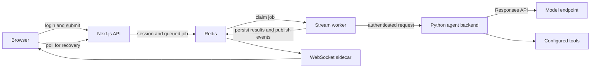

# Understanding and adapting Daedalus

Daedalus is a personal assistant with a Next.js application and a Python backend
built on NVIDIA NeMo Agent Toolkit. The local chat example uses the same request
path as the home deployment, with a much smaller set of tools.

## Follow one chat request

1. [`frontend/pages/api/chat/async.ts`](../frontend/pages/api/chat/async.ts)
   authenticates the caller and queues a job in Redis.
2. [`frontend/stream-worker.ts`](../frontend/stream-worker.ts) consumes jobs;
   [`frontend/server/chat/`](../frontend/server/chat/) contains execution,
   cancellation, and finalization logic.
   [`natMessages.ts`](../frontend/server/chat/natMessages.ts) assembles the
   trusted user headers and toolkit session cookie used for backend requests.
3. [`builder/entrypoint.py`](../builder/entrypoint.py) starts the backend with
   version checks and toolkit adapters.
   [`nat_helpers/front_end.py`](../builder/nat_helpers/src/nat_helpers/front_end.py)
   adds the application's HTTP routes and health checks.
4. [`per_user_tool_calling.py`](../builder/nat_helpers/src/nat_helpers/per_user_tool_calling.py)
   builds an agent for the authenticated user, forwards conversation history,
   and runs the configured tools through the model's Responses API.
5. The stream worker saves results and publishes events. The
   [`WebSocket sidecar`](../frontend/ws-server.ts) delivers updates; polling
   provides recovery when the connection is interrupted.

The frontend calls `/v1/chat/completions`. The backend calls the model provider's
`/responses` API. These are different interfaces. A provider that only implements
Chat Completions cannot run the current agent unchanged.

## State and dependencies

Redis stores accounts, sessions, conversations, jobs, approvals, and other
application state. The shipped Redis image includes modules used by the app;
substituting a plain Redis image needs validation. S3-compatible object storage
holds document bytes. Local Compose starts both stores.

Hindsight adds durable agent memory across conversations. Milvus, embeddings,
reranking, and NV-Ingest add document retrieval. MCP servers, image providers,
and the sandbox add their respective tools. Phoenix receives traces when
configured. These external integrations are absent from the local chat workflow.

The stream worker keeps chat execution alive when a browser disconnects. It is
different from the optional autonomous worker, which performs scheduled work
and is started by the Helm deployment. Splitting those processes supports the
app's recovery behavior even with two users; it is also operational overhead
that an adopter should understand.

## Where to change things

| Goal                            | Start here                                                                                                                           | What else to check                                                                                            |
| ------------------------------- | ------------------------------------------------------------------------------------------------------------------------------------ | ------------------------------------------------------------------------------------------------------------- |
| Use your model endpoint         | `llms` in [local-chat-config.yaml](../backend/local-chat-config.yaml), [.env.example](../.env.example)                               | Responses API, tool calling, streaming, timeouts                                                              |
| Change the assistant's behavior | `workflow.instructions` and `workflow.nat_tools` in your selected YAML                                                               | Prompts describe behavior; backend policy enforces authorization                                              |
| Add an existing Python tool     | `functions` in your YAML and the matching [builder package](../builder/)                                                             | Its environment variables, services, registration, and test coverage                                          |
| Add an MCP integration          | `authentication`, `function_groups`, and `workflow.nat_tools` in the [home workflow](../backend/tool-calling-config.yaml)            | Explicit tool exposure and approval policy; see [operations](operations.md#adding-or-expanding-an-mcp-server) |
| Change screens or API behavior  | [frontend/components](../frontend/components/), [frontend/pages/api](../frontend/pages/api/), [frontend/server](../frontend/server/) | Authentication, user ownership, narrow layouts, and recovery                                                  |
| Change background work          | [autonomous_agent](../builder/autonomous_agent/)                                                                                     | Worker identity, non-interactive permissions, scheduling, and cancellation                                    |
| Deploy to your cluster          | [chart defaults](../helm/daedalus/values.yaml), [Helm guide](../helm/daedalus/README.md)                                             | Your images, domains, storage, secrets, endpoints, and node placement                                         |

Start from the local chat YAML and add one capability at a time. Copy the
function's complete dependency wiring from the home workflow: referenced LLMs,
embedders, authentication, and object stores may be needed too. Merely removing
a tool from `workflow.nat_tools` does not remove its configured dependency.
Recreate the backend after changing YAML, then exercise the new tool.

## Reusing part of the project

The Python packages under `builder/` have their own `pyproject.toml` files and
toolkit entry points. They are useful extraction points, but some depend on
`nat_helpers`, Redis, application identity, or external services. Check those
dependencies before copying a package into another application. The frontend
also depends on Daedalus's API and state contracts.

[`protocol/`](../protocol/README.md) defines shared payloads and generated
TypeScript types. Preserve those contracts when changing both sides of an API.
Toolkit compatibility adapters use version-specific behavior; the runtime is
pinned and checked in [`builder/Dockerfile`](../builder/Dockerfile). Upgrade the
pin and validate the adapters together.

My home deployment settings remain in [`custom-values.yaml`](../custom-values.yaml)
and [`backend/tool-calling-config.yaml`](../backend/tool-calling-config.yaml).
They contain my registry, node names, integrations, and assistant preferences.
Use them as worked examples when adapting your own deployment.
