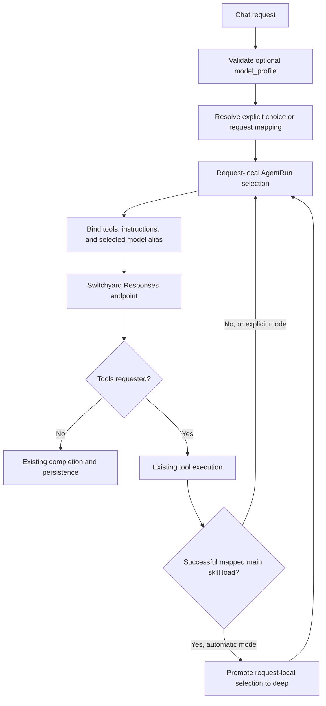

# Software Requirements Document: Request-scoped Model Routing

| Field             | Value                                                                                     |
| ----------------- | ----------------------------------------------------------------------------------------- |
| Status            | Implemented; see verification report; production rollout pending                          |
| Date              | 2026-09-16                                                                                |
| Application       | Daedalus Agent                                                                            |
| Primary owner     | Daedalus Agent engineering                                                                |
| Integration owner | Switchyard deployment maintainer                                                          |
| Source baseline   | Daedalus Agent checkout at `270d4cf`; separately inspected local Switchyard configuration |

## 1. Purpose

Allow Daedalus to select an appropriate model route for each user request while
balancing answer quality, completion time, and cost. Routine work should use the
default route; demanding workflows should select a deeper route deliberately.
Maximum reasoning should be available when explicitly requested.

The change must preserve the existing model → tools → model execution loop,
per-user tool construction, streaming, approvals, and partial-result recovery.
All profiles share the existing Switchyard endpoint and credentials. Switchyard
continues to own provider model IDs and reasoning settings.

Success means that the intended route is used on the actual outbound Responses
requests, including subsequent tool rounds. A configuration entry, successful
HTTP status, or generated answer alone does not establish correct routing.

## 2. Problem and current behavior

Daedalus currently configures one `tool_calling_llm`, whose model comes from
`TOOL_CALLING_LLM_MODEL_MODEL`. In the Switchyard deployment this is `daedalus`.
The per-user Responses adapter builds that client once and reuses it across
the agent loop. Its daily-summary branches restrict tools but use the same
model client.

Switchyard now has additional local route definitions. Their existence does
not make Daedalus select them. Loading a skill returns instructions and resources;
it does not currently change the model. These observations describe inspected
source and local configuration, not a verified live deployment.

| Application profile | Public Switchyard model ID | Intended target behavior                                                       |
| ------------------- | -------------------------- | ------------------------------------------------------------------------------ |
| `default`           | `daedalus`                 | Stage routing between GLM-5.3 Flash at `low` and DeepSeek V4.1 Flash at `high` |
| `deep`              | `daedalus/deep`            | DeepSeek V4.1 Flash at `high`, selected directly                               |
| `deep_max`          | `daedalus/max`             | DeepSeek V4.1 Flash at `max`, selected directly                                |

`deep_max` is an application profile and an internal Switchyard configuration
key. The public model ID is **`daedalus/max`**, not `daedalus/deep_max`.
These IDs are values of the request's `model` property; they are not HTTP paths.

The inspected Switchyard default route currently uses `capable_first`. After
application profile selection is implemented and verified, the intended steady
state is `efficient_first` on `daedalus`. A default profile still delegates target
selection to Switchyard and therefore does not guarantee GLM on every call.

Relevant current code:

| Responsibility                                | Source                                                                                                      |
| --------------------------------------------- | ----------------------------------------------------------------------------------------------------------- |
| Model transport and workflow configuration    | [backend/tool-calling-config.yaml](../backend/tool-calling-config.yaml)                                     |
| Per-user agent, model bindings, and streaming | [per_user_tool_calling.py](../builder/nat_helpers/src/nat_helpers/per_user_tool_calling.py)                 |
| Per-invocation state and lifetime             | [agent_loop_guard.py](../builder/nat_helpers/src/nat_helpers/agent_loop_guard.py)                           |
| Existing daily-summary request detection      | [daily_summary_runtime.py](../builder/nat_helpers/src/nat_helpers/daily_summary_runtime.py)                 |
| Skill loading and resource access             | [agent_skills_function.py](../builder/agent_skills/src/agent_skills/agent_skills_function.py)               |
| Queued chat request and backend forwarding    | [async.ts](../frontend/pages/api/chat/async.ts), [streamReader.ts](../frontend/server/chat/streamReader.ts) |

## 3. Scope

The first release includes:

- Optional backend configuration for named model routes and task/skill mappings.
- Explicit profile selection through the interactive chat request API, for both
  streaming and single-response execution.
- Automatic initial selection for the existing daily-summary request profile.
- Automatic promotion after a configured skill's main instructions load
  successfully during the current invocation.
- Request-local state, outbound model binding, queue metadata preservation,
  routing telemetry, regression tests, and deployment documentation.

The first release excludes a visible model picker, a new classifier model,
automatic promotion to `deep_max`, generic recovery retries, a new orchestration
service, and changes to scheduled autonomous-worker model selection. Image
generation, image comprehension, embeddings, reranking, and helper-tool model
calls retain their existing configuration. No skill markdown changes are
required to activate routing.

A future UI may expose Automatic, Default, Deep, and Maximum modes using the
API contract below. Its absence does not block automatic routing or API use.

## 4. Configuration contract

### 4.1 Retain one model transport

Keep the existing `llms.tool_calling_llm` and its `_type: openai`,
`api_type: responses`, base URL, API key, retry, and timeout settings.
The default alias remains the model name resolved from
`TOOL_CALLING_LLM_MODEL_MODEL`.

Add these optional fields to
`DaedalusPerUserResponsesAPIAgentWorkflowConfig`:

| Field                    | Proposed type                                              | Default   | Meaning                                                               |
| ------------------------ | ---------------------------------------------------------- | --------- | --------------------------------------------------------------------- |
| `model_routes`           | Map from `deep` or `deep_max` to nonempty model ID         | Empty map | Additional model aliases available to the main agent                  |
| `request_model_profiles` | Map from recognized request profile to `default` or `deep` | Empty map | Initial automatic selection; first release recognizes `daily_summary` |
| `skill_model_profiles`   | Map from installed skill name to `default` or `deep`       | Empty map | Automatic selection following a successful main skill load            |

The default alias is derived from the existing LLM configuration rather than
duplicated in `model_routes`. This keeps one authoritative default. Mapping to
`default` does not undo an earlier promotion to `deep`.

**The following fields require the routing implementation. Deploy the new
backend together with its configuration changes; older images do not support
these fields.**

```yaml
llms:
  tool_calling_llm:
    _type: openai
    api_type: responses
    api_key: ${TOOL_CALLING_LLM_MODEL_API_KEY}
    base_url: ${TOOL_CALLING_LLM_MODEL_BASE_URL}
    max_retries: ${DAEDALUS_LLM_MAX_RETRIES:-3}
    model_name: ${TOOL_CALLING_LLM_MODEL_MODEL}
    request_timeout: ${DAEDALUS_LLM_TIMEOUT:-60.0}
    truncation: auto

workflow:
  _type: daedalus_per_user_responses_api_agent
  llm_name: tool_calling_llm
  model_routes:
    deep: ${DAEDALUS_LLM_DEEP_MODEL:-daedalus/deep}
    deep_max: ${DAEDALUS_LLM_DEEP_MAX_MODEL:-daedalus/max}
  request_model_profiles:
    daily_summary: deep
  skill_model_profiles:
    daily-summary: deep
    fantasy-football-recap: deep
    sre-engineer: deep
    kubernetes-specialist: deep
  # Retain the remaining existing workflow settings and tool definitions.
```

These skill mappings are the initial deployment policy and are configurable.
They apply to actual skill loads, not general keyword matches. For example, a
simple status lookup that does not load a mapped skill stays on the default
route unless the caller explicitly selects a profile.

### 4.2 Environment and deployment wiring

| Backend environment variable   | Switchyard deployment value |
| ------------------------------ | --------------------------- |
| `TOOL_CALLING_LLM_MODEL_MODEL` | `daedalus`                  |
| `DAEDALUS_LLM_DEEP_MODEL`      | `daedalus/deep`             |
| `DAEDALUS_LLM_DEEP_MAX_MODEL`  | `daedalus/max`              |

Configure these through the existing backend environment mechanism: the
Compose environment file, or Helm's `backend.default.env` settings and referenced
Secret. Keep the existing base URL and API credential. The route names are
configuration, not new credentials. The current Helm allowlist already permits
`DAEDALUS_LLM_*`; verify all other environment loaders and examples during
implementation.

The minimal [local chat configuration](../backend/local-chat-config.yaml) must
remain usable without Switchyard or any optional profile fields. Do not add
Switchyard-specific defaults to the generic workflow class.

### 4.3 Configuration validation

- Reject unknown profile keys, empty aliases, unsupported request-profile keys,
  and automatic mappings to `deep_max`.
- A mapping to `deep` requires a configured deep alias. Validate configured
  skill names against the loaded skill catalog; report invalid names as
  configuration errors rather than silently ignoring them.
- Profiles are optional. If the three new maps are absent, existing requests
  without an explicit deep profile retain the current single-model behavior.
- An explicit request for an unconfigured profile is a validation error. Do not
  silently substitute the default model.
- Resolve and validate configuration before serving the affected workflow.
  Do not make remote provider discovery a new dependency on every request.

## 5. Request API and precedence

### 5.1 Public request fields

The frontend chat API accepts the optional field inside its existing
`additionalProps` object:

```json
{
  "additionalProps": {
    "model_profile": "deep_max"
  }
}
```

This is a fragment of the existing chat request. Other required request fields
remain unchanged. The stream worker forwards the selection to the backend as
`additional_props.model_profile`. Direct backend callers use that same snake-case
container.

Accepted values are exactly `default`, `deep`, and `deep_max`. Omission enables
automatic policy. An explicit `default` pins the default route and disables
automatic promotion for that invocation. It does not force Switchyard's weak
target. `null`, blank values, other types, and unknown strings are invalid.

Validate the enum at the frontend boundary before queuing and authoritatively
at the backend before any model or tool invocation. Backend validation also
checks whether the requested profile is configured. Use the existing request or
job error path; do not execute the request under another profile after a
validation failure. Preserve unrelated `additionalProps` fields.

Do not accept arbitrary upstream model IDs, URLs, credentials, or reasoning
objects through this feature. The backend resolves an allowed profile to an
operator-configured alias. The frontend-to-backend API remains
`/v1/chat/completions`; the backend-to-Switchyard API remains `/v1/responses`.

### 5.2 Selection rules

| Condition                                                               | Required behavior                                                                         |
| ----------------------------------------------------------------------- | ----------------------------------------------------------------------------------------- |
| Explicit `default`                                                      | Use the configured default alias for the complete invocation; ignore automatic promotions |
| Explicit `deep`                                                         | Use the deep alias from the first model call through completion                           |
| Explicit `deep_max`                                                     | Use the maximum alias from the first model call through completion                        |
| No explicit profile; request detector returns a mapped profile          | Apply its mapping before the first model call                                             |
| No explicit profile; successful mapped main skill load                  | Promote the next model call to deep if the mapping requests deep                          |
| Already deep; another skill maps to default or deep                     | Remain deep                                                                               |
| Failed skill load, skill listing, resource-only read, or unmapped skill | No profile change                                                                         |
| Provider timeout, tool error, or renderer validation failure            | Existing error/retry behavior; no automatic maximum-profile selection                     |
| Next user request in the conversation                                   | Resolve independently from its own metadata and current request context                   |

The existing daily-summary detector supplies the first initial mapping.
General research, diagnosis, and recap requests without an explicit profile may
start on the default route and promote when their mapped skill loads. The first
release does not claim universal intent classification or guaranteed promotion
for difficult requests that never load a mapped skill.

Automatic transitions are limited to `default` → `deep`. Explicit selection
locks the application profile. Within `default`, Switchyard may still change
its underlying target between model calls.

## 6. Functional requirements

### FR-01: Request isolation and lifetime

Keep the selected profile, selection source, and explicit-selection flag in the
existing per-invocation `AgentRun` context or an equivalent request-local object.
Keep this separate from `request_profile`, which currently controls daily-summary
tool selection and time budgets.

Never mutate the cached shared LLM's `model_name`, global workflow configuration,
or another invocation's state. Concurrent requests from the same user, as well
as different users, must remain isolated. Historical skill loads and old
conversation metadata must not cause promotion on a new request.

Preserve the effective selection during an existing same-invocation synthesis
retry. Persist the caller's requested profile through the existing job queue and
supported resubmission paths. Do not add automatic replay or pretend that an
in-memory promotion survives an interrupted process. Existing recovery behavior
continues to preserve partial output without restarting external actions.

### FR-02: Reliable skill promotion

Promote only after the configured skill's main instructions were successfully
loaded during the active invocation. Use a trusted success signal from the skill
dispatcher, carrying the canonical skill name and operation. An attempted tool
call, a string mentioning a skill, or the absence of an exception is insufficient:
the current dispatcher can return error text as a normal string result.

Resource-only reads and discovery must not promote. Companion skills may promote
when their main instructions load and their name is explicitly mapped. Concurrent
skill loads must converge on the same monotonic result before the next model
call. An explicit caller profile always wins.

The implementation must preserve the dispatcher output contract and avoid a
circular package dependency. A small internal callback or request-scoped event
is sufficient; no new external message bus is required.

### FR-03: Apply selection at the model boundary

Resolve the chosen alias on each main-agent model invocation and bind it as the
outgoing `model`. Preserve the existing tool schemas, parallel tool calling,
instructions, history handling, and Responses transport options.

Apply routing consistently to the general, daily-summary research, and
daily-summary final-synthesis bindings. Selecting deep must not restore tools
that were removed after the research budget expired.

An implementation can extend the existing bindings with
`bound_llm.bind(model=selected_alias)`. Local payload construction with the
installed client has confirmed that this retains tools and instructions without
mutating the shared default. That check is design evidence, not proof of runtime
or provider compatibility.

### FR-04: Keep provider reasoning policy in Switchyard

The agent must not inject `reasoning`, `reasoning_effort`, provider model names,
or sampling parameters as part of profile selection. These remain target defaults
in Switchyard. Caller-supplied reasoning objects can override those defaults,
which would defeat the profile contract.

Retain the existing single provider-neutral LLM configuration and its contract
tests. Profile aliases are deployment configuration and must also work with a
compatible non-Fireworks gateway.

### FR-05: Preserve conversation and tool continuity

On an automatic promotion, continue from the existing conversation and tool
results. Do not restart research, replay tools, or drop unresolved tool-call
pairs. Continue using the existing full-history Responses behavior rather than
introducing reliance on `previous_response_id` across model changes.

Verify that reasoning items, image inputs, and function-call history produced
before a switch are accepted by the next target. Do not assume opaque
provider-specific items are portable or indiscriminately remove history to make
a request pass. Any required normalization must preserve user content, tool
evidence, call/result associations, and the application's reasoning-history
contract.

Pinning an application alias does not guarantee a provider cache hit, shared
cache across model families, or a fixed target beneath the default stage route.

### FR-06: Preserve failure and completion behavior

Route selection must not alter OAuth or approval boundaries, cancellation,
iteration limits, repeated-error detection, validated-artifact termination, or
partial-output journaling.

An unavailable route uses existing bounded transport retries and error reporting.
Do not silently downgrade, upgrade, or add a second recovery model call. Preserve
collected evidence on failure. The existing bounded daily-summary synthesis retry
retains the chosen profile and its existing time limit.

An explicit maximum request changes model selection only. It does not expand
permissions, tool access, research budgets, timeouts, or approval authority.

### FR-07: Queue and protocol compatibility

Preserve `model_profile` through submission, Redis job serialization, stream-worker
forwarding, and supported OAuth/approval continuation paths. Existing queued jobs
without the field remain valid.

Use an explicit shared enum/type and runtime validation at both language
boundaries. Follow the repository's [protocol conventions](../protocol/README.md)
if adding a canonical shared schema and generated types. Generated types alone
do not validate incoming JSON. A new broad chat protocol redesign is out of scope.

The automatic routing policy must work without a frontend control. Existing
image and document-ingestion execution paths must not acquire this profile as an
unintended model override.

### FR-08: Observability

Record bounded routing metadata with the existing run trace:

- Requested profile, or automatic mode when omitted.
- Effective profile and outgoing route alias for each main-agent model call.
- Selection source: `default`, `explicit`, `request_profile`, or `skill_load`.
- Promotion count and the triggering skill name when applicable.
- Existing outcome, model-call count, and tool-call count.

Distinguish the requested route alias from the actual Switchyard target. Capture
selected-target metadata where the client exposes it; otherwise correlate with
Switchyard routing logs or statistics. Do not label every `daedalus` call as GLM.
Keep streamed model metadata consistent with the route used, or document the
existing workflow alias separately from actual invocation metadata.

Do not add prompt bodies, tool payloads, reasoning text, or credentials to routing
logs. Missing usage or cache-hit data must remain unknown rather than zero.
Helper-tool calls retain their separately configured model behavior and must be
distinguishable from the main-agent profile in evaluation accounting.

## 7. Proposed implementation shape



| Component                                              | Expected change                                                                          |
| ------------------------------------------------------ | ---------------------------------------------------------------------------------------- |
| `backend/tool-calling-config.yaml`                     | Declare optional aliases and deployment task/skill policy                                |
| `backend/local-chat-config.yaml`                       | Preserve operation with no routing extension                                             |
| `per_user_tool_calling.py`                             | Add validated config fields, explicit request handling, and profile-aware model bindings |
| `agent_loop_guard.py`                                  | Add independent per-invocation routing state without changing loop-guard policy          |
| `daily_summary_runtime.py`                             | Reuse existing request identification; keep research-budget behavior separate            |
| `agent_skills_function.py` and supporting code         | Produce trustworthy main-skill-load success information                                  |
| Frontend chat API, job types, and stream worker        | Validate and preserve the optional requested profile                                     |
| `.env.example`, Helm/operations documentation          | Document route overrides, compatibility, and rollout sequence                            |
| Existing builder, API, integration, and runtime checks | Assert the routing contract and preserve current behavior                                |

A small `nat_helpers` policy module may hold pure selection/configuration logic.
Keep it independent of provider SDKs and avoid duplicating the agent graph.

## 8. Acceptance criteria

All deterministic criteria below must pass before enabling automatic routing in
the deployment. Tests must inspect captured outbound requests as well as returned
answers.

| ID    | Scenario                                                                                 | Required result                                                                                     |
| ----- | ---------------------------------------------------------------------------------------- | --------------------------------------------------------------------------------------------------- |
| AC-01 | Existing configuration and request without profile fields                                | Same default model behavior; local chat still starts and completes                                  |
| AC-02 | Explicit `default`, `deep`, and `deep_max` requests                                      | Exact configured alias on every main-agent call; explicit default suppresses automatic promotion    |
| AC-03 | Daily-summary request in automatic mode                                                  | Deep alias from the first main-agent call through research and synthesis                            |
| AC-04 | Successful configured main skill load                                                    | Next call uses deep with existing history; subsequent calls remain deep                             |
| AC-05 | Skill listing, resource read, missing skill, dispatcher error string, or historical load | No promotion                                                                                        |
| AC-06 | Parallel mapped and unmapped skill loads                                                 | Deterministic promotion; no downgrade or cross-request mutation                                     |
| AC-07 | Concurrent calls for one user and for different users                                    | Each keeps its own route; the cached client's default stays unchanged                               |
| AC-08 | Next user request after a deep or maximum invocation                                     | Fresh selection; no inherited promotion from prior history                                          |
| AC-09 | Invalid type/value or unconfigured explicit profile                                      | Validation failure before model/tool execution; no silent fallback                                  |
| AC-10 | Invalid route map or automatic mapping to maximum                                        | Clear configuration failure before the affected workflow serves traffic                             |
| AC-11 | Async queue and supported authorization continuation                                     | Caller-selected profile survives existing serialization and continuation paths                      |
| AC-12 | Streaming and single-response requests, including normal tool rounds                     | Same selection semantics; instructions, schemas, and parallel-tool settings retained                |
| AC-13 | Daily-summary budget expiry and existing synthesis retry                                 | Selected route retained; restricted tool set and original retry/time bounds respected               |
| AC-14 | Model switch with image and function-call history                                        | Valid requests and correct tool-call/result associations; no replay or evidence loss                |
| AC-15 | Provider failure, cancellation, approval boundary, or incomplete response                | Existing outcome and partial-result handling; no maximum-profile escalation or extra recovery calls |
| AC-16 | Inspect outbound payloads and routing traces                                             | Correct model alias; no injected reasoning/sampling overrides; route and target distinguished       |
| AC-17 | Helper-tool, image, embedding, and scheduled-worker execution                            | Existing model selection remains unchanged outside the main interactive agent                       |
| AC-18 | Deploy without optional deep routes, then roll back routing configuration                | Supported default behavior restored without a database migration                                    |

### 8.1 Verification layers

1. **Policy/configuration tests:** exercise precedence, validation, promotion,
   and request isolation. Keep existing singleton transport and reasoning-policy
   assertions in `test_backend_config_contracts.py`.
2. **Agent tests:** extend `test_per_user_tool_calling.py` and skill-dispatcher
   tests with controlled main-skill success and failure cases. Assert complete
   outbound history and preservation of partial work.
3. **Frontend and queue tests:** check field validation, absence compatibility,
   serialization, forwarding, and supported continuation paths using the existing
   integration fixtures.
4. **Built-backend HTTP checks:** run the actual backend image with a recording
   Responses upstream. Cover every alias, streaming, promotion, parallel requests,
   invalid selection, and synthesis retry. Framework stubs alone are insufficient.
5. **Gateway/provider smoke:** verify the deployed Switchyard aliases and actual
   provider acceptance of reasoning defaults, tools, images, streaming, and
   cross-model history. A mock upstream does not establish these properties.

Run the affected repository checks, including the relevant builder tests,
frontend lint/types/tests/build when frontend code changes, integration checks
for queue behavior, Helm validation for deployment changes, and pre-commit hooks.
Record unavailable checks rather than describing them as passed.

### 8.2 Workload evaluation

Use a frozen set of approximately 20–30 representative tasks spanning routine
lookups, daily briefings, fantasy recaps, infrastructure diagnosis, synthesis,
and difficult reasoning. Include multi-round tools and at least one image input.
Use controlled fixtures for correctness comparisons and separate live runs for
end-to-end latency. Repeat tasks where practical; report sample counts and
uncertainty, especially for tail latency.

Compare the current deployed baseline, the proposed two-model policy, and
DeepSeek with lower/higher reasoning profiles as an alternative. Record the exact
baseline configuration instead of assuming it matches the current local file.

Measure completed-task correctness, schema/renderer validation, unnecessary tool
calls, retries, first useful output, total completion time, input/cache/output
usage, and cost per successful task. Include failed attempts and helper calls in
total task cost. Do not double-count reasoning tokens already included in output
usage. Freeze the price assumptions with the results.

No latency SLA, savings percentage, or model-quality superiority is established
by this SRD. Record evaluation thresholds before comparing candidates and report
quality, latency, and cost separately. Required routing correctness and isolation
must pass regardless of the model-performance result.

## 9. Rollout and rollback

1. Verify that Switchyard serves `daedalus`, `daedalus/deep`, and `daedalus/max`
   with the intended target defaults. Keep its default picker at `capable_first`
   during the initial application rollout.
2. Deploy the new backend image with compatible optional profile configuration
   and the API/worker validation changes. Do not send new workflow fields to an
   older backend that does not recognize them. Older clients and queued jobs
   without a selection must continue to work.
3. Exercise explicit profiles, then automatic daily-summary and skill promotion.
   Verify captured aliases, provider behavior, and task completion in the running
   deployment. Preserve existing source/OAuth boundaries during validation.
4. After promotion behavior is verified, change only the default Switchyard
   stage route to `efficient_first`; initially retain threshold `0.5` and window
   `3`. The explicit deep routes remain passthrough routes.
5. Compare observed correctness, latency, and cost with the recorded baseline.
   Keep maximum reasoning explicitly selected in this release.

To disable automatic promotion while keeping explicit profiles, remove the
request and skill mappings. To restore the earlier single-route deployment,
first restore Switchyard's desired default picker and stop callers sending
explicit deep profiles, then remove the optional maps and aliases. Coordinate
application rollback so an old image never receives unsupported workflow fields.
Finish or cancel active requests through existing mechanisms; do not replay tools
as a rollback step. No conversation or Redis data migration is required.

## 10. Known limits and implementation decisions

- The model pair and effort levels are deployment choices, not universal
  application constants. Current recommendation quality has not been measured
  through Daedalus.
- Stage routing beneath `default` remains heuristic. It cannot guarantee that
  every difficult request is recognized, especially without a mapped skill.
- Skill promotion occurs after a successful main load. Tasks needing deep from
  their first call require an initial request mapping or explicit selection.
- The new route may have a cold cache after promotion. Measure the benefit of
  switching rather than assuming equal cache behavior.
- The installed dependency stack and live providers have passed the checks in
  the [verification report](model-routing-validation.md). Production rollout
  checks remain separate from those controlled checks.
- Automatic maximum-reasoning escalation, broader intent detection, a UI picker,
  and profile selection for autonomous workers are separate follow-ups. They
  must not be added implicitly to this implementation.

The implementation should settle the internal skill-success notification
mechanism and trace metadata schema while keeping the observable contracts in
this document unchanged. Record any proposed contract change in this SRD before
shipping it.

## 11. Engineering handoff

Deliver the backend policy and bindings, optional deployment configuration,
request/queue contract support, routing telemetry, tests, and operator guidance
as one coherent feature. Include a verification report that separates source
tests, built-image checks, provider smoke results, and workload measurements.

This document is the requirements and acceptance baseline and authorizes no
deployment. Implementation evidence and remaining rollout gates are recorded in
the [verification report](model-routing-validation.md).
