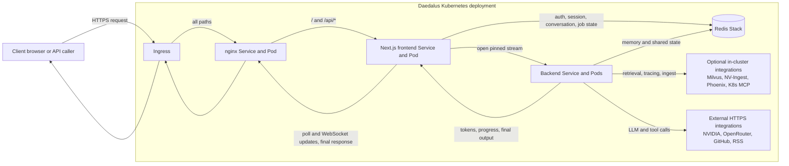
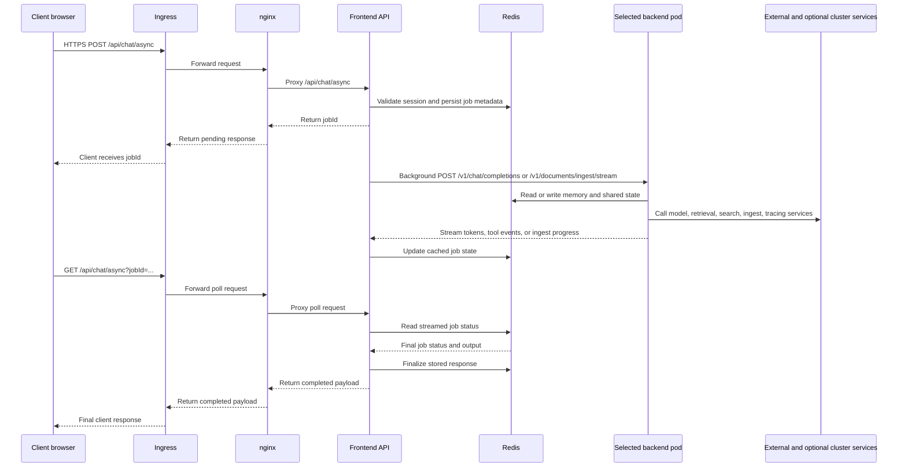

# Full deployment and integration reference

This reference describes the configuration I use at home and the integration
code available for reuse. Start with the [README](../README.md) for local text
chat and the [code map](architecture.md) for adaptation points.

Commands below run from the repository root. `custom-values.yaml` contains my
registry, domains, node placement, storage, and service endpoints. Review and
replace those settings for your environment. `make deploy` is the canonical
Kubernetes deployment entry point: it validates configuration, builds and
pushes images, synchronizes Secrets, runs dependency preflights, and performs
the guarded Helm upgrade. It is not part of the local quick start.

Use `.env.template` as the full environment reference. For image Content
Credentials, see the [setup guide](content-credentials.md). Durable memory uses
a separately deployed Hindsight service configured through `HINDSIGHT_API_URL`,
`HINDSIGHT_API_KEY`, and `DAEDALUS_MEMORY_MODE=hindsight`.

## Kubernetes Deployment

My home deployment uses Kubernetes for the full Daedalus layout: backend,
frontend, nginx public edge, PVC-backed storage, the autonomous worker, and
optional Cilium policies. The unused Kubernetes ingress is disabled.

The current repository application images are published for `linux/amd64`.
`custom-values.yaml` therefore sets
`global.nodePlacement.allowedArchitectures: [amd64]`, preventing Kubernetes from
scheduling backend, frontend, or worker pods on an incompatible ARM64 node.
The RAG preflight inherits the rendered backend affinity so it tests the same
eligible node pool as the deployed workload.

### Canonical Path: `make deploy`

The Make target invokes the repository deployment implementation with the
development image policy used by this installation. Pass supported
implementation options through `DEPLOY_ARGS`; do not run Helm separately because
that bypasses the authentication, image, Secret, MCP, storage, and readiness
gates.

Before using it:

1. Fill in `.env` with your real secrets.
2. Set `DOCKER_REGISTRY` and `DAEDALUS_VERSION` in `.env`.
3. Update image repositories, ingress hostnames, and any node-placement or persistence settings in [`custom-values.yaml`](../custom-values.yaml).
4. If you want the autonomous worker to write memories and dashboard updates for your account, set `autonomousAgent.userId` to a real login username.

Run:

```bash
make deploy
```

Useful flags:

```bash
make deploy DEPLOY_ARGS='--dry-run'
make deploy DEPLOY_IMAGE_ARGS= DEPLOY_ARGS='--skip-build --release-metadata ./release-metadata.json'
make deploy DEPLOY_ARGS='--skip-tls'
make deploy DEPLOY_ARGS='--mcp-preflight-timeout 30'
make deploy DEPLOY_ARGS='--mcp-preflight-kubectl-image curlimages/curl:8.8.0'
make deploy DEPLOY_ARGS='--backend-config backend/tool-calling-config.yaml'
make deploy DEPLOY_ARGS='--namespace daedalus --release daedalus'
```

The deployment runs an MCP pre-flight before Helm. It checks every
`streamable-http` MCP server in `backend/tool-calling-config.yaml`, verifies
that configured `include` tools are advertised by `tools/list`, and runs
cluster-local URLs such as `*.svc.cluster.local` from a short-lived Kubernetes
curl pod in the target namespace. Authenticated cluster-local probes read API
keys from the same backend Secret through `envFrom`; key values are never
placed in command arguments or printed.
The checker reads complete pod logs after the probe exits, then deletes the
temporary pod. This avoids losing fast initialization responses before
`kubectl` attaches; cleanup is also attempted when execution or log collection fails.

For Kubernetes RAG deployments, `make deploy` also mirrors the authoritative
Milvus and MinIO credentials into namespace-local workload Secrets, then runs
authenticated `list_collections` and `has_collection` probes with the exact
rendered backend configuration. The second call exercises Milvus's
`DescribeCollection` authorization path rather than accepting a public-role
collection listing as proof of RAG access. The same preflight verifies TCP
reachability for the configured embedding and reranker URLs from a pod carrying
the backend policy labels. For Cilium namespace egress, configure the target
container port after Service translation (for example, the retriever Services
expose `8000` but their adapter pods receive traffic on `8080`). The defaults
match `daedalus-context`:

- `daedalus/milvus-root-credentials`, key `password`, username `root`
- `daedalus/milvus-minio-credentials`, keys `accesskey` and `secretkey`

Override the source contract by exporting `MILVUS_AUTH_SOURCE_NAMESPACE`,
`MILVUS_AUTH_SOURCE_SECRET`, `MILVUS_AUTH_SOURCE_PASSWORD_KEY`,
`MILVUS_AUTH_USERNAME`, `MINIO_AUTH_SOURCE_NAMESPACE`,
`MINIO_AUTH_SOURCE_SECRET`, `MINIO_AUTH_SOURCE_ACCESS_KEY`, and
`MINIO_AUTH_SOURCE_SECRET_KEY`. The copies are `<release>-milvus-auth`,
`<release>-minio-auth`, and `<release>-document-objects` in the Daedalus
namespace. Secret payloads are sent directly to the Kubernetes API and never
passed as Helm values. Use `--skip-rag-secret-sync` only when another Secret
controller provisions those target Secrets.

After synchronization, the deploy reads only each target Secret's Kubernetes
`metadata.resourceVersion` and places those opaque versions in pod-template
annotations. A credential rotation therefore changes the backend pod template;
the document-object version also changes the frontend pod template. Credential
bytes and hashes are not stored in Helm release metadata.

The production RAG contract uses Milvus database `default`, document bucket
`nv-ingest`, and the in-cluster endpoints
`milvus.daedalus.svc.cluster.local:19530`,
`milvus-minio.daedalus.svc.cluster.local:9000`, and
`nv-ingest.daedalus.svc.cluster.local:7670`. Keep the query embedding model,
vector dimension, vector/content field names, and distance metric compatible
with the URL-ingest writer; changing only the query side can leave a healthy
deployment that cannot search an existing collection correctly.

After rollout, verify both the workload and the authenticated RAG dependency:

```bash
kubectl -n daedalus rollout status deployment/daedalus-backend-default
kubectl -n daedalus get secret \
  daedalus-milvus-auth daedalus-minio-auth daedalus-document-objects
kubectl -n daedalus port-forward service/daedalus-backend-default 18000:8000
# In another shell:
curl -fsS http://127.0.0.1:18000/health/ready
```

For this full RAG deployment, the readiness response must report RAG ready. A successful TCP connection or
`list_collections` result alone is insufficient because the production path
also needs `DescribeCollection`, exercised by `has_collection`.

### Adding or expanding an MCP server

MCP exposure and approval are configured separately:

- A non-empty `include` list exposes only those tools. Omitting `include` or
  setting `include: []` exposes all tools advertised by the server, except any
  listed in `exclude`. A non-empty `include` takes precedence over `exclude`,
  matching NAT's native filtering. Discovery happens when the workflow is
  built; restart or rebuild cached workflows to discover newly added tools.
  Discovering a tool does not itself authorize its execution.

- Mark a verified read-only tool beside its exact name under `tool_overrides`:

  ```yaml
  function_groups:
    example_mcp_server:
      _type: mcp_client
      include: [get_status]
      tool_overrides:
        get_status:
          approval_policy: read_only
  ```

  `backend/tool-calling-config.yaml` is the only repository configuration
  surface for this decision, including the Responses workflow. The removed
  Responses overlay is no longer required. The pinned runtime adapter loads the effective
  declarations before installing the approval gate. NAT ignores this
  Daedalus-owned extension itself.

- A mutating, irreversible, or unreviewed tool must never be marked `read_only`.
  The group default is `approval_required`. Unless explicitly authorized as
  described below, the call remains fail-closed until
  `confirm_action` records an intent bound to the exact server, tool, and final
  arguments. In interactive Chat, a strict next-message approval atomically
  creates one short-lived credential in trusted request metadata. The browser
  and model never receive it. Unknown policy values, policy entries outside a
  non-empty `include`, and policy entries for excluded tools fail backend
  startup. Autonomous runs cannot request approvals.
- To authorize an exact tool without per-call approval, set its override to
  `approval_policy: auto_approve`. This is an explicit operator authorization,
  including for mutations, and applies to interactive and autonomous calls.
  To authorize all exposed tools, set `approval_policy: auto_approve` on the
  function group. Exact per-tool overrides take precedence: `approval_required`
  requires approval even with that group default, while `read_only` retains
  read-only checks and safe retry behavior. Removing an override restores the
  group default. Group defaults support `auto_approve` and `approval_required`;
  `read_only` must be assigned to individual verified tools.

  Google Calendar's `create_event` uses an exact `auto_approve` override. Once
  Calendar OAuth is connected, new events run without a per-call approval prompt.
  Missing or expired authorization still follows the per-user OAuth flow.
  Updating, deleting, and responding to existing events require approval.

  Hue omits `include` and uses the group default below. Its three verified reads
  keep `read_only` overrides; other current and newly discovered Hue tools
  inherit `auto_approve`:

  ```yaml
  function_groups:
    hue_mcp_server:
      _type: mcp_client
      approval_policy: auto_approve
      tool_overrides:
        get_bridge_status:
          approval_policy: read_only
        list_resources:
          approval_policy: read_only
        get_resource:
          approval_policy: read_only
      # Keep the existing server and authentication settings.
  ```

  Auto-approved calls retain protection against automatic replay after an
  uncertain response and do not create per-call approval credentials or receipts.

- For static API-key MCP providers, backend startup logs only whether the
  required environment variable is non-empty (`configured=True|False`), never
  the value. This verifies deployment injection, not upstream acceptance; a
  remote 401/403 or MCP error is the signal to investigate the credential or
  server policy.

Authentication scope is part of the server contract:

- Kubernetes and UniFi are shared-credential services. Their API key comes
  from the backend Secret and is never user-authorized. A 401/403 is an
  operator incident; `confirm_action` cannot repair it and the agent must not
  retry it in a loop.
- Gmail, Google Calendar, and Docs use one shared OAuth
  client configuration with per-user authorization. Google publishes each MCP
  as a separate protected resource, so the first use of each service can still
  require its own consent. NAT stores the resulting tokens in separate
  Redis-backed object-store buckets keyed by the authenticated user, so they
  survive restarts and work across chats and backend replicas. The frontend
  records each short-lived OAuth state in Redis, sends the callback to the exact
  backend pod that initiated the flow, and exposes one Connections view for all
  three saved authorizations. Missing, expired, or refresh-rejected tokens produce
  an `oauth_required` stream event with a service-specific Connect/Reopen action.
  The approval policy must allow a read-only call to reach the provider
  challenge or that reauthorization event cannot be created.
- Give each new per-user OAuth provider its own token bucket. NAT's token key
  is derived from user identity, so sharing a bucket between providers would
  allow one provider's token record to replace another's.

Provider-side quota, billing, rate-limit, and shared server-credential failures
are not user OAuth problems. Tools must return them explicitly, and the agent
must disclose the affected provider in its final response even if it can use a
fallback. In particular, Perplexity `insufficient_quota` is an operator-managed
usage limit; retrying or asking the user to authorize cannot repair it.

### Deployment Boundary

Use `make deploy` for installs and upgrades. Direct Helm invocation is a chart
development operation, not a supported deployment path: it does not build or
verify immutable images, filter workload Secrets, validate password hashes,
check MCP catalogs, synchronize RAG credentials, or record release evidence.

### Full Helm Footprint

The Helm chart can deploy:

- Backend deployment
- Frontend and nginx
- Redis Stack using the repository-owned, security-updated runtime image
- An autonomous-agent worker Deployment
- Ingress, PVCs, PodDisruptionBudget, and network policies
- A chart-managed internal API token shared by frontend and backend
- Optional Cilium FQDN-based egress restrictions

Start with [`helm/daedalus/values.yaml`](../helm/daedalus/values.yaml) for defaults and [`custom-values.yaml`](../custom-values.yaml) for my home deployment settings. RedisInsight isn't shipped. Use an authenticated, time-bounded local client through `kubectl port-forward` when interactive Redis inspection is required. The [Helm Redis runbook](../helm/daedalus/README.md#redis-acl-tls-and-rotation) covers ACL credential and TLS certificate rotation.

### Kubernetes Request Flow

The main browser chat path in Kubernetes goes through the frontend's async API route. The frontend authenticates the user, stores frontend-managed job metadata in Redis, opens a pinned backend stream, and returns a `jobId` immediately. Normal chat uses `/v1/chat/completions`; uploaded document ingestion always uses `/v1/documents/ingest/stream` so progress can be pushed back through Redis and WebSocket.



The sequence below shows the primary UI request and response path used by `/api/chat/async`.



> **Direct API access:** Helm defaults to `nginx.config.restrictedMode=true`,
> which forces browser and API traffic through the authenticated frontend. Set
> `nginx.config.restrictedMode=false` only when you intentionally want nginx
> to proxy `/chat/*`, `/generate/*`, and `/v1/*` directly to the backend.

### Timeout Budget

Every network hop has its own deadline, and the outer hop must always be a
superset of the inner one. When they invert, the shorter hop returns a 504 while
the inner handler keeps running, which looks like a hang rather than a failure.
The intended ordering, outermost first:

| Hop                                      | Budget | Set in                                      |
| ---------------------------------------- | ------ | ------------------------------------------- |
| Ingress `proxy-read-timeout`             | 900s   | `custom-values.yaml`                        |
| nginx `location /api/chat`               | 900s   | `helm/daedalus/templates/config-nginx.yaml` |
| nginx `location /api/document/`          | 900s   | `helm/daedalus/templates/config-nginx.yaml` |
| nginx `location /api/images/`            | 360s   | `helm/daedalus/templates/config-nginx.yaml` |
| nginx `location /api/` (everything else) | 120s   | `helm/daedalus/templates/config-nginx.yaml` |
| nginx `location /ws`                     | 3600s  | `helm/daedalus/templates/config-nginx.yaml` |
| Stream worker MCP-OAuth idle             | 660s   | `MCP_OAUTH_STREAM_IDLE_TIMEOUT_MS`          |
| Backend interactive OAuth deadline       | 600s   | `DAEDALUS_MCP_OAUTH_TIMEOUT_SECONDS`        |
| Stream worker backend SSE idle           | 300s   | `STREAM_READ_IDLE_TIMEOUT_MS`               |

Long chat answers are not bounded by the proxy hops above. Tokens reach the
browser over the WebSocket sidecar (`/ws`, 3600s) while the stream worker holds
the backend connection, so the effective limit on a chat turn is
`STREAM_READ_IDLE_TIMEOUT_MS` of _silence_ from the backend, not total duration.

That has a consequence worth remembering when tuning tools: any single tool call
that can run longer than `STREAM_READ_IDLE_TIMEOUT_MS` without emitting an
intermediate step will trip the idle deadline. `visual_media_tool` is the
closest case in the shipped config, with `image_timeout` and
`comprehension_timeout` both at 300s against a 300s idle budget. Raise
`STREAM_READ_IDLE_TIMEOUT_MS` above the slowest tool timeout before increasing a
tool's own budget.

### Document Ingestion and Milvus Collections

Uploaded-document ingestion can target either user-scoped collections or
allow-listed shared collections. Both collection classes intentionally live in
the same Milvus database; the distinction is policy and naming, not a separate
database boundary.

The shared upload targets are `kubernetes`, `mentalhealth`, `nvidia`,
`semianalysis`, and `vetpartner`. Other arbitrary collection names are scoped
to the authenticated user before they reach Milvus. Ingestion requests carry
`collection_scope` (`shared` or `user`) plus provenance metadata such as
uploader, source, target collection, database name, and timestamp. The backend
rejects scope mismatches so accidental writes to shared corpora are caught
before ingestion.

Legacy normalized private collections have an authenticated, operator-only
migration command at
[`builder/milvus_collection_migration.py`](../builder/milvus_collection_migration.py).
It migrates one reviewed subject at a time, refuses ambiguous ownership, and
doesn't expose migration actions to the agent. See the private collection
migration runbook in
[`builder/nat_nv_ingest/README.md`](../builder/nat_nv_ingest/README.md#private-collection-migration-runbook)
before cutover.

For implementation details, see
[`frontend/pages/api/milvus/README.md`](../frontend/pages/api/milvus/README.md)
and [`builder/nat_nv_ingest/README.md`](../builder/nat_nv_ingest/README.md).

## Backend Workflows

The full home-deployment backend configuration lives at [`backend/tool-calling-config.yaml`](../backend/tool-calling-config.yaml), uses the Responses API by default, and covers tool use, retrieval, memory, MCP integrations, image tooling, and reasoning. The workflow includes the custom packages from `builder/` and relies heavily on environment-variable substitution for secrets and endpoints.

The workflow uses one top-level, per-user Responses API agent with a direct
leaf-tool surface. It preserves full chat history, top-level instructions,
streaming, and per-user OAuth isolation. Concise factual questions use retrievers, curated feeds, search, and
scraping directly; comprehensive reports, broad surveys, strategy work, and
multi-section comparisons use the same direct tools with source planning, plan
approval for expensive/open-ended research, source-ledger tracking, targeted
claim verification, and citation auditing before returning a report. The
frontend can pass per-message `sourcePolicy` metadata that becomes a hidden
`[SOURCE_POLICY]` control message for source inclusion/exclusion, retrieval
budget, and plan-approval requirements.

### Tool-output context compaction

Daedalus reduces large structured tool results immediately before each model
call. This is separate from Hindsight memory, provider prompt caching, and the
manual `content_distiller_tool`:

- Small results, generic prose, code, malformed JSON, duplicate-key JSON, and
  non-finite JSON pass through unchanged. Valid JSON can be whitespace-minified
  without losing data.
- Large JSON arrays receive a bounded preview containing the first and last
  rows, error-like rows, query-relevant rows, and an even sample. The model sees
  the original item count and the exact indices retained. Requests for exact
  counts, exhaustive lists, absence checks, raw output, or verbatim output keep
  the complete result instead.
- Structured RSS article results retain their source metadata and up to 4,000
  characters of verbatim excerpts. Their marker explicitly identifies omitted
  content and explains exact recovery. Excerpt positions are relative to the
  decoded article, not offsets into the stored JSON; use literal search or page
  the original JSON. Generic web scrapes remain unchanged because they can
  contain code or documents.
- Before a preview replaces the result, Daedalus stores the exact original in
  user-isolated Redis with a two-hour TTL. If storage fails, the original result
  stays in the prompt. `tool_output_retriever_tool` can search or page the exact
  cached text when omitted rows could affect the answer.
- The retriever is exempt from compaction, and every retrieval is bounded.
  References cannot cross authenticated user boundaries.

The workflow fields under `tool_output_compaction_*` set the activation size,
preview size, required savings, maximum accepted result size, and cache TTL.
Disable `tool_output_compaction_enabled` for an A/B baseline. Compare
provider-reported input tokens and end-to-end latency on the same request set,
then use exact-answer, exhaustive-list, absence-claim, and anomaly-retention
checks as quality gates. Logs record only tool names and aggregate sizes; they
do not record result content or cache references.

### Daily briefing latency

The initial `daily-summary` skill load includes a fresh backend UTC/local clock
and the four canonical policy, sourcing, format, and editorial references. It
does not fetch personal sources or bypass their authorization preflight. After
that preflight, source planning can share a tool round with independent baseline
reads that already satisfy the source policy. Conditional sources and anomaly
follow-ups remain agent decisions; the renderer still validates the final edition.

Use `curated_feed_search_tool` with `mode="discover"`, `top_k=3`, and up to six
`queries` containing `query`/`feed_scope` pairs. The registered schema derives
valid scopes from the feed map. Discovery returns bounded excerpts, publication
and fetch dates, cache expiry, and explicit `ok`, `partial`, `empty`, or
`unavailable` results. Feed excerpts are candidate evidence, not verified article
claims. Fetch selected URLs concurrently when their contents are needed. The
legacy single-query article mode remains available. Production feed freshness
is 15 minutes, with four concurrent feed fetches and shared in-flight misses.

RSS article mode and webscrape share a bounded anonymous article cache within
the owning workflow builder. The cache holds at most 64 entries / 8 MiB for at
most five minutes and honors shorter server cache lifetimes. Query-string URLs,
responses setting cookies, and private/no-store/no-cache responses are not
cached. Cache hits retain original fetch timestamps; failed fetches are not
cached. Clients retain TLS connections without sending cookies or credentials;
public-IP validation and redirect restrictions still apply. A cancelled waiter
does not cancel another consumer's shared fetch.

Known generic HTML uses MarkItDown's HTML converter directly, retaining its
complete output and charset handling. This avoids initializing the general
Magika/ONNX file classifier for every page, which can oversubscribe a container's
CPU quota. Non-HTML documents, specialized converter URLs, and installed plugins
keep the general conversion path. Compare the conversion span separately from
fetching; cache hits and faster downloads do not establish faster conversion.

`nws_weather_tool` reads official NWS JSON for US coordinates. `days=4` covers
today's remaining hours and the next three complete local calendar days.
`include_observations=true` also reads current station observations. Forecast
gaps, stale issue times, unavailable observations, and alert failures remain
explicit. Only location-to-grid mappings are cached; forecasts and alerts are
fetched on each call.

GitHub requests explicitly select the read-only remote catalog using
`X-MCP-Tools` and `X-MCP-Readonly`, including `get_commit` and `actions_list`.
Keep the header and local allowlist aligned. The direct MCP preflight honors
these headers. Exact repeated read failures for rejected credentials or invalid
arguments reuse their sanitized result only within the current agent request;
successful reads, changed arguments, new requests, and transient failures are
not suppressed.
GitHub's explicit credential/repository access denials return
`mcp_authorization_denied` with sanitized permission guidance. For `actions_list`,
check repository access and Actions read permission; user confirmation does not
change an operator-managed token's grants.

The briefing tool advertises the nested canonical `edition-schema.json`
contract. The standalone renderer checks that same contract and reports
structural errors together before source/HTML validation. Correct all reported
paths in the one permitted correction; the two-attempt limit remains unchanged.
Diagnostics are bounded and indicate omitted errors when a malformed input
exceeds the diagnostic budget. The schema and stdlib contract helper are required
registration assets and are included in build-time runtime validation.

Before staging files, the renderer checks discovered `python3`, file staging,
and conversation workspace capabilities. The sandbox remains the primary path;
the fixed local canonical scripts provide bounded recovery for unavailable
capabilities or transport failures. Tool results identify `execution_path`,
`stage`, `failure_type`, and `recovery_reason`, including failed local validation.
All sandbox replicas must advertise the updated allowlist; changing a ConfigMap
does not update environment variables already loaded by running pods.

A daily-summary text response without a validated artifact emits
`briefing_text_fallback`, `degraded=true`, and `artifact_validated=false`, with
the render attempt count and failure reason. Gracefully delivered text retains
`failed=false`; it is not a transport error. Canonical HTML emits
`validated_artifact` and `artifact_validated=true`. A green request status alone
does not establish that the requested HTML was produced.

Phoenix now receives duration spans for `daedalus.agent.model`, MCP catalog,
session acquisition and dispatch, feed fetch/rerank, public-content fetch and
conversion, and NWS requests. Metadata contains operational labels, timings,
counts and cache states, without source text, queries, credential values, or
exception messages. These complement the existing workflow outcome and model
call count. Compare end-to-end p50/p95, model rounds, and cache states across
repeated cold and warm runs; account for overlapping spans rather than summing
tool durations. Require the same desk coverage, source freshness, supported
claims, explicit unavailable sources, and successful renderer validation before
accepting a latency improvement. A shorter timeout alone is not evidence of a
faster successful workflow.

## Frontend Capabilities

The frontend includes:

- Frontend-managed async chat with pinned backend streaming
- Autonomy dashboard for worker status, goals, runs, and feed items
- Authentication backed by Redis
- File attachments for images, documents, and videos
- Durable, authenticated downloads for files created in the Bubblewrap sandbox
- Direct document ingestion with streamed progress
- Doc-to-Markdown: download an entire uploaded document as a Markdown file (`POST /v1/documents/markdown`)
- Conversation export, import, and search
- Real-time cross-device sync over the WebSocket sidecar
- PWA support and offline assets
- A built-in Help dialog for end users

The sandbox adapter keeps multi-step files in a trusted conversation workspace.
After the agent verifies a completed file, `publish_file` copies its exact bytes
to owner-scoped document object storage. The final assistant message receives an
authenticated `/api/session/documentStorage` link instead of an unreachable
sandbox-relative path. Published files use the configured document retention
period and remain subject to the normal authenticated download checks.

For frontend-specific details, see [`frontend/README.md`](../frontend/README.md).

## Custom Builder Packages

The `builder/` directory contains reusable NeMo Agent functions, helpers, and standalone modules that patch NAT at startup.
The `skills/` directory contains the runtime skills exposed to Daedalus.

| Name                | Type    | Purpose                                                               |
| ------------------- | ------- | --------------------------------------------------------------------- |
| `agent_skills`      | package | Discovers and runs repo-packaged skills                               |
| `autonomous_agent`  | package | Long-running autonomous worker, Redis state store, and prompt runtime |
| `content_distiller` | package | Long-content distillation helper                                      |
| `visual_media`      | package | Unified text-to-image, image edit, and image/video analysis           |
| `nat_helpers`       | package | Shared identity, memory, NVIDIA docs, image, and URL utilities        |
| `nat_nv_ingest`     | package | Unified user-document ingestion, search, and listing                  |
| `rss_feed`          | package | RSS fetching, reranking, and scraping                                 |
| `smart_milvus`      | package | Milvus retrieval, domain routing, and reranking                       |
| `source_verifier`   | package | Source planning, claim verification, and citation auditing            |
| `user_interaction`  | package | Structured clarification, plan approval, and confirmation prompts     |
| `webscrape`         | package | Web page extraction                                                   |
| `entrypoint.py`     | module  | Version-guarded NAT entrypoint with auth and application routes       |
| `mcp_patches.py`    | module  | Bounded MCP startup, OAuth bootstrap, and approval policy adapters    |

Several packages include their own README files under `builder/`.

### Source-verification critic

`source_verifier_tool.verify_claim` fact-checks one precise claim against the
content fetched from its cited URL. The critic is provider-neutral: its
`llm_name` refers to a normal entry in the workflow's `llms` section, so any LLM
provider supported by NeMo Agent Toolkit can be used without changing the
verifier implementation.

The home workflow currently shares `tool_calling_llm` with the critic. To use a
separate model, add an LLM entry and point `source_verifier_tool.llm_name` at it;
changing `VERIFIER_*` environment variables alone does not change that wiring.
The critic returns a validated `supported`, `partially_supported`,
`unsupported`, or `insufficient_context` verdict with source evidence and
specific claim issues. Its reported confidence is explicitly uncalibrated.

## Autonomous Agent

The Helm chart enables an autonomous background agent by default; disable it if you do not need scheduled work. It runs as a dedicated worker Deployment, using Redis as its control plane: the UI stores config, goals, queued runs, events, feed items, and cancellation flags, while the worker consumes the queue and publishes updates back through the existing WebSocket sync channel.

The design follows the useful parts of Hermes-style autonomy: a persistent agent loop, stable identity and memory context, explicit goals, and structured run output. Daedalus intentionally keeps background work non-interactive and the UI as the control point; there are no Slack, Discord, or other third-party messaging surfaces.

### Runtime Behavior

- The worker runs `python -m autonomous_agent.worker` from the builder image.
- Scheduled runs are controlled by `autonomousAgent.worker.intervalSeconds` and can be changed in the Autonomy dashboard.
- Each scheduled run selects a never-run or due active goal. Add a `cadence:<n>h` or `cadence:<n>d` goal tag to set its target refresh interval; untagged goals default to daily. When no goal is due, the run explores established user interests instead of checking a fresh goal again. Explicit goal runs always keep their selected objective.
- Research rotates between familiar updates, adjacent connections, deeper familiar research, and scouting. This aims for a balanced mix across runs, not a required number of cards in each lane. The worker records its position in run metrics, independently for each goal and for general discovery; failed or cancelled runs do not advance it. Existing histories start from an underrepresented lane.
- Recent attempts include the number of cards actually stored after deduplication. Two consecutive completed attempts without a card steer the next familiar research slot toward a different angle. The agent keeps up to five compact follow-up notes, including exhausted questions and retry conditions, in its existing private workspace. It can pivot once within the same objective and research budget.
- Manual runs are queued from the Autonomy dashboard, which writes to the Redis queue the worker consumes.
- The worker streams from the already-loaded backend workflow at `autonomousAgent.backendApiPath` (defaults to `/v1/chat/completions`) and writes structured feed items plus workspace updates.
- Authenticated autonomy requests keep the background feed contract even when their context mentions daily summaries. Interactive briefing tool restrictions and rendering instructions apply only to interactive requests. The prompt's output example is validated against the same strict JSON schema used before publication.
- Autonomous research must stay non-interactive. Goal definitions should not use Gmail, Calendar, or other tools that can pause for per-user OAuth.
- Feed items must offer a verified first-time finding or a material change, with a concrete reason it matters. Older or undated reference material can support a discovery when its present applicability is checked; time-sensitive claims still require current evidence. A second publisher repeating the same underlying story is corroboration, not a new update. Canonical story keys remain stable across storage and subsequent runs.
- The feed keeps its Known, Adjacent, and Scout lanes. Cards provide a specific title, one-sentence takeaway, short plain-text explanation, source, and confidence. Runs normally produce one or two cards, with a hard maximum of four; an empty feed result remains valid. Research progress and unsuccessful searches stay in run history and workspace notes.
- The worker skips destructive, irreversible, credential-related, send/merge/delete/scale/uninstall, memory-delete, OAuth, and other approval-gated actions. Use interactive Chat for work that requires user confirmation or authorization.
- A Redis lease with heartbeat prevents multiple worker replicas from running the same configured user concurrently.

### UI Control Plane

Open the app and select the **Autonomy** tab. The dashboard provides:

- Pause and resume for scheduled autonomous work
- Run-now and cancel controls
- Interval editing
- Goal creation
- Structured feed review
- Recent run and event history
- Failed-run diagnostics for work that required interaction

Important settings:

- `autonomousAgent.enabled`
- `autonomousAgent.worker.intervalSeconds`
- `autonomousAgent.worker.pollIntervalSeconds`
- `autonomousAgent.worker.leaseTtlSeconds`
- `autonomousAgent.replicas`
- `autonomousAgent.suspend`
- `autonomousAgent.userId`
- `autonomousAgent.backendApiPath`
- `autonomousAgent.requestTimeout`

The worker seeds its first-run workspace from built-in defaults in
[`builder/autonomous_agent/src/autonomous_agent/prompt.py`](../builder/autonomous_agent/src/autonomous_agent/prompt.py).
After that, mutable workspace sections live in Redis and are updated by the
worker itself. Exploration guidance lives in the runtime overlay, so existing
workspace notes receive the new behavior without being reset. The autonomy
Redis role needs access to both `autonomy:*` control-plane keys and
`autonomous:*:workspace:*` notes. RedisJSON capability checks use the requested
authorized key and do not treat an ACL failure as missing RedisJSON support.

### Separate Autonomy Model

To use a different model for autonomous runs, set all three variables on the
**backend** service:

```dotenv
AUTONOMOUS_LLM_MODEL_BASE_URL=http://switchyard.daedalus.svc.cluster.local:4000/v1
AUTONOMOUS_LLM_MODEL_API_KEY=not-used
AUTONOMOUS_LLM_MODEL_MODEL=daedalus/cheap
```

Compose reads these from its backend environment file. In Helm, place them in
the backend Secret or `backend.default.env.data` with `createSecret: true`;
the non-secret URL and model can also use `backend.default.env.overrides`. Keep provider credentials out of
the autonomous worker environment. See [model routing](model-routing.md) for
the configuration and fallback behavior.

The worker still calls the existing backend workflow. The backend selects the
separate model for trusted autonomy requests, retaining its tools, source
policy, identity, and approval restrictions. Interactive Chat keeps its normal
model. The endpoint must support the OpenAI Responses API. Leaving all three
variables unset retains the shared model behavior; a partial configuration
fails configuration validation rather than borrowing the chat provider's credential.
These settings require a backend restart; code and Redis ACL changes require
the corresponding application deployment.

## Observability

`backend/tool-calling-config.yaml` sends traces to Phoenix by default through
`general.telemetry.tracing.phoenix`, using `DAEDALUS_PHOENIX_ENDPOINT` and
`PHOENIX_PROJECT_NAME`.

`.env.template` also documents the v1.7 Arize AX exporter variables
(`ARIZE_SPACE_ID`, `ARIZE_API_KEY`, `ARIZE_PROJECT_NAME`, and
`ARIZE_USE_EU_REGION`). Use those in an Arize-specific backend config or CLI
override; the default config stays on Phoenix so deployments without hosted
Arize credentials still start cleanly.

## Network Security

The Helm chart supports two layers of traffic control for Kubernetes deployments.

- Kubernetes `NetworkPolicy` for coarse ingress and egress control
- Optional `CiliumNetworkPolicy` resources for FQDN-based egress allowlists and DNS visibility

The Cilium layer is disabled by default in [`helm/daedalus/values.yaml`](../helm/daedalus/values.yaml) and enabled in my home deployment [`custom-values.yaml`](../custom-values.yaml).

Backend ingress is limited to the chart-managed frontend and nginx pods by default. The chart no longer opens the backend to every pod in the release namespace. If another namespace needs access, add it explicitly:

```yaml
backend:
  networkPolicy:
    extraIngressNamespaces:
      - name: monitoring
        ports:
          - port: 8000
            protocol: TCP
```

Backend egress to known in-cluster dependencies such as Redis, Milvus,
NV-Ingest, Phoenix, and the Kubernetes MCP server is rendered by default. Add
extra namespace egress the same way:

```yaml
backend:
  networkPolicy:
    extraEgressNamespaces:
      - name: llm-gateway
        ports:
          - port: 8000
            protocol: TCP
```

When Cilium is enabled, the broad Kubernetes `0.0.0.0/0:443` egress fallback is
not rendered. External access is then controlled by the Cilium FQDN allowlist
and the optional `backend.networkPolicy.cilium.webscrape` rule. Disable
`webscrape.enabled` if you do not want broad HTTP/HTTPS fetches for the
webscrape tool.

Frontend-to-backend identity headers are protected by
`DAEDALUS_INTERNAL_API_TOKEN`. Helm creates `<release>-daedalus-internal-api`
and injects the token into both pods. Non-Helm deployments should set the same
token on frontend and backend. The backend fails closed when it is unset unless
`ALLOW_INSECURE_INTERNAL=1` is explicitly configured for a local environment;
Docker Compose uses that opt-out together with a loopback-only backend mapping.

## Troubleshooting

### Backend Config Override Is Missing

The local backend container mounts `/workspace/config.yaml` from
`BACKEND_CONFIG_FILE`. The newcomer `.env.example` selects
`./backend/local-chat-config.yaml`; without an override Compose defaults to
`./backend/tool-calling-config.yaml`. If you
select an inherited compatibility overlay, Compose also mounts the canonical
base beside it so NAT can resolve `base: tool-calling-config.yaml`. Recreate the
backend container after changing the selection.

### Login Page Loads But No User Can Sign In

Make sure you defined either (bcrypt cost 12 or greater):

- `AUTH_USERNAME` and `AUTH_PASSWORD_HASH`, or
- `AUTH_USER_1_USERNAME`, `AUTH_USER_1_PASSWORD_HASH`, and related numbered variables

Generate a hash from `frontend/` without placing the password in shell history:

```bash
read -rsp 'Password: ' DAEDALUS_PASSWORD; echo
AUTH_PASSWORD_INPUT="$DAEDALUS_PASSWORD" node -e 'console.log(require("bcryptjs").hashSync(process.env.AUTH_PASSWORD_INPUT, 12))'
unset DAEDALUS_PASSWORD AUTH_PASSWORD_INPUT
```

Quote the resulting hash in dotenv and YAML sources so its dollar signs remain
literal. Plaintext `AUTH_PASSWORD` variables and `auth-passwords.json` are no
longer supported. The hash is the one-way verifier for the existing local login,
not a second authentication factor. `make deploy` validates the account pairs,
bcrypt format, and minimum cost before building images or changing cluster state.

#### Existing-password migration

Users do not need to select new passwords. For every configured account, run
the command above with that account's current password, then make only the
following `.env` representation change:

```dotenv
# Before
AUTH_USER_1_PASSWORD=<the existing password>

# After; generated from that same existing password
AUTH_USER_1_PASSWORD_HASH='$2b$12$...'
```

Use `AUTH_PASSWORD_HASH` instead for the non-numbered single-user form. Keep the
username, password, account ID, and `SESSION_SECRET` unchanged, and remove the
plaintext variable after inserting its hash. Login behavior does not change,
and existing server-side sessions remain valid. The first `make deploy` with
this source format copies the configured hash into the isolated frontend Secret
and reconciles it into the frontend-owned Redis authentication record.

To associate autonomous-worker memory and dashboard activity with a specific
account, set `autonomousAgent.userId` in your Helm values to that login name.

### Local Compose Cannot Reach Milvus or NV-Ingest

That is expected unless you provide those external services yourself. The local stack only starts the Daedalus-facing containers.

### Milvus Authentication Failures During Ingestion

If NvIngest document ingestion fails with `StatusCode.UNAUTHENTICATED` and
`auth check failure`, verify the authoritative source Secret and rerun
`make deploy`. The rollout preflight and `/health/ready` both call authenticated
`list_collections` plus `has_collection` (the `DescribeCollection` path);
readiness reports `reason=milvus_unavailable` without returning credentials.
For an externally managed target, configure
`retrieval.milvus.auth.existingSecret` with `MILVUS_USERNAME` and
`MILVUS_PASSWORD`, or set `tokenKey` for token authentication.

## Request-scoped model routing

See [interactive model routing](model-routing.md) for the API, optional backend
maps, Compose/Helm environment wiring, diagnostics, validation and rollout gates.
Provider model IDs and reasoning defaults remain in Switchyard.
