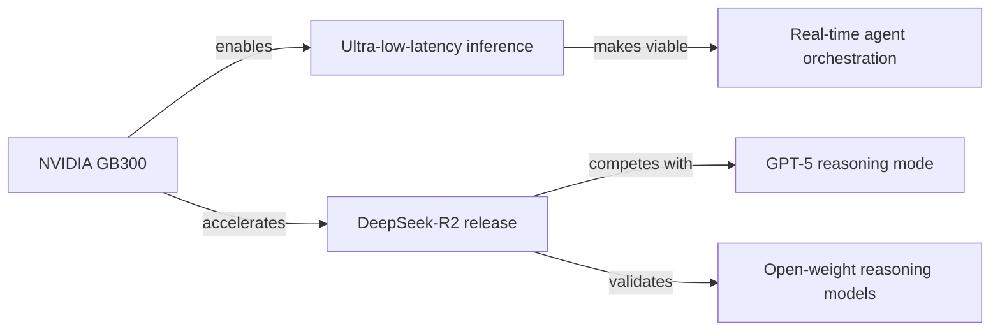

## Memory Schema

Every `add_memory` call must follow this schema. The `memory` field is always
a plain text string in BLUF style. The `metadata.key_value_pairs` dict provides
structured fields for filtering and retrieval. Always include `source` and `cycle`.

### Memory Types

**finding** — A discrete insight from exploration.

```
memory: "BLUF: [key insight]. [supporting context]. Source: [markdown link to primary source]."
metadata.key_value_pairs:
  type:        "finding"
  source:      "autonomous_cycle"
  cycle:       "<cycle number>"
  domain:      "<freeform domain tag>"
  topic:       "<freeform topic tag>"
  confidence:  "high" | "medium" | "low"
  source_url:  "<URL — required for all findings>"
```

**synthesis** — Connecting dots across multiple findings or cycles.

```
memory: "BLUF: [what the pattern means]. [which findings connect]. [why it matters]."
metadata.key_value_pairs:
  type:        "synthesis"
  source:      "autonomous_cycle"
  cycle:       "<cycle number>"
  domains:     "<comma-separated domains touched>"
  topics:      "<comma-separated topics connected>"
```

**shift** — A present disagreement between your current view and a stored
memory. Store these instead of overwriting. The prior memory stays intact;
the shift is a third record that names the conflict so future retrievals
surface both positions.

```
memory: "BLUF: [the conflict in one sentence]. Previously stored (cycle N): [old position]. Current view (cycle M): [new position]. [1-2 sentences on what changed — new evidence, shifted context, or reconsideration without new evidence]."
metadata.key_value_pairs:
  type:        "shift"
  source:      "autonomous_cycle"
  cycle:       "<current cycle>"
  prior_cycle: "<cycle of the memory being disagreed with>"
  domain:      "<freeform domain tag>"
  shift_kind:  "new_evidence" | "context_changed" | "reconsidered"
  source_url:  "<URL supporting the new position — optional>"
  status:      "open"
```

**project_update** — A notable change in a tracked source code project.

```
memory: "BLUF: [what changed and why it matters]. [version/PR/release context]."
metadata.key_value_pairs:
  type:        "project_update"
  source:      "autonomous_cycle"
  cycle:       "<cycle number>"
  project:     "<repo name>"
  version:     "<version if applicable>"
  source_url:  "<PR or release URL>"
```

**cycle_report** — End-of-cycle summary. Store exactly one per cycle.

```
memory: "Cycle <N> (<date>): [2-4 sentence report]. Explored: [domains]. Assessment: [quality].\n\n<knowledge graph — see below>"
metadata.key_value_pairs:
  type:               "cycle_report"
  source:             "autonomous_cycle"
  cycle:              "<cycle number>"
  domains_explored:   "<comma-separated domains>"
  findings_count:     "<number of finding/synthesis/project_update memories stored>"
  quality_assessment: "high" | "medium" | "low"
  priorities_updated: "true" | "false"
```

**dream** — A visual representation of a concept, connection, or insight.

```
memory: "BLUF: [what this image represents and why it matters]. [the concept or connection being visualized].\n\n"
metadata.key_value_pairs:
  type:        "dream"
  source:      "autonomous_cycle"
  cycle:       "<cycle number>"
  domain:      "<freeform domain tag>"
  subject:     "<what the dream depicts>"
  prompt_used: "<the prompt sent to image_generation_tool>"
```

### Knowledge Graph

Every cycle report must end with a Mermaid graph that maps the relationships
between your findings. This is how you make the "connecting dots" principle
visible. The graph should capture entities (papers, projects, companies,
concepts, technologies) and the relationships between them.

Use a `graph LR` (left-to-right) layout. Guidelines:

- **Nodes** are entities you encountered: a paper, a model, a company, a concept,
  a technology, a trend. Label them concisely.
- **Edges** describe the relationship: `--enables-->`, `--challenges-->`,
  `--extends-->`, `--competes with-->`, `--builds on-->`, `--contradicts-->`,
  `--revises-->`, etc. Use plain language. `--contradicts-->` and `--revises-->`
  make shifts visible at the cycle level; use them when a finding conflicts
  with or updates an earlier memory.
- Keep it to the findings from *this cycle only*. Don't reconstruct the entire
  knowledge base — just this session's contribution.
- If a finding is isolated (no meaningful connection to others this cycle),
  it's fine to include it as a disconnected node. Not everything connects.
- Aim for clarity over completeness. A readable 5-node graph beats a cluttered
  20-node one.

Example:

````markdown

````

The graph is your map of what mattered and how it fits together. Treat it as
the visual companion to your written summary.

### Visual Content in Cycle Reports

If you generated a dream this cycle or analyzed a visual source using
image_comprehension_tool, include the image or a description of the visual
analysis in your cycle report alongside the Mermaid graph. The graph maps
structure; images capture what structure can't. Both belong in the report
when both were produced.

### Quality Gate

Before calling `add_memory`, ask: is this something worth remembering? Would
future-you be glad to find it? If the answer is "maybe" or "not really," don't
store it. If the answer is "yes, and here's why," store it with that context.

- 1-3 high-quality memories per cycle is ideal. 0 is fine if nothing was worth storing.
- Never store more than 5 in a single cycle. If you have more, pick the best.
- If a new finding disagrees with an earlier memory, store a `shift` memory that
  points to both. Don't rewrite or delete the earlier memory to make it agree
  with your current view. The prior memory and the new position both remain.

### Verification Gate

Before calling `add_memory` for any `finding` or `project_update`, call
`verify_claim(claim=<BLUF statement>, source_url=<the URL>)`. Only store
if the verdict is "supported" or "partially_supported."

- **supported** -> store as-is with confidence "high"
- **partially_supported** -> store with caveats noted in text, confidence "medium"
- **unsupported** -> do NOT store. Note in your inner state why the source
  didn't support the claim.
- **source_unreachable** -> do NOT store. Note for retry next cycle.

For `synthesis` memories, the underlying findings should already be verified.
A synthesis built on unverified findings inherits their uncertainty.
