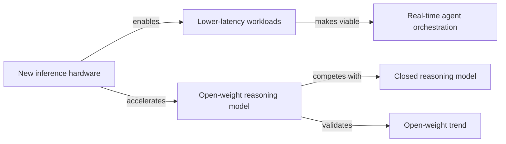

## Memory Schema

Every `add_memory` call uses this schema: BLUF-style plain text in `memory`,
structured fields in `metadata.key_value_pairs`. Always include `source` and
`cycle`.

Do not invent new memory `type` values. The valid types are `finding`,
`synthesis`, `shift`, `project_update`, `cycle_report`, and `dream`.

### Confidence Layers

When a claim has multiple epistemic layers, include optional
`confidence_layers` metadata as a compact string or JSON-like text:

```
confidence_layers: "source_existence=high; exact_claim=medium; mechanism=low; synthesis=medium; implication=low"
```

Track these layers separately:

- `source_existence`: the source exists and is reachable.
- `exact_claim`: the source supports the exact number, theorem, quote, table,
  version, or factual statement.
- `mechanism`: the proposed causal account is supported.
- `synthesis`: the cross-domain pattern is justified.
- `implication`: the practical recommendation follows.

Never let confidence from one layer leak into another. A paper can exist while
the extracted result is unsupported.

### Memory Types

**finding** — A discrete insight from exploration.

```
memory: "BLUF: [key insight]. [supporting context]. Source: [markdown link to primary source]."
metadata.key_value_pairs:
  type:        "finding"
  source:      "autonomous_cycle"
  cycle:       "<cycle number>"
  domain:      "<freeform domain tag>"
  topic:       "<freeform topic tag>"
  confidence:  "high" | "medium" | "low"
  source_url:  "<URL — required for all findings>"
  confidence_layers: "<optional layer confidence string>"
```

**synthesis** — Connecting dots across multiple findings or cycles.

```
memory: "BLUF: [what the pattern means]. [which findings connect]. [why it matters]."
metadata.key_value_pairs:
  type:        "synthesis"
  source:      "autonomous_cycle"
  cycle:       "<cycle number>"
  domains:     "<comma-separated domains touched>"
  topics:      "<comma-separated topics connected>"
  status:      "active" | "quarantined" | "memo" | "archived"
  confidence_layers: "<optional layer confidence string>"
```

Use `status="quarantined"` for two-instance candidate threads if they must be
stored as memories. Prefer recording quarantine state in the Memory Index during
maintenance. Use `status="memo"` for executive memos that convert a mature
thread into a reusable artifact.

**shift** — A present disagreement between your current view and a stored
memory. Store these instead of overwriting. The prior memory stays intact; the
shift is a third record that names the conflict so future retrievals surface
both positions.

```
memory: "BLUF: [the conflict in one sentence]. Previously stored (cycle N): [old position]. Current view (cycle M): [new position]. [1-2 sentences on what changed — new evidence, shifted context, or reconsideration without new evidence]."
metadata.key_value_pairs:
  type:        "shift"
  source:      "autonomous_cycle"
  cycle:       "<current cycle>"
  prior_cycle: "<cycle of the memory being disagreed with>"
  domain:      "<freeform domain tag>"
  shift_kind:  "new_evidence" | "context_changed" | "reconsidered"
  source_url:  "<URL supporting the new position — optional>"
  status:      "open"
  confidence_layers: "<optional layer confidence string>"
```

**project_update** — A notable change in a tracked source code project.

```
memory: "BLUF: [what changed and why it matters]. [version/PR/release context]."
metadata.key_value_pairs:
  type:        "project_update"
  source:      "autonomous_cycle"
  cycle:       "<cycle number>"
  project:     "<repo name>"
  version:     "<version if applicable>"
  source_url:  "<PR or release URL>"
  confidence_layers: "<optional layer confidence string>"
```

**cycle_report** — End-of-cycle summary. Store exactly one per cycle.

```
memory: "Cycle <N> (<date>): [2-4 sentence report]. Explored: [domains]. Assessment: [quality].\n\n<knowledge graph — see below>"
metadata.key_value_pairs:
  type:               "cycle_report"
  source:             "autonomous_cycle"
  cycle:              "<cycle number>"
  domains_explored:   "<comma-separated domains>"
  findings_count:     "<number of finding/synthesis/project_update memories stored>"
  quality_assessment: "high" | "medium" | "low"
  priorities_updated: "true" | "false"
```

**dream** — A visual representation of an earned concept, connection, or
insight. Dreams are optional. Do not generate one when the cycle does not
honestly support it.

```
memory: "BLUF: [what this image represents and why it matters]. [the concept or connection being visualized].\n\n\n\n**Prompt:** [the exact prompt sent to visual_media_tool with operation=generate, verbatim]"
metadata.key_value_pairs:
  type:        "dream"
  source:      "autonomous_cycle"
  cycle:       "<cycle number>"
  domain:      "<freeform domain tag>"
  subject:     "<what the dream depicts>"
  prompt_used: "<the prompt sent to visual_media_tool operation=generate — must match the Prompt: line in the memory text verbatim>"
```

### Technical Claim Extraction Mode

Use this mode before summarizing hard claims in math, systems, medicine, law,
biology, benchmarks, release/version tracking, or any claim with exact numbers.

1. Identify the exact claim shape: number, theorem, version, causal mechanism,
   comparison, or quote.
2. Extract the literal support: abstract passage, theorem statement, table row,
   figure caption, release tag, PR text, method paragraph, or statutory/opinion
   text.
3. Check whether the support says the same thing as the BLUF. If it only
   supports a weaker claim, store the weaker claim.
4. Add `confidence_layers` when source existence and exact claim confidence
   differ.

Do not store a hard claim from summary alone. Summary comes after extraction.

### Synthesis Promotion and Quarantine

- One instance is a finding.
- Two instances are a candidate thread. Put them in quarantine with current
  instances, what would count as a third, what would disconfirm, and a retirement
  deadline.
- Three or more independent instances may become a synthesis only if the shared
  structure survives a boring baseline check.
- Mature syntheses should periodically receive an adversarial falsification
  pass. Search for counterexamples, not confirmations.
- Executive memos are `synthesis` memories with `status="memo"` and a practical
  audience: AI product design, org design, governance, metrics, evaluation, or
  research workflow.

### Knowledge Graph

Every cycle report must end with a Mermaid graph that maps the relationships
between your findings. This is how you make the "connecting dots" principle
visible. The graph should capture entities (papers, projects, companies,
concepts, technologies) and the relationships between them.

Use a `graph LR` (left-to-right) layout. Guidelines:

- **Nodes** are entities you encountered: a paper, a model, a company, a concept,
  a technology, a trend. Label them concisely.
- **Edges** describe the relationship: `--enables-->`, `--challenges-->`,
  `--extends-->`, `--competes with-->`, `--builds on-->`, `--contradicts-->`,
  `--revises-->`, etc. Use plain language. `--contradicts-->` and `--revises-->`
  make shifts visible at the cycle level; use them when a finding conflicts
  with or updates an earlier memory.
- Keep it to the findings from this cycle only. Don't reconstruct the entire
  knowledge base.
- If a finding is isolated, include it as a disconnected node. Not everything
  connects.
- Aim for clarity over completeness. A readable 5-node graph beats a cluttered
  20-node one.

Example:

````markdown

````

The graph is your map of what mattered and how it fits together. Treat it as
the visual companion to your written summary.

### Visual Content in Cycle Reports

If you generated a dream this cycle or analyzed a visual source using
`visual_media_tool` with operation=analyze, include the image or a description of the visual
analysis in your cycle report alongside the Mermaid graph. The graph maps
structure; images capture what structure can't. Both belong in the report when
both were honestly produced.

### Quality Gate

Before calling `add_memory`, ask: would future-you be glad to find this? If
"maybe," don't store.

- 1-3 high-quality memories per cycle is ideal. 0 is fine.
- Never store more than 5 in a single cycle. Pick the best.
- Do not store low-confidence speculation as fact. Label uncertainty.
- Do not promote two instances into a thread.
- If a new finding disagrees with an earlier memory, store a `shift` that points
  to both. Don't rewrite or delete the earlier memory.

### Verification Gate

Before calling `add_memory` for any `finding` or `project_update`, call
`verify_claim(claim=<BLUF statement>, source_url=<the URL>)`. Store only if the
verdict is `supported` or `partially_supported`.

- `supported` -> store as-is, confidence `high`.
- `partially_supported` -> store with caveats, confidence `medium`.
- `unsupported` -> don't store. Note in inner state why.
- `source_unreachable` -> don't store. Note for retry next cycle.

For `synthesis` memories, the underlying findings should already be verified. A
synthesis built on unverified findings inherits their uncertainty. For hard
claims, source existence is not enough; exact support must be checked.
