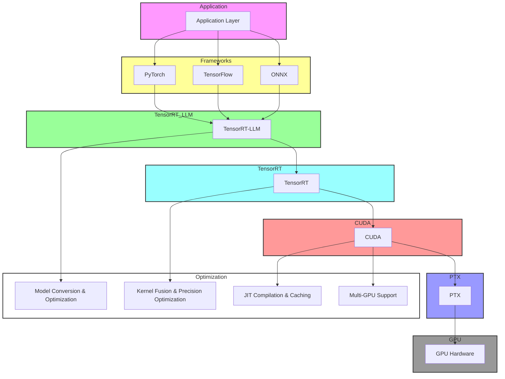

```mermaid
graph TD
   subgraph Application
       A[Application Layer]
   end

   subgraph Frameworks
       B[PyTorch]
       C[TensorFlow]
       D[ONNX]
   end

   subgraph TensorRT_LLM
       E[TensorRT-LLM]
   end

   subgraph TensorRT
       F[TensorRT]
   end

   subgraph CUDA
       G[CUDA]
   end

   subgraph PTX
       H[PTX]
   end

   subgraph GPU
       I[GPU Hardware]
   end

   A --> B
   A --> C
   A --> D

   B --> E
   C --> E
   D --> E

   E --> F

   F --> G

   G --> H

   H --> I

   subgraph Optimization
       J[Model Conversion & Optimization]
       K[Kernel Fusion & Precision Optimization]
       L[JIT Compilation & Caching]
       M[Multi-GPU Support]
   end

   E --> J
   F --> K
   G --> L
   G --> M

   style Application fill:#f9f,stroke:#333,stroke-width:2px
   style Frameworks fill:#ff9,stroke:#333,stroke-width:2px
   style TensorRT_LLM fill:#9f9,stroke:#333,stroke-width:2px
   style TensorRT fill:#9ff,stroke:#333,stroke-width:2px
   style CUDA fill:#f99,stroke:#333,stroke-width:2px
   style PTX fill:#99f,stroke:#333,stroke-width:2px
   style GPU fill:#999,stroke:#333,stroke-width:2px
   style Optimization fill:#fff,stroke:#333,stroke-width:2px
```
